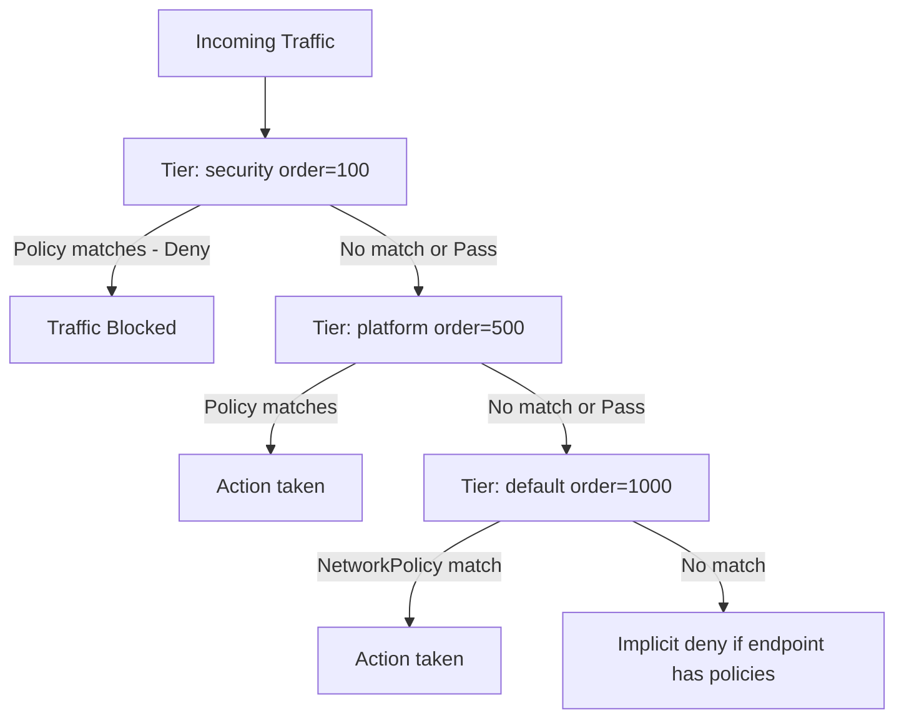

# Configure Calico Tier Resource

Author: [nawazdhandala](https://github.com/nawazdhandala)

Tags: Calico, Kubernetes, Networking, Tier, Policy, Configuration

Description: How to configure Calico Tier resources to organize network policies into ordered evaluation layers, enabling security-team-managed platform policies to take precedence over application-team policies.

---

## Introduction

Calico Tier resources define ordered evaluation layers for GlobalNetworkPolicy and NetworkPolicy resources. Tiers allow different teams to manage policies at different priority levels — a security team can enforce cluster-wide baseline policies in a high-priority tier, while application teams manage their own connectivity policies in lower-priority tiers, without risking that application policies override security baselines.

The default tier (`default`) has order 1000 and contains all standard NetworkPolicy resources. Custom tiers with lower order numbers are evaluated first, enabling a layered security model.

## Prerequisites

- Calico Enterprise or Calico Cloud (Tier resources require enterprise features)
- `calicoctl` with cluster admin access
- RBAC configured to control which teams can manage each tier

## Step 1: Understand Tier Evaluation Order

```yaml
# Lower order = higher priority
# Tier evaluation: security (100) → platform (500) → default (1000)
```

Traffic passes through each tier in order. If a tier's policies match the traffic and take action (Allow or Deny), evaluation stops. If no policy in a tier matches, evaluation passes to the next tier with an implicit pass.

## Step 2: Create Security Tier

```yaml
apiVersion: projectcalico.org/v3
kind: Tier
metadata:
  name: security
spec:
  order: 100
```

```bash
calicoctl apply -f security-tier.yaml
```

## Step 3: Create Platform Tier

```yaml
apiVersion: projectcalico.org/v3
kind: Tier
metadata:
  name: platform
spec:
  order: 500
```

## Step 4: Create Policies in Specific Tiers

```yaml
# Policy in security tier - applies cluster-wide before any application policies
apiVersion: projectcalico.org/v3
kind: GlobalNetworkPolicy
metadata:
  name: security.block-known-malicious
spec:
  tier: security
  order: 100
  selector: "all()"
  ingress:
    - action: Deny
      source:
        selector: "threat-level == 'high'"
  egress:
    - action: Pass  # Let other tiers handle egress
```



## Step 5: Assign RBAC for Tier Management

```yaml
# Allow security team to manage policies in security tier
apiVersion: rbac.authorization.k8s.io/v1
kind: ClusterRole
metadata:
  name: security-tier-admin
rules:
  - apiGroups: ["projectcalico.org"]
    resources: ["globalnetworkpolicies", "networkpolicies"]
    resourceNames: ["security.*"]
    verbs: ["get", "list", "create", "update", "delete"]
```

## Step 6: Verify Tier Configuration

```bash
# List all tiers with their orders
calicoctl get tiers

# Check policies in each tier
calicoctl get globalnetworkpolicies -o wide | sort -k4 -n
```

## Conclusion

Calico Tier resources implement a multi-team policy ownership model where security rules always take precedence. Configure tiers with distinct order numbers reflecting their priority: security (100) for cluster-wide security baselines, platform (500) for infrastructure policies like monitoring access, and leave the default tier (1000) for application teams. Combine tier RBAC with this ordering to enforce that application teams cannot override security or platform policies.
