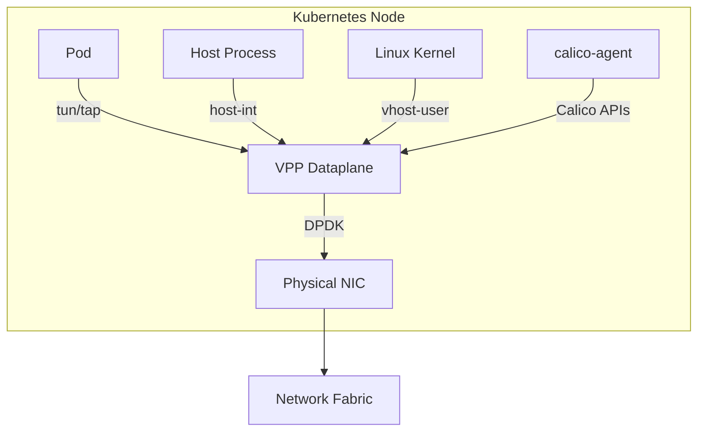

# Configure Calico VPP Host Networking

Author: [nawazdhandala](https://github.com/nawazdhandala)

Tags: Calico, Kubernetes, Networking, VPP, DPDK, High Performance, Configuration

Description: A guide to configuring Calico's VPP (Vector Packet Processing) dataplane for high-performance host networking, enabling line-rate packet processing for Kubernetes workloads.

---

## Introduction

Calico VPP is an alternative dataplane that replaces the Linux kernel networking stack with FD.io VPP (Vector Packet Processing) for dramatically improved packet processing throughput and latency. VPP processes network packets in vectors (batches) using SIMD instructions, achieving performance characteristics that approach hardware packet processors.

The Calico VPP integration is particularly valuable for network function virtualization (NFV), telecommunications workloads, and any Kubernetes application where sub-100 microsecond pod-to-pod latency or multi-10Gbps per-node throughput is required. This guide covers the initial configuration of Calico VPP for host networking.

## Prerequisites

- Kubernetes cluster with nodes running Linux kernel 5.4+
- DPDK-compatible network interface cards on worker nodes
- Hugepages configured on worker nodes
- VPP-compatible CPU with DPDK support (most modern x86_64 CPUs)
- Calico VPP images accessible (quay.io/calicovpp/)

## Architecture Overview



## Step 1: Configure Hugepages on Worker Nodes

VPP requires hugepages for DPDK packet buffer memory:

```bash
# Configure 2MB hugepages at boot
echo "vm.nr_hugepages = 1024" | sudo tee /etc/sysctl.d/hugepages.conf
sudo sysctl -p /etc/sysctl.d/hugepages.conf

# Verify hugepages
grep HugePages /proc/meminfo
# HugePages_Total: 1024
# HugePages_Free:  1024

# Mount hugetlbfs
sudo mount -t hugetlbfs hugetlbfs /dev/hugepages
```

Add to /etc/fstab for persistence:

```bash
echo "hugetlbfs /dev/hugepages hugetlbfs defaults 0 0" | sudo tee -a /etc/fstab
```

## Step 2: Deploy Calico VPP

```bash
# Clone Calico VPP configuration
kubectl apply -f https://raw.githubusercontent.com/projectcalico/vpp-dataplane/master/yaml/generated/calico-vpp.yaml
```

Or via Helm:

```bash
helm repo add calicovpp https://projectcalico.github.io/vpp-dataplane
helm install calico-vpp calicovpp/calico-vpp \
  --namespace calico-vpp-dataplane \
  --create-namespace \
  --set vppConfig.uplinks[0].ifSpec.pci="0000:00:0a.0"
```

## Step 3: Configure the VPP Uplink Interface

Create the VPP configuration ConfigMap specifying which NIC VPP will take over:

```yaml
apiVersion: v1
kind: ConfigMap
metadata:
  name: calico-vpp-config
  namespace: calico-vpp-dataplane
data:
  CALICOVPP_INTERFACES: |
    {
      "uplinkInterfaces": [
        {
          "interfaceName": "eth0",
          "vppDriver": "af_packet"
        }
      ]
    }
  SERVICE_PREFIX: "10.96.0.0/12"
  CALICOVPP_FEATURE_GATES: |
    {
      "multinetEnabled": false,
      "srv6Enabled": false,
      "mcastEnabled": false
    }
```

## Step 4: Configure Hugepages Resource Limits

```yaml
# In the calico-vpp DaemonSet
resources:
  limits:
    hugepages-2Mi: "512Mi"
    memory: "1Gi"
  requests:
    hugepages-2Mi: "512Mi"
    memory: "512Mi"
```

## Step 5: Verify VPP Startup

```bash
# Check VPP pods are running
kubectl get pods -n calico-vpp-dataplane

# Check VPP agent logs
kubectl logs -n calico-vpp-dataplane ds/calico-vpp-node -c vpp-manager

# VPP CLI access
kubectl exec -n calico-vpp-dataplane ds/calico-vpp-node -c vpp -- vppctl show interface
```

## Conclusion

Configuring Calico VPP host networking requires hugepage setup, DPDK-compatible hardware, and specific VPP interface configuration. The VPP dataplane takes over the primary network interface from the Linux kernel, so careful configuration is critical to avoid losing node connectivity. Start with a test environment using the `af_packet` driver (which doesn't require DPDK) before moving to DPDK for full performance.
