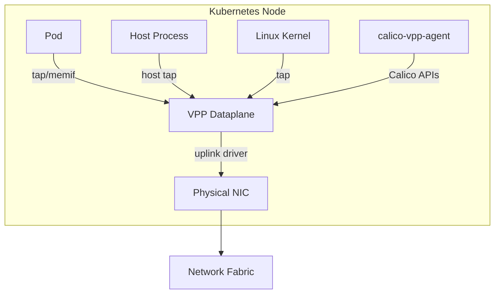

# Configure Calico VPP Host Networking

Author: [nawazdhandala](https://github.com/nawazdhandala)

Tags: Calico, Kubernetes, Networking, VPP, DPDK, High Performance, Configuration

Description: A guide to configuring Calico's VPP (Vector Packet Processing) dataplane for high-performance host networking, enabling line-rate packet processing for Kubernetes workloads.

---

## Introduction

Calico VPP is an alternative dataplane that uses FD.io VPP (Vector Packet Processing) for dramatically improved packet processing throughput and latency. VPP processes network packets in vectors (batches), achieving performance characteristics that approach hardware packet processors.

The Calico VPP integration is particularly valuable for network function virtualization (NFV), telecommunications workloads, and Kubernetes applications where very low pod-to-pod latency or multi-10Gbps per-node throughput is required. This guide covers the initial configuration of Calico VPP for host networking.

## Prerequisites

- A blank Kubernetes cluster where no CNI has already been configured
- Worker node primary interfaces that are up, configured with the Kubernetes node IP, and supported by the chosen VPP uplink driver
- Hugepages configured on worker nodes when using drivers that require them, such as `dpdk`, `virtio`, `avf`, or `vmxnet3`
- Linux kernel 5.4+ when using the `af_xdp` uplink driver
- DPDK-compatible network interface cards on worker nodes when using the `dpdk` uplink driver
- Calico VPP images accessible (`docker.io/calicovpp/`)

## Architecture Overview


```mermaid
graph TD
    subgraph Kubernetes Node
        A[Pod] -->|tap/memif| B[VPP Dataplane]
        C[Host Process] -->|host tap| B
        B -->|uplink driver| D[Physical NIC]
        E[Linux Kernel] -->|tap| B
        F[calico-vpp-agent] -->|Calico APIs| B
    end
    D --> G[Network Fabric]
```

## Step 1: Configure Hugepages on Worker Nodes

VPP requires hugepages for DPDK packet buffer memory:

```bash
# Configure 2MB hugepages

echo "vm.nr_hugepages = 1024" | sudo tee /etc/sysctl.d/hugepages.conf
sudo sysctl -p /etc/sysctl.d/hugepages.conf
sudo systemctl restart kubelet

# Verify hugepages
grep HugePages /proc/meminfo
# HugePages_Total: 1024
# HugePages_Free:  1024

# Mount hugetlbfs
sudo mount -t hugetlbfs hugetlbfs /dev/hugepages
```

Add to /etc/fstab for persistence:

```bash
echo "hugetlbfs /dev/hugepages hugetlbfs defaults 0 0" | sudo tee -a /etc/fstab
```

## Step 2: Deploy Calico VPP

```bash
# Install the Calico operator and CRDs
kubectl create -f https://raw.githubusercontent.com/projectcalico/calico/v3.32.0/manifests/v1_crd_projectcalico_org.yaml
kubectl create -f https://raw.githubusercontent.com/projectcalico/calico/v3.32.0/manifests/tigera-operator.yaml

# Configure Calico for the VPP dataplane
kubectl create -f https://raw.githubusercontent.com/projectcalico/vpp-dataplane/v3.31.0/yaml/calico/installation-default.yaml

# Download the VPP dataplane manifest so you can edit calico-vpp-config first
curl -o calico-vpp.yaml https://raw.githubusercontent.com/projectcalico/vpp-dataplane/v3.31.0/yaml/generated/calico-vpp.yaml
```

## Step 3: Configure the VPP Uplink Interface

Create the VPP configuration ConfigMap specifying which NIC VPP will take over:

```yaml
apiVersion: v1
kind: ConfigMap
metadata:
  name: calico-vpp-config
  namespace: calico-vpp-dataplane
data:
  CALICOVPP_INTERFACES: |
    {
      "uplinkInterfaces": [
        {
          "interfaceName": "eth0",
          "vppDriver": "af_packet"
        }
      ]
    }
  SERVICE_PREFIX: "10.96.0.0/12"
```

After editing the `calico-vpp-config` ConfigMap in `calico-vpp.yaml`, apply the manifest:

```bash
kubectl create -f calico-vpp.yaml
```

## Step 4: Configure Hugepages Resource Limits

```yaml
# In the calico-vpp DaemonSet
resources:
  limits:
    hugepages-2Mi: "512Mi"
    memory: "512Mi"
  requests:
    hugepages-2Mi: "512Mi"
    memory: "512Mi"
```

## Step 5: Verify VPP Startup

```bash
# Check VPP pods are running
kubectl get pods -n calico-vpp-dataplane

# Check VPP agent logs
kubectl logs -n calico-vpp-dataplane ds/calico-vpp-node -c agent

# Check VPP startup logs
kubectl logs -n calico-vpp-dataplane ds/calico-vpp-node -c vpp

# VPP CLI access
kubectl exec -n calico-vpp-dataplane ds/calico-vpp-node -c vpp -- vppctl show interface
```

## Conclusion

Configuring Calico VPP host networking requires driver-specific host setup and specific VPP interface configuration. With drivers such as `dpdk`, the VPP dataplane takes over the primary network interface from the Linux kernel, so careful configuration is critical to avoid losing node connectivity. Start with a test environment using the `af_packet` driver (which doesn't require DPDK) before moving to DPDK for full performance.
