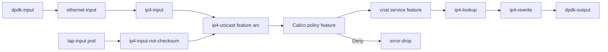

# Configure Calico VPP Technical Details

Author: [nawazdhandala](https://github.com/nawazdhandala)

Tags: Calico, Kubernetes, Networking, VPP, DPDK, Technical, Configuration

Description: An in-depth look at the technical configuration details of Calico VPP, including the node graph architecture, plugin configuration, and startup parameters for production deployments.

---

## Introduction

Understanding Calico VPP's technical details enables more precise configuration and better troubleshooting. VPP's node graph architecture - where packets flow through a directed graph of processing nodes - is fundamentally different from the Linux kernel's networking stack. Each VPP node performs a specific operation (IP lookup, ACL check, NAT, etc.) and passes processed packet vectors to the next node.

Calico VPP configures VPP through `vpp-manager`, `calico-vpp-agent`, and Calico-specific VPP plugins for policy and Kubernetes service load balancing. Configuring these components correctly requires understanding their interdependencies and the startup configuration parameters that control their behavior.

## Prerequisites

- Familiarity with VPP concepts (vectors, node graphs, workers)
- Calico VPP deployment experience
- Understanding of DPDK and hugepage configuration

## VPP Node Graph for Calico


```mermaid
graph LR
    A[dpdk-input] --> B[ethernet-input]
    B --> C[ip4-input]
    C --> D[ip4-unicast feature arc]
    D --> P[Calico policy feature]
    P --> S[cnat service feature]
    S --> E[ip4-lookup]
    E --> F[ip4-rewrite]
    F --> G[dpdk-output]
    P -->|Deny| H[error-drop]
    I[tap-input pod] --> J[ip4-input-not-checksum]
    J --> D
```

## VPP Startup Configuration Deep Dive

### Memory Configuration

```plaintext
# /etc/vpp/startup.conf

buffers {
  # Number of packet buffers allocated per NUMA node
  # Increase this for large numbers of interfaces or worker threads
  buffers-per-numa 128000
  page-size 2m                  # Use 2MB hugepages
  default data-size 2048        # Buffer data area size
}
```

### DPDK Configuration

```plaintext
dpdk {
  dev 0000:00:0a.0 {            # PCI address of NIC
    name eth0                   # VPP interface name
    num-rx-queues 4             # One queue per VPP worker
    num-tx-queues 4
    num-rx-desc 4096            # RX ring depth
    num-tx-desc 4096
    rss {                       # RSS hash configuration
      ipv4
      ipv4-tcp
      ipv4-udp
    }
  }
  uio-driver uio_pci_generic   # Or vfio-pci for IOMMU
  no-multi-seg                 # Disable scatter-gather (improves performance)
}
```

### Thread/CPU Configuration

```plaintext
cpu {
  main-core 0                  # Core for VPP main thread
  corelist-workers 2-5         # Cores for packet processing workers
}
```

## Calico VPP ConfigMap Parameters

```yaml
data:
  CALICOVPP_INTERFACES: |
    {
      "defaultPodIfSpec": {
        "rx": 1,
        "tx": 1,
        "rxqsz": 1024,
        "txqsz": 1024,
        "isl3": true,
        "rxMode": "polling"
      },
      "vppHostTapSpec": {
        "rx": 1,
        "tx": 1,
        "rxqsz": 1024,
        "txqsz": 1024,
        "isl3": false,
        "rxMode": "polling"
      },
      "uplinkInterfaces": [
        {
          "interfaceName": "eth0",
          "vppDriver": "dpdk",
          "newDriver": "vfio-pci",
          "rxMode": "polling",
          "rx": 4,
          "tx": 4,
          "rxqsz": 1024,
          "txqsz": 1024
        }
      ]
    }
  CALICOVPP_FEATURE_GATES: |
    {
      "multinetEnabled": false,
      "srv6Enabled": false,
      "ipsecEnabled": false,
      "prometheusEnabled": false
    }
  CALICOVPP_INITIAL_CONFIG: |
    {
      "vppStartupSleepSeconds": 2,
      "corePattern": "/var/log/vpp/core-%e-%p-%t"
    }
```

## Calico VPP Tap Interface Configuration

Each pod gets a VPP tapv2 interface, configured as a tun interface by default, connecting it to VPP:

```bash
# View tap interface parameters
kubectl exec -n calico-vpp-dataplane ds/calico-vpp-node -c vpp -- \
  vppctl show tap verbose

# Output shows:
# Interface: tap0
#   Linux interface name: eth0 (in pod netns)
#   RX queue size: 1024
#   TX queue size: 1024
```

## NAT and Service Load Balancing

Calico VPP implements Kubernetes service load balancing natively using VPP's CNAT plugin:

```bash
# View service translations
kubectl exec -n calico-vpp-dataplane ds/calico-vpp-node -c vpp -- \
  vppctl show cnat translation

# View active service sessions
kubectl exec -n calico-vpp-dataplane ds/calico-vpp-node -c vpp -- \
  vppctl show cnat session verbose
```

## Conclusion

Calico VPP's technical configuration involves careful tuning of buffer memory, CPU allocation, DPDK device parameters, and the interface between VPP's processing graph and Calico's policy model. Understanding the node graph architecture helps in troubleshooting packet loss and in optimizing performance for specific traffic patterns. The ConfigMap-based configuration provides a Kubernetes-native way to manage these complex VPP parameters.
