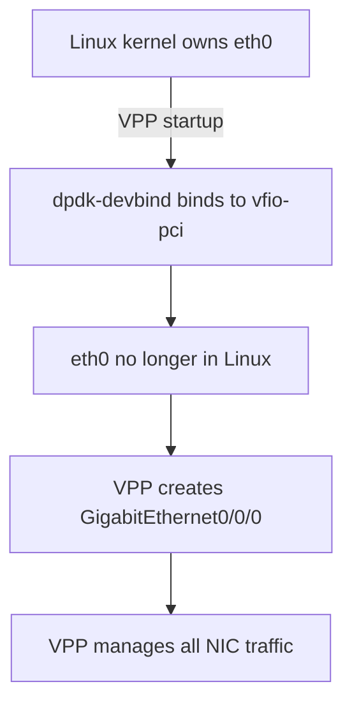

# Configure Calico VPP Uplink Configuration

Author: [nawazdhandala](https://github.com/nawazdhandala)

Tags: Calico, Kubernetes, Networking, VPP, DPDK, Uplink, NIC, Configuration

Description: A detailed guide to configuring the uplink interface for Calico VPP, covering DPDK driver selection, PCI device configuration, multi-queue setup, and SR-IOV uplink modes.

---

## Introduction

The uplink configuration in Calico VPP determines how VPP connects to the physical network. The uplink interface is the NIC that VPP takes over from the Linux kernel using DPDK — this is the most impactful configuration decision for Calico VPP performance. The choice of driver (af_packet, DPDK, SR-IOV), queue count, and interrupt vs. polling mode directly determines the maximum throughput and minimum latency achievable.

Calico VPP supports several uplink modes:
- `af_packet`: Uses Linux AF_PACKET socket (no DPDK required, lower performance)
- `dpdk`: Full DPDK with user-space NIC driver (maximum performance)
- `virtio`: For virtual machine environments
- SR-IOV Virtual Functions: For hardware offload on supported NICs

## Prerequisites

- Nodes with supported NICs (Intel, Mellanox, Broadcom for DPDK)
- Hugepages configured (required for DPDK mode)
- DPDK kernel modules loaded (vfio-pci or uio_pci_generic)
- PCI address of the target NIC identified

## Step 1: Identify Your NIC and PCI Address

```bash
# List network interfaces and their PCI addresses
lspci -D | grep -i "network\|ethernet"

# Example output:
# 0000:00:0a.0 Ethernet controller: Intel Corporation 82599ES 10G (rev 01)

# Or use dpdk-devbind
dpdk-devbind.py --status-dev net
```

## Step 2: Configure af_packet Mode (No DPDK)

For testing or environments without DPDK support:

```yaml
apiVersion: v1
kind: ConfigMap
metadata:
  name: calico-vpp-config
  namespace: calico-vpp-dataplane
data:
  CALICOVPP_INTERFACES: |
    {
      "uplinkInterfaces": [
        {
          "interfaceName": "eth0",
          "vppDriver": "af_packet"
        }
      ]
    }
```

Note: af_packet mode keeps eth0 in the Linux kernel but creates a mirror in VPP. Performance is significantly lower than full DPDK.

## Step 3: Configure DPDK Mode (Full Performance)



```yaml
data:
  CALICOVPP_INTERFACES: |
    {
      "uplinkInterfaces": [
        {
          "interfaceName": "eth0",
          "vppDriver": "dpdk",
          "newDriverName": "vfio-pci",
          "rxMode": "polling",
          "numRxQueues": 4,
          "numTxQueues": 4,
          "rxQueueSize": 4096,
          "txQueueSize": 4096
        }
      ]
    }
```

## Step 4: Configure virtio Mode (VMs)

For VMs using virtio NICs (KVM, QEMU):

```yaml
data:
  CALICOVPP_INTERFACES: |
    {
      "uplinkInterfaces": [
        {
          "interfaceName": "eth0",
          "vppDriver": "virtio",
          "rxMode": "interrupt",
          "numRxQueues": 2
        }
      ]
    }
```

## Step 5: Configure Multiple Uplinks (Bonding)

```yaml
data:
  CALICOVPP_INTERFACES: |
    {
      "uplinkInterfaces": [
        {
          "interfaceName": "eth0",
          "vppDriver": "dpdk",
          "newDriverName": "vfio-pci",
          "numRxQueues": 4
        },
        {
          "interfaceName": "eth1",
          "vppDriver": "dpdk",
          "newDriverName": "vfio-pci",
          "numRxQueues": 4
        }
      ],
      "bondInterfaces": [
        {
          "interfaceNames": ["eth0", "eth1"],
          "mode": "lacp",
          "loadBalance": "l34"
        }
      ]
    }
```

## Step 6: Verify Uplink Configuration

```bash
kubectl exec -n calico-vpp-dataplane ds/calico-vpp-node -c vpp -- \
  vppctl show hardware-interfaces

# Expected: GigabitEthernet0/0/0 or similar, state "up"
```

## Conclusion

Configuring the Calico VPP uplink requires careful selection of the VPP driver mode based on your hardware and performance requirements. af_packet mode provides easy deployment without DPDK dependencies; full DPDK mode with vfio-pci driver and multiple queues provides maximum throughput. Verify the PCI address and driver compatibility before deployment, and always test uplink configuration in a non-production environment since DPDK mode removes the NIC from Linux's control.
