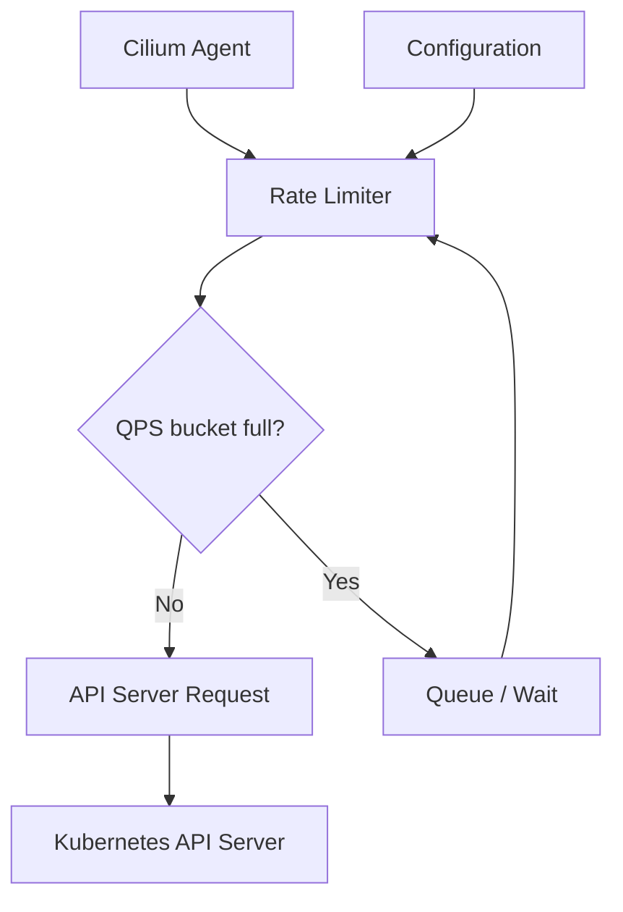

# How to Configure Cilium API Rate Limiting

Author: [nawazdhandala](https://github.com/nawazdhandala)

Tags: Cilium, Kubernetes, Rate Limiting, API, Performance, Configuration

Description: Configure Cilium API rate limiting to control the rate of Kubernetes API server calls made by Cilium agents, preventing API server overload in large clusters.

---

## Introduction

In large Kubernetes clusters, Cilium agents can generate significant load on the API server, especially during policy reconciliation, endpoint updates, and node discovery. Cilium's built-in API rate limiting mechanism controls how many API calls agents make per second, protecting the API server from overload while ensuring Cilium operations complete within acceptable time bounds.

Rate limiting in Cilium is configurable per API call type, allowing operators to tune aggressively for small clusters or conservatively for large clusters with many Cilium agents.

## Prerequisites

- Cilium 1.10+
- `kubectl` with kube-system access

## Understanding Default Rate Limits

Cilium applies default rate limits for different API operation types. View current limits:

```bash
kubectl get cm -n kube-system cilium-config -o jsonpath='{.data.k8s-api-burst}'
kubectl get cm -n kube-system cilium-config -o jsonpath='{.data.k8s-api-qps}'
```

## Configure Global QPS and Burst

Set the global API rate limit via Helm:

```bash
helm upgrade cilium cilium/cilium \
  --namespace kube-system \
  --reuse-values \
  --set k8s.requireIPv4PodCIDR=true \
  --set apiRateLimit.k8s-agent.qps=10 \
  --set apiRateLimit.k8s-agent.burst=20
```

## Architecture



## Configure Per-Operation Rate Limits

Cilium supports fine-grained rate limits per API category:

```yaml
apiVersion: v1
kind: ConfigMap
metadata:
  name: cilium-config
  namespace: kube-system
data:
  api-rate-limit: |
    {
      "endpoint-create": {"rate-limit": "2/s", "rate-burst": 4},
      "endpoint-delete": {"rate-limit": "2/s", "rate-burst": 4},
      "endpoint-update": {"rate-limit": "5/s", "rate-burst": 10},
      "nodes-get": {"rate-limit": "20/s", "rate-burst": 40}
    }
```

```bash
kubectl apply -f cilium-config-ratelimit.yaml
kubectl rollout restart ds/cilium -n kube-system
```

## Monitor Rate Limiting

Check for rate limit throttling in Cilium agent logs:

```bash
kubectl logs -n kube-system ds/cilium --since=5m | grep -i "rate limit\|throttle"
```

Prometheus metric for rate limit hits:

```promql
rate(cilium_api_limiter_wait_duration_seconds_count[5m])
```

## Tune for Large Clusters

For clusters with 500+ nodes, increase limits:

```bash
helm upgrade cilium cilium/cilium \
  --namespace kube-system \
  --reuse-values \
  --set k8s.requireIPv4PodCIDR=true \
  --set apiRateLimit.k8s-agent.qps=50 \
  --set apiRateLimit.k8s-agent.burst=100
```

## Conclusion

Cilium API rate limiting prevents agent-induced API server overload in large clusters. Starting with the defaults and monitoring the `api_limiter_wait_duration` metric helps identify when limits need adjustment. Tuning per-operation limits for the most frequent operations provides precise control over API server load.
