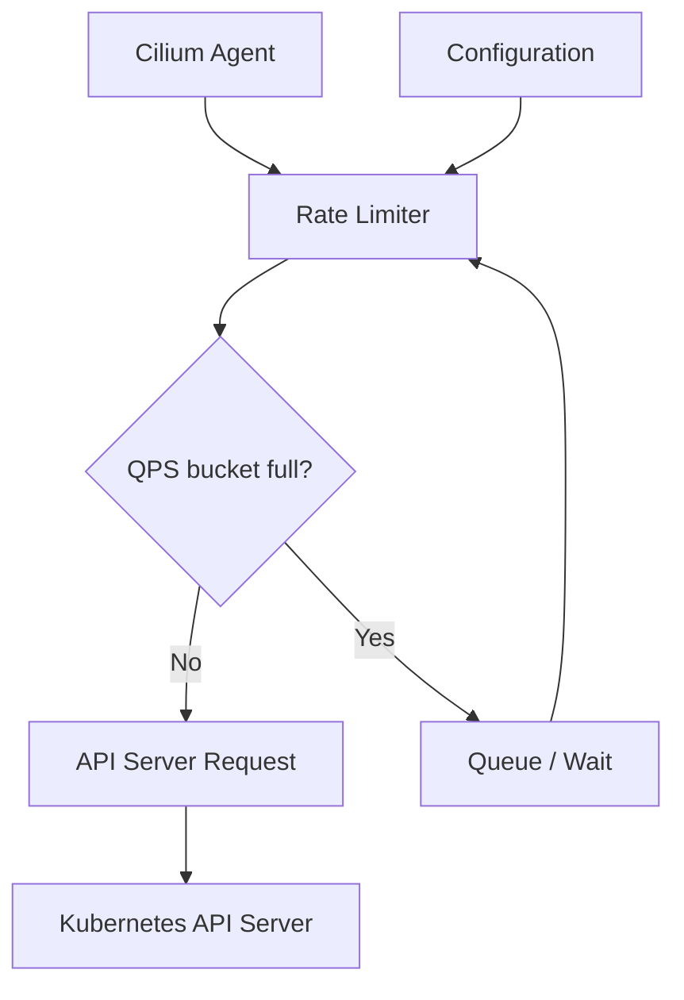

# How to Configure Cilium API Rate Limiting

Author: [nawazdhandala](https://github.com/nawazdhandala)

Tags: Cilium, Kubernetes, Rate Limiting, API, Performance, Configuration

Description: Configure Cilium API rate limiting to control the rate of Kubernetes API server calls made by Cilium agents, preventing API server overload in large clusters.

---

## Introduction

In large Kubernetes clusters, Cilium agents can generate significant load on the API server, especially during policy reconciliation, endpoint updates, and node discovery. Cilium's Kubernetes client rate limiting controls how many API server calls agents make per second, protecting the API server from overload while ensuring Cilium operations complete within acceptable time bounds.

Cilium also has a separate API rate limiter for calls to the Cilium agent API. That limiter is configurable per API call type, allowing operators to tune aggressively for small clusters or conservatively for large clusters with many Cilium agents.

## Prerequisites

- Cilium 1.11+
- `kubectl` with kube-system access

## Understanding Default Rate Limits

Cilium's Kubernetes client defaults to 10 QPS and a burst of 20 for the agent. View the configured values in the ConfigMap, if they have been set:

```bash
kubectl get cm -n kube-system cilium-config -o jsonpath='{.data.k8s-client-burst}'
kubectl get cm -n kube-system cilium-config -o jsonpath='{.data.k8s-client-qps}'
```

## Configure Global QPS and Burst

Set the Kubernetes API client rate limit via Helm:

```bash
helm upgrade cilium cilium/cilium \
  --namespace kube-system \
  --reuse-values \
  --set k8sClientRateLimit.qps=10 \
  --set k8sClientRateLimit.burst=20
```

## Architecture


```mermaid
flowchart TD
    A[Cilium Agent] --> B[Rate Limiter]
    B --> C{QPS bucket full?}
    C -->|No| D[API Server Request]
    C -->|Yes| E[Queue / Wait]
    D --> F[Kubernetes API Server]
    E --> B
    G[Configuration] --> B
```

## Configure Per-Operation Rate Limits

Cilium also supports fine-grained rate limits for Cilium agent API calls:

```yaml
apiVersion: v1
kind: ConfigMap
metadata:
  name: cilium-config
  namespace: kube-system
data:
  api-rate-limit: |
    {
      "endpoint-create": "rate-limit:2/s,rate-burst:4",
      "endpoint-delete": "parallel-requests:4",
      "endpoint-get": "rate-limit:4/s,rate-burst:4",
      "endpoint-list": "rate-limit:1/s,rate-burst:4",
      "endpoint-patch": "rate-limit:2/s,rate-burst:4"
    }
```

```bash
kubectl apply -f cilium-config-ratelimit.yaml
kubectl rollout restart ds/cilium -n kube-system
```

## Monitor Rate Limiting

Check for Kubernetes client throttling or Cilium agent API rate limiting in Cilium agent logs:

```bash
kubectl logs -n kube-system ds/cilium --since=5m | grep -Ei "client-side throttling|rate limiter|throttle"
```

Prometheus metric for Cilium agent API rate limiter wait duration:

```promql
cilium_api_limiter_wait_duration_seconds{value="mean"}
```

## Tune for Large Clusters

For clusters with 500+ nodes, increase limits:

```bash
helm upgrade cilium cilium/cilium \
  --namespace kube-system \
  --reuse-values \
  --set k8sClientRateLimit.qps=50 \
  --set k8sClientRateLimit.burst=100
```

## Conclusion

Cilium Kubernetes client rate limiting helps prevent agent-induced API server overload in large clusters. Starting with the defaults and monitoring client-side throttling logs helps identify when limits need adjustment. Tuning per-operation Cilium agent API limits for the most frequent operations provides precise control over agent API load.
