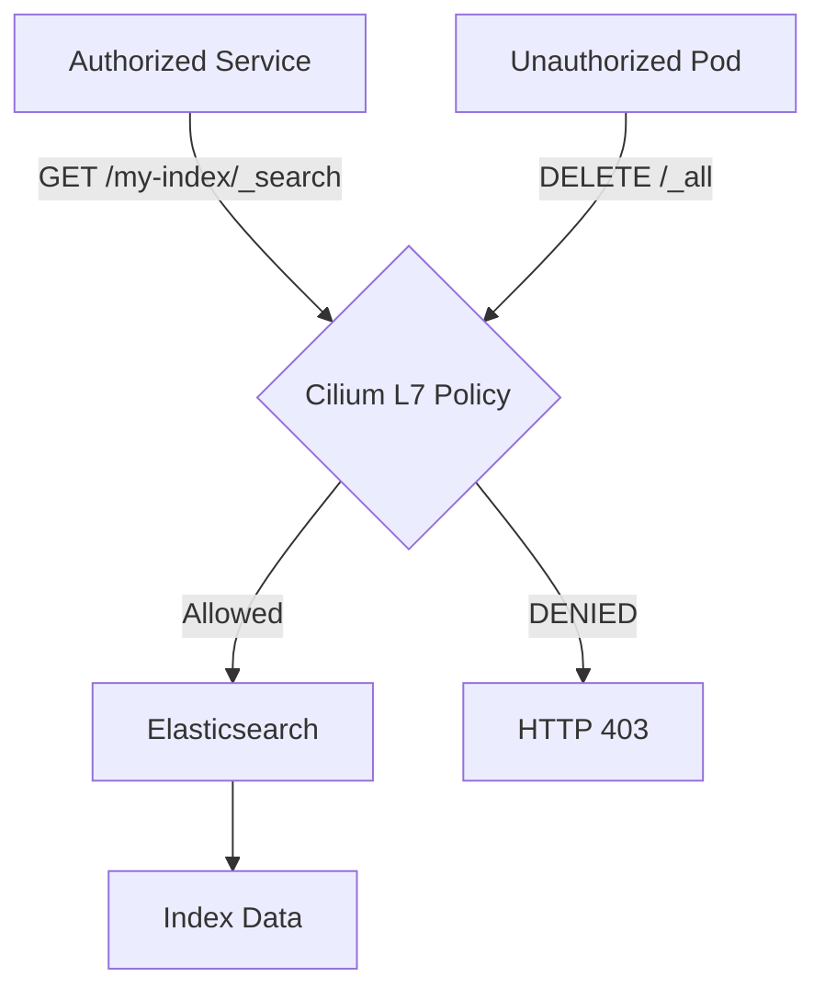

# How to Secure Elasticsearch Using Cilium

Author: [nawazdhandala](https://github.com/nawazdhandala)

Tags: Cilium, Kubernetes, Elasticsearch, Security, Network Policy, eBPF

Description: Use Cilium network policies to control access to Elasticsearch, preventing unauthorized data access and protecting against exfiltration from within the cluster.

---

## Introduction

Elasticsearch clusters running in Kubernetes are exposed to all pods in the cluster by default unless a network policy or Elasticsearch authentication and authorization blocks access. Any pod that knows the service name can query, delete, or export index data when Elasticsearch does not enforce its own access controls. Cilium network policies restrict access to Elasticsearch at the network level, ensuring only authorized services can communicate with the cluster.

Beyond basic port-level access control, Cilium's L7 HTTP policies can restrict access to specific Elasticsearch index patterns and HTTP methods, providing fine-grained control over what each client can do.

## Prerequisites

- Cilium with L7 HTTP policy support
- Elasticsearch deployed in Kubernetes
- Plain HTTP access to Elasticsearch on port 9200, or Cilium TLS visibility configured for encrypted Elasticsearch traffic
- `kubectl` CLI

## Deploy Test Elasticsearch

```bash
kubectl apply -f https://raw.githubusercontent.com/cilium/cilium/1.19.3/examples/kubernetes-es/es-sw-app.yaml
```

## Architecture


```mermaid
flowchart TD
    A[Authorized Service] -->|GET /my-index/_search| B{Cilium L7 Policy}
    B -->|Allowed| C[Elasticsearch]
    D[Unauthorized Pod] -->|DELETE /_all| B
    B -->|DENIED| E[HTTP 403]
    C --> F[Index Data]
```

## Apply Basic Access Policy

Only allow specific pods to reach Elasticsearch:

```yaml
apiVersion: cilium.io/v2
kind: CiliumNetworkPolicy
metadata:
  name: elasticsearch-access
  namespace: default
spec:
  endpointSelector:
    matchLabels:
      component: elasticsearch
  ingress:
    - fromEndpoints:
        - matchLabels:
            app: empire-hq
      toPorts:
        - ports:
            - port: "9200"
              protocol: TCP
          rules:
            http:
              - method: GET
                path: "^/spaceship_diagnostics/_search/??.*$"
              - method: GET
                path: "^/troop_logs/_search/??.*$"
    - fromEndpoints:
        - matchLabels:
            app: outpost
      toPorts:
        - ports:
            - port: "9200"
              protocol: TCP
          rules:
            http:
              - method: PUT
                path: "^/troop_logs/log/.*$"
```

## Apply L7 HTTP Policy

Restrict which HTTP methods and paths are allowed:

```yaml
apiVersion: cilium.io/v2
kind: CiliumNetworkPolicy
metadata:
  name: elasticsearch-read-policy
  namespace: default
spec:
  endpointSelector:
    matchLabels:
      component: elasticsearch
  ingress:
    - fromEndpoints:
        - matchLabels:
            app: empire-hq
      toPorts:
        - ports:
            - port: "9200"
              protocol: TCP
          rules:
            http:
              - method: GET
                path: "^/troop_logs/_search/??.*$"
```

```bash
kubectl apply -f elasticsearch-policy.yaml
```

## Test Policy Enforcement

```bash
# Authorized client - should succeed

kubectl exec -it empire-hq -- \
  curl -s http://elasticsearch:9200/troop_logs/_search

# Unauthorized client - should fail
kubectl exec -it outpost -- \
  curl -s http://elasticsearch:9200/_cat/indices
```

## Monitor Access with Hubble

```bash
hubble observe --to-label component=elasticsearch \
  --protocol http --follow
```

## Conclusion

Securing Elasticsearch with Cilium policies prevents unauthorized data access from within the cluster. L7 HTTP policies provide method and path-level control, enabling least-privilege access patterns that protect against data exfiltration and accidental or malicious index deletion.
