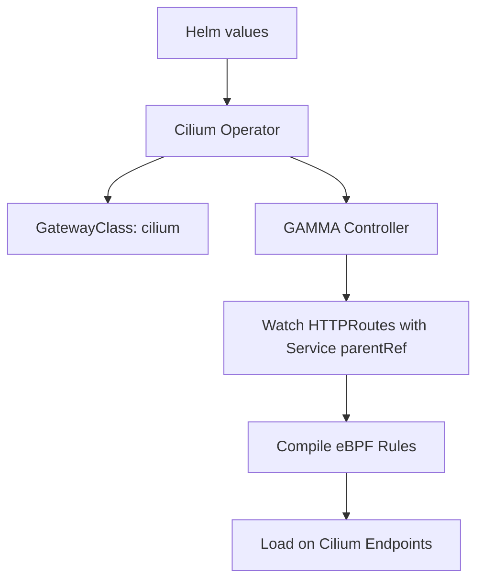

# How to Configure Cilium GAMMA Support in the Cilium Gateway API

Author: [nawazdhandala](https://github.com/nawazdhandala)

Tags: Cilium, Kubernetes, GAMMA, Gateway API, Configuration, Service Mesh

Description: Configure Cilium GAMMA support within the Cilium Gateway API controller to enable sidecar-free service mesh routing using eBPF.

---

## Introduction

Cilium's Gateway API controller includes native GAMMA support that can be enabled alongside standard ingress gateway functionality. The GAMMA controller watches for HTTPRoutes with Service parentRefs and compiles the routing rules into eBPF programs loaded onto the relevant endpoints.

Enabling GAMMA support requires both Helm configuration and installing the experimental Gateway API CRDs. Once enabled, Cilium can simultaneously handle north-south ingress traffic via Gateway resources and east-west mesh traffic via GAMMA HTTPRoutes.

This guide walks through the complete configuration sequence.

## Prerequisites

- Kubernetes 1.25+
- Cilium 1.15+ installed via Helm
- Helm 3.x

## Install Experimental Gateway API CRDs

GAMMA requires experimental CRDs that include mesh route support:

```bash
kubectl apply -f https://github.com/kubernetes-sigs/gateway-api/releases/download/v1.1.0/standard-install.yaml
kubectl apply -f https://github.com/kubernetes-sigs/gateway-api/releases/download/v1.1.0/experimental-install.yaml
```

## Enable Cilium GAMMA Support

```bash
helm upgrade cilium cilium/cilium \
  --namespace kube-system \
  --reuse-values \
  --set gatewayAPI.enabled=true \
  --set gatewayAPI.enableGamma=true
```

## Architecture



## Verify GAMMA is Enabled

```bash
kubectl get cm -n kube-system cilium-config -o yaml | grep -E "gateway|gamma"
```

Check the GatewayClass reflects GAMMA support:

```bash
kubectl describe gatewayclass cilium | grep -A10 "Status"
```

## Create a GAMMA GatewayClass (if needed)

Cilium typically creates a default GatewayClass. If not present:

```yaml
apiVersion: gateway.networking.k8s.io/v1
kind: GatewayClass
metadata:
  name: cilium
spec:
  controllerName: io.cilium/gateway-controller
```

## Deploy a GAMMA HTTPRoute

```yaml
apiVersion: gateway.networking.k8s.io/v1
kind: HTTPRoute
metadata:
  name: mesh-route
  namespace: my-app
spec:
  parentRefs:
    - group: ""
      kind: Service
      name: my-service
      port: 80
  rules:
    - backendRefs:
        - name: my-service-canary
          port: 80
          weight: 10
        - name: my-service-stable
          port: 80
          weight: 90
```

```bash
kubectl apply -f mesh-route.yaml
kubectl get httproute -n my-app
```

## Conclusion

Configuring Cilium GAMMA support in the Gateway API controller enables service mesh routing without sidecar proxies. After installing the experimental CRDs and enabling the GAMMA feature flag, HTTPRoutes targeting Services provide canary deployments, header routing, and traffic splitting at the eBPF layer.
