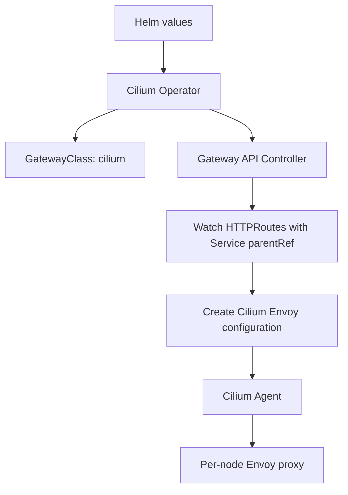

# How to Configure Cilium GAMMA Support in the Cilium Gateway API

Author: [nawazdhandala](https://github.com/nawazdhandala)

Tags: Cilium, Kubernetes, GAMMA, Gateway API, Configuration, Service Mesh

Description: Configure Cilium GAMMA support within the Cilium Gateway API controller to enable sidecar-free service mesh routing using eBPF.

---

## Introduction

Cilium's Gateway API controller includes native GAMMA support that can be enabled alongside standard ingress gateway functionality. The GAMMA support watches for HTTPRoutes with Service parentRefs and programs Cilium's per-node Envoy proxy for east-west Layer 7 routing.

Enabling GAMMA support requires Helm configuration and installing the Gateway API CRDs supported by your Cilium version. Once enabled, Cilium can simultaneously handle north-south ingress traffic via Gateway resources and east-west mesh traffic via GAMMA HTTPRoutes.

This guide walks through the complete configuration sequence.

## Prerequisites

- Kubernetes 1.25+
- Cilium 1.16+ installed via Helm
- Cilium CLI
- Helm 3.x

## Install Gateway API CRDs

Cilium requires the Gateway API CRDs before enabling the controller. For Cilium 1.19, install the Gateway API v1.4.1 CRDs:

```bash
kubectl apply --server-side -f https://github.com/kubernetes-sigs/gateway-api/releases/download/v1.4.1/standard-install.yaml
```

If you need TLSRoute support, install the experimental TLSRoute CRD as well:

```bash
kubectl apply --server-side -f https://raw.githubusercontent.com/kubernetes-sigs/gateway-api/v1.4.1/config/crd/experimental/gateway.networking.k8s.io_tlsroutes.yaml
```

## Enable Cilium GAMMA Support

```bash
helm upgrade cilium cilium/cilium \
  --namespace kube-system \
  --reuse-values \
  --set kubeProxyReplacement=true \
  --set gatewayAPI.enabled=true

kubectl -n kube-system rollout restart deployment/cilium-operator
kubectl -n kube-system rollout restart ds/cilium
```

## Architecture


```mermaid
flowchart TD
    A[Helm values] --> B[Cilium Operator]
    B --> C[GatewayClass: cilium]
    B --> D[Gateway API Controller]
    D --> E[Watch HTTPRoutes with Service parentRef]
    E --> F[Create Cilium Envoy configuration]
    F --> G[Cilium Agent]
    G --> H[Per-node Envoy proxy]
```

## Verify Gateway API is Enabled

```bash
cilium status
```

Check the GatewayClass is present and accepted:

```bash
kubectl describe gatewayclass cilium
```

## Create a Cilium GatewayClass (if needed)

Cilium typically creates a default GatewayClass. If not present:

```yaml
apiVersion: gateway.networking.k8s.io/v1
kind: GatewayClass
metadata:
  name: cilium
spec:
  controllerName: io.cilium/gateway-controller
```

## Deploy a GAMMA HTTPRoute

Create the HTTPRoute in the same namespace as the parent Service:

```yaml
apiVersion: gateway.networking.k8s.io/v1
kind: HTTPRoute
metadata:
  name: mesh-route
  namespace: my-app
spec:
  parentRefs:
    - group: ""
      kind: Service
      name: my-service
      port: 80
  rules:
    - backendRefs:
        - name: my-service-canary
          port: 80
          weight: 10
        - name: my-service-stable
          port: 80
          weight: 90
```

```bash
kubectl apply -f mesh-route.yaml
kubectl get httproute -n my-app
```

## Conclusion

Configuring Cilium GAMMA support in the Gateway API controller enables service mesh routing without sidecar proxies. After installing the Gateway API CRDs and enabling Cilium Gateway API support, HTTPRoutes targeting Services provide canary deployments, header routing, and traffic splitting through Cilium's Layer 7 proxy integration.
