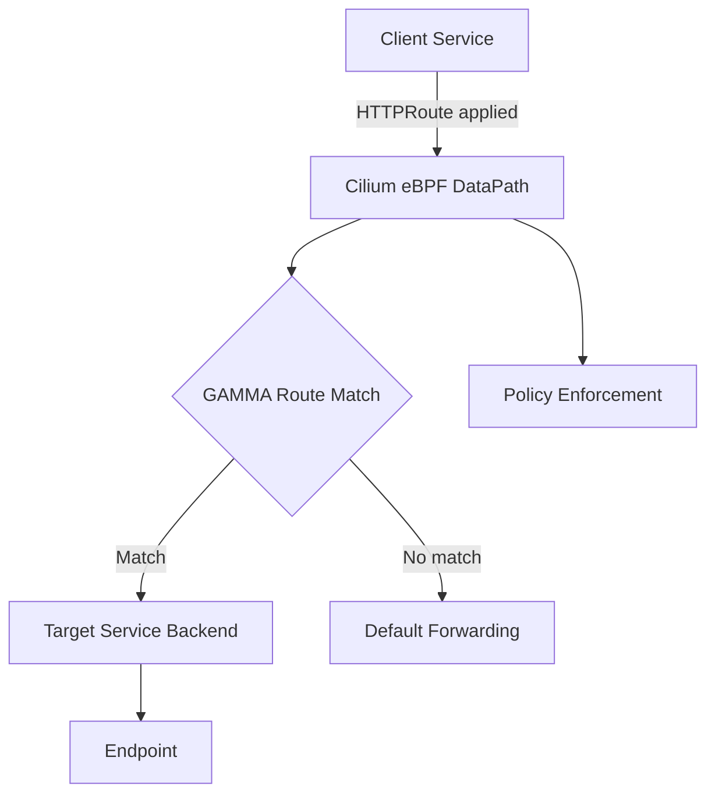

# How to Configure Cilium GAMMA Support

Author: [nawazdhandala](https://github.com/nawazdhandala)

Tags: Cilium, Kubernetes, GAMMA, Gateway API, Service Mesh, eBPF

Description: A guide to configuring Cilium GAMMA (Gateway API for Mesh Management and Administration) support to enable service mesh capabilities without a sidecar proxy.

---

## Introduction

GAMMA (Gateway API for Mesh Management and Administration) is a sub-project of the Kubernetes Gateway API that extends Gateway API semantics to east-west (service-to-service) traffic. Cilium supports GAMMA, enabling identity-aware and policy-driven mesh functionality using eBPF without requiring sidecar injection.

With Cilium GAMMA, you can configure HTTPRoutes that apply to traffic between services within the cluster. This provides advanced traffic management capabilities such as weighted routing, header manipulation, and retries—all handled at the kernel level via eBPF.

This guide walks through enabling and configuring Cilium's GAMMA support in an existing cluster.

## Prerequisites

- Kubernetes 1.25+
- Cilium 1.15+
- Gateway API CRDs v1.1+
- `cilium` and `kubectl` CLIs

## Install Gateway API CRDs

```bash
kubectl apply -f https://github.com/kubernetes-sigs/gateway-api/releases/download/v1.1.0/standard-install.yaml
kubectl apply -f https://github.com/kubernetes-sigs/gateway-api/releases/download/v1.1.0/experimental-install.yaml
```

## Enable GAMMA in Cilium

Enable GAMMA and Gateway API in the Cilium Helm values:

```bash
helm upgrade cilium cilium/cilium --reuse-values \
  --set gatewayAPI.enabled=true \
  --set gatewayAPI.enableGamma=true
```

Verify the feature flags:

```bash
kubectl get cm -n kube-system cilium-config -o yaml | grep -i gamma
```

## Architecture



## Create a GAMMA HTTPRoute

GAMMA HTTPRoutes target a Service (as parentRef) rather than a Gateway:

```yaml
apiVersion: gateway.networking.k8s.io/v1
kind: HTTPRoute
metadata:
  name: service-mesh-route
  namespace: default
spec:
  parentRefs:
    - group: ""
      kind: Service
      name: my-service
      port: 8080
  rules:
    - matches:
        - path:
            type: PathPrefix
            value: /api
      backendRefs:
        - name: api-backend
          port: 8080
          weight: 100
```

Apply the route:

```bash
kubectl apply -f gamma-httproute.yaml
```

## Verify GAMMA Route Status

```bash
kubectl get httproute service-mesh-route -n default
kubectl describe httproute service-mesh-route -n default | grep -A10 Status
```

## Test Traffic Routing

```bash
kubectl run test-client --image=curlimages/curl --rm -it --restart=Never -- \
  curl http://my-service:8080/api/health
```

## Conclusion

Cilium's GAMMA support provides sidecar-free service mesh capabilities using the Gateway API specification. By enabling GAMMA and defining HTTPRoutes that target Services directly, you gain fine-grained traffic control across your Kubernetes workloads without the overhead of proxy injection.
