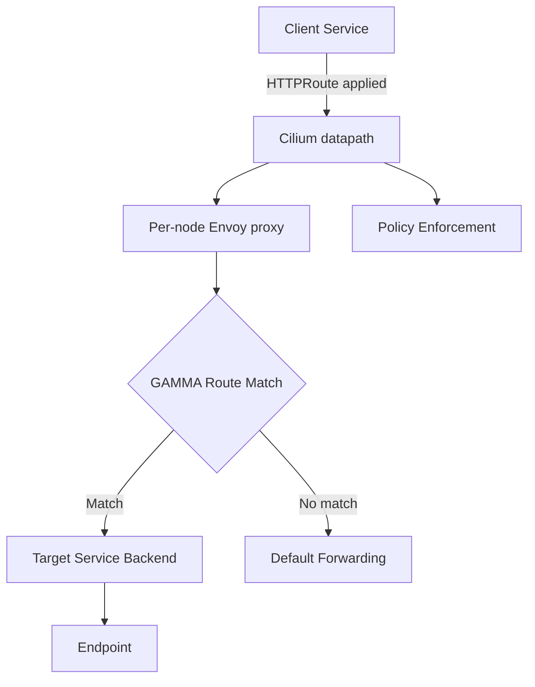

# How to Configure Cilium GAMMA Support

Author: [nawazdhandala](https://github.com/nawazdhandala)

Tags: Cilium, Kubernetes, GAMMA, Gateway API, Service Mesh, eBPF

Description: A guide to configuring Cilium GAMMA (Gateway API for Mesh Management and Administration) support to enable service mesh capabilities without a sidecar proxy.

---

## Introduction

GAMMA (Gateway API for Mesh Management and Administration) is a workstream within the Kubernetes Gateway API project that extends Gateway API semantics to east-west (service-to-service) traffic. Cilium supports GAMMA, enabling identity-aware and policy-driven mesh functionality without requiring sidecar injection.

With Cilium GAMMA, you can configure HTTPRoutes that apply to traffic between services within the cluster. This provides traffic management capabilities such as weighted routing and header manipulation through Cilium's Gateway API controller and per-node Envoy proxy.

This guide walks through enabling and configuring Cilium's GAMMA support in an existing cluster.

## Prerequisites

- A Kubernetes version supported by your Cilium release
- Cilium 1.19+
- Gateway API CRDs v1.4+
- `cilium` and `kubectl` CLIs

## Install Gateway API CRDs

```bash
kubectl apply --server-side -f https://github.com/kubernetes-sigs/gateway-api/releases/download/v1.4.1/standard-install.yaml
```

## Enable GAMMA in Cilium

Enable GAMMA by enabling Gateway API support in the Cilium Helm values:

```bash
helm upgrade cilium cilium/cilium --reuse-values \
  --namespace kube-system \
  --set kubeProxyReplacement=true \
  --set gatewayAPI.enabled=true
```

Then restart the Cilium operator and agent so the updated configuration is picked up:

```bash
kubectl -n kube-system rollout restart deployment/cilium-operator
kubectl -n kube-system rollout restart ds/cilium
```

Verify the feature flags:

```bash
kubectl get cm -n kube-system cilium-config -o yaml | grep -E 'enable-gateway-api|kube-proxy-replacement'
```

## Architecture


```mermaid
flowchart TD
    A[Client Service] -->|HTTPRoute applied| B[Cilium datapath]
    B --> C[Per-node Envoy proxy]
    C --> D{GAMMA Route Match}
    D -->|Match| E[Target Service Backend]
    D -->|No match| F[Default Forwarding]
    E --> G[Endpoint]
    B --> H[Policy Enforcement]
```

## Create a GAMMA HTTPRoute

GAMMA HTTPRoutes target a ClusterIP Service (as parentRef) rather than a Gateway. Cilium currently supports producer routes, so the HTTPRoute must be in the same namespace as the Service it binds to:

```yaml
apiVersion: gateway.networking.k8s.io/v1
kind: HTTPRoute
metadata:
  name: service-mesh-route
  namespace: default
spec:
  parentRefs:
    - group: ""
      kind: Service
      name: my-service
      port: 8080
  rules:
    - matches:
        - path:
            type: PathPrefix
            value: /api
      backendRefs:
        - name: api-backend
          port: 8080
          weight: 100
```

Apply the route:

```bash
kubectl apply -f gamma-httproute.yaml
```

## Verify GAMMA Route Status

```bash
kubectl get httproute service-mesh-route -n default
kubectl describe httproute service-mesh-route -n default | grep -A10 Status
```

## Test Traffic Routing

```bash
kubectl run test-client --image=curlimages/curl --rm -it --restart=Never -- \
  curl http://my-service:8080/api/health
```

## Conclusion

Cilium's GAMMA support provides sidecar-free service mesh capabilities using the Gateway API specification. By enabling Gateway API support and defining HTTPRoutes that target Services directly, you gain fine-grained traffic control across your Kubernetes workloads without the overhead of proxy injection.
