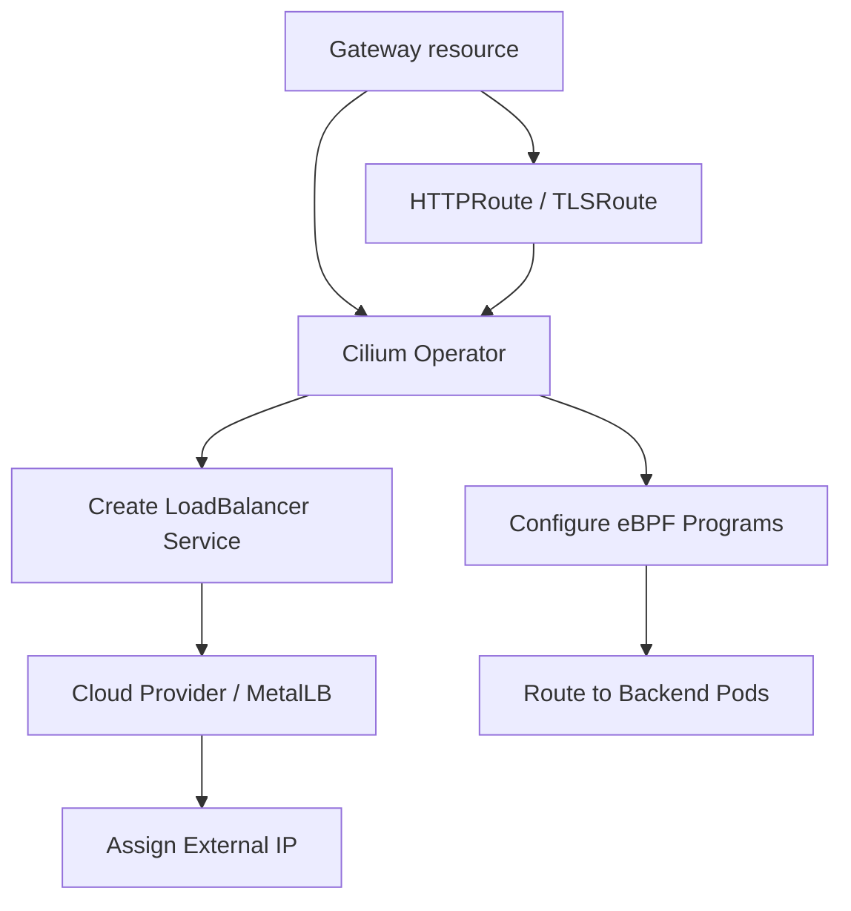

# How to Configure Cilium Gateway API Support

Author: [nawazdhandala](https://github.com/nawazdhandala)

Tags: Cilium, Kubernetes, Gateway API, Ingress, Configuration, eBPF

Description: Configure Cilium Gateway API support to replace traditional Ingress controllers with a standards-based, eBPF-powered ingress solution.

---

## Introduction

Cilium's Gateway API support provides a modern alternative to Kubernetes Ingress, implementing the Gateway API specification using eBPF for high-performance traffic management. It supports HTTP, HTTPS, and TLS passthrough routing, along with advanced features like traffic splitting, header manipulation, and TLS termination.

Enabling Gateway API support in Cilium requires installing the Gateway API CRDs and configuring the Cilium Helm chart. Once enabled, Cilium's operator acts as the Gateway API controller, creating load balancer services and configuring eBPF programs for each Gateway.

This guide covers the complete setup from CRD installation to deploying your first Gateway.

## Prerequisites

- Kubernetes 1.24+
- Cilium 1.13+ installed via Helm
- A cloud provider or MetalLB for load balancer IP assignment

## Install Gateway API CRDs

```bash
kubectl apply -f https://github.com/kubernetes-sigs/gateway-api/releases/download/v1.1.0/standard-install.yaml
```

## Enable Gateway API in Cilium

```bash
helm upgrade cilium cilium/cilium \
  --namespace kube-system \
  --reuse-values \
  --set gatewayAPI.enabled=true
```

Verify the GatewayClass is created:

```bash
kubectl get gatewayclass cilium
```

## Architecture



## Deploy a Gateway

```yaml
apiVersion: gateway.networking.k8s.io/v1
kind: Gateway
metadata:
  name: cilium-gateway
  namespace: default
spec:
  gatewayClassName: cilium
  listeners:
    - name: http
      protocol: HTTP
      port: 80
```

```bash
kubectl apply -f gateway.yaml
kubectl get gateway cilium-gateway -w
```

## Deploy an HTTPRoute

```yaml
apiVersion: gateway.networking.k8s.io/v1
kind: HTTPRoute
metadata:
  name: my-app-route
  namespace: default
spec:
  parentRefs:
    - name: cilium-gateway
  hostnames:
    - "my-app.example.com"
  rules:
    - backendRefs:
        - name: my-app
          port: 8080
```

```bash
kubectl apply -f httproute.yaml
```

## Verify External Access

```bash
GATEWAY_IP=$(kubectl get gateway cilium-gateway \
  -o jsonpath='{.status.addresses[0].value}')
curl -H "Host: my-app.example.com" http://${GATEWAY_IP}/
```

## Conclusion

Configuring Cilium Gateway API support enables standards-based ingress using the Kubernetes Gateway API. The eBPF-powered implementation delivers high performance without traditional proxy overhead, and the declarative configuration model supports advanced routing patterns from day one.
