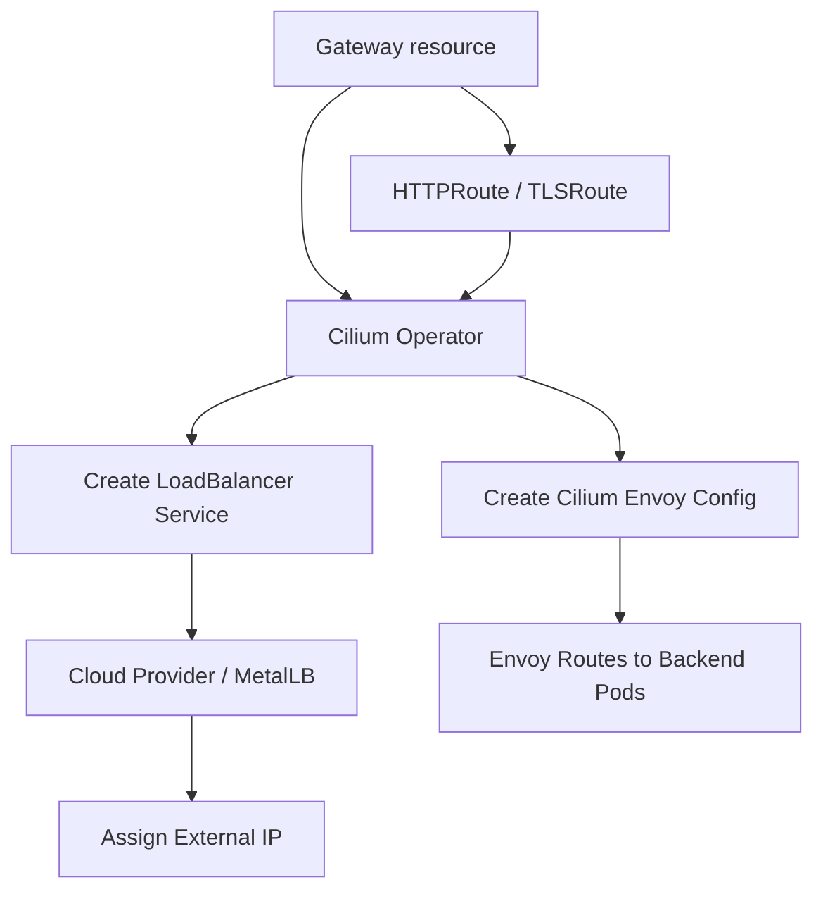

# How to Configure Cilium Gateway API Support

Author: [nawazdhandala](https://github.com/nawazdhandala)

Tags: Cilium, Kubernetes, Gateway API, Ingress, Configuration, eBPF

Description: Configure Cilium Gateway API support to replace traditional Ingress controllers with a standards-based, eBPF-powered ingress solution.

---

## Introduction

Cilium's Gateway API support provides a modern alternative to Kubernetes Ingress, implementing the Gateway API specification with Cilium's eBPF datapath and Envoy integration for high-performance traffic management. It supports HTTP, HTTPS, and TLS passthrough routing when the TLSRoute CRD is installed, along with advanced features like traffic splitting, header manipulation, and TLS termination.

Enabling Gateway API support in Cilium requires installing the Gateway API CRDs and configuring the Cilium Helm chart. Once enabled, Cilium's operator watches Gateway API resources, creates the required load balancer services, and translates valid resources into Cilium Envoy configuration.

This guide covers the complete setup from CRD installation to deploying your first Gateway.

## Prerequisites

- Kubernetes 1.24+
- Cilium installed via Helm with kube-proxy replacement enabled
- A cloud provider or MetalLB for load balancer IP assignment

## Install Gateway API CRDs

```bash
kubectl apply --server-side -f https://github.com/kubernetes-sigs/gateway-api/releases/download/v1.4.1/standard-install.yaml
```

If you plan to use TLS passthrough with TLSRoute, install the experimental TLSRoute CRD as well:

```bash
kubectl apply --server-side -f https://raw.githubusercontent.com/kubernetes-sigs/gateway-api/v1.4.1/config/crd/experimental/gateway.networking.k8s.io_tlsroutes.yaml
```

## Enable Gateway API in Cilium

```bash
helm upgrade cilium cilium/cilium \
  --namespace kube-system \
  --reuse-values \
  --set kubeProxyReplacement=true \
  --set gatewayAPI.enabled=true
kubectl -n kube-system rollout restart deployment/cilium-operator
kubectl -n kube-system rollout restart ds/cilium
```

Verify the GatewayClass is created:

```bash
kubectl get gatewayclass cilium
```

## Architecture


```mermaid
flowchart TD
    A[Gateway resource] --> B[Cilium Operator]
    B --> C[Create LoadBalancer Service]
    C --> D[Cloud Provider / MetalLB]
    D --> E[Assign External IP]
    B --> F[Create Cilium Envoy Config]
    F --> G[Envoy Routes to Backend Pods]
    A --> H[HTTPRoute / TLSRoute]
    H --> B
```

## Deploy a Gateway

```yaml
apiVersion: gateway.networking.k8s.io/v1
kind: Gateway
metadata:
  name: cilium-gateway
  namespace: default
spec:
  gatewayClassName: cilium
  listeners:
    - name: http
      protocol: HTTP
      port: 80
```

```bash
kubectl apply -f gateway.yaml
kubectl get gateway cilium-gateway -w
```

## Deploy an HTTPRoute

```yaml
apiVersion: gateway.networking.k8s.io/v1
kind: HTTPRoute
metadata:
  name: my-app-route
  namespace: default
spec:
  parentRefs:
    - name: cilium-gateway
  hostnames:
    - "my-app.example.com"
  rules:
    - backendRefs:
        - name: my-app
          port: 8080
```

```bash
kubectl apply -f httproute.yaml
```

## Verify External Access

```bash
GATEWAY_IP=$(kubectl get gateway cilium-gateway \
  -o jsonpath='{.status.addresses[0].value}')
curl -H "Host: my-app.example.com" http://${GATEWAY_IP}/
```

## Conclusion

Configuring Cilium Gateway API support enables standards-based ingress using the Kubernetes Gateway API. The implementation integrates Cilium's eBPF datapath with Envoy-based L7 routing, and the declarative configuration model supports advanced routing patterns from day one.
