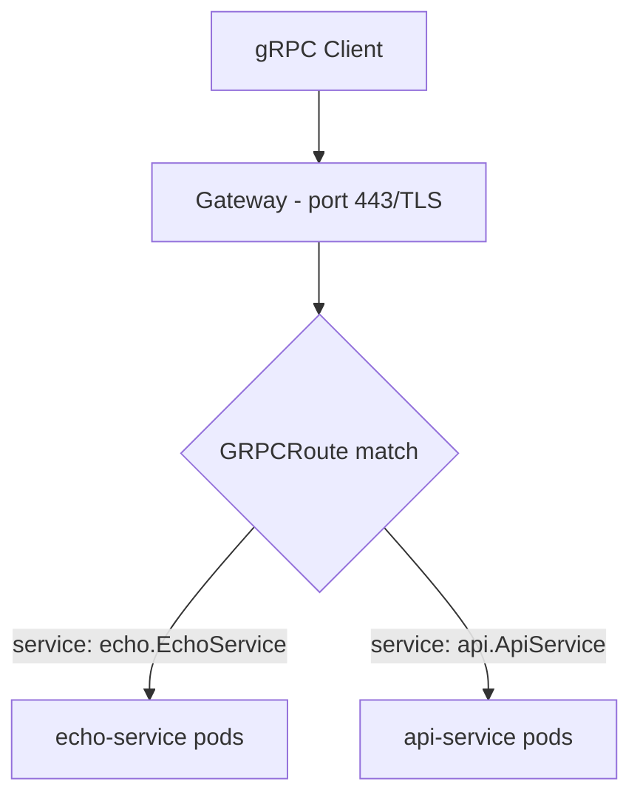

# How to Configure gRPC Routing in the Cilium Gateway API

Author: [nawazdhandala](https://github.com/nawazdhandala)

Tags: Cilium, Kubernetes, gRPC, Gateway API, Routing, Service Mesh

Description: Configure gRPC routing in Cilium's Gateway API implementation using GRPCRoute resources to route gRPC service calls to backend pods.

---

## Introduction

Cilium's Gateway API implementation supports GRPCRoute resources, enabling native gRPC routing at the gateway level. GRPCRoute provides gRPC-aware routing rules including service name matching, method-level routing, and header-based routing—all without requiring application-level load balancing.

GRPCRoute is part of the Gateway API experimental specification and requires the experimental CRDs to be installed alongside the standard ones.

## Prerequisites

- Cilium with Gateway API enabled
- Experimental Gateway API CRDs installed
- gRPC backend services deployed

## Install Experimental CRDs

```bash
kubectl apply -f https://github.com/kubernetes-sigs/gateway-api/releases/download/v1.1.0/experimental-install.yaml
```

## Architecture



## Deploy a TLS Gateway for gRPC

gRPC over HTTP/2 typically uses TLS:

```yaml
apiVersion: gateway.networking.k8s.io/v1
kind: Gateway
metadata:
  name: grpc-gateway
  namespace: grpc-demo
spec:
  gatewayClassName: cilium
  listeners:
    - name: https
      protocol: HTTPS
      port: 443
      tls:
        certificateRefs:
          - kind: Secret
            name: grpc-tls
```

## Create a GRPCRoute

```yaml
apiVersion: gateway.networking.k8s.io/v1alpha2
kind: GRPCRoute
metadata:
  name: echo-grpc-route
  namespace: grpc-demo
spec:
  parentRefs:
    - name: grpc-gateway
  hostnames:
    - "grpc.example.com"
  rules:
    - matches:
        - method:
            service: "echo.EchoService"
            method: "Echo"
      backendRefs:
        - name: echo-service
          port: 50051
```

## Make a gRPC Test Request

```bash
# Using grpcurl
GATEWAY_IP=$(kubectl get gateway grpc-gateway -n grpc-demo \
  -o jsonpath='{.status.addresses[0].value}')

grpcurl -d '{"message": "hello"}' \
  -authority grpc.example.com \
  ${GATEWAY_IP}:443 echo.EchoService/Echo
```

## Verify GRPCRoute Status

```bash
kubectl describe grpcroute echo-grpc-route -n grpc-demo
```

Check `Accepted` and `ResolvedRefs` conditions are both `True`.

## Route by Service Name

Route different gRPC services to different backends:

```yaml
spec:
  rules:
    - matches:
        - method:
            service: "v1.UserService"
      backendRefs:
        - name: user-service-v1
          port: 50051
    - matches:
        - method:
            service: "v2.UserService"
      backendRefs:
        - name: user-service-v2
          port: 50051
```

## Conclusion

Configuring gRPC routing in Cilium's Gateway API provides native protocol-level routing for gRPC services. GRPCRoute resources enable service and method-level routing rules that integrate with Cilium's eBPF datapath, delivering high-performance gRPC load balancing without external proxy dependencies.
