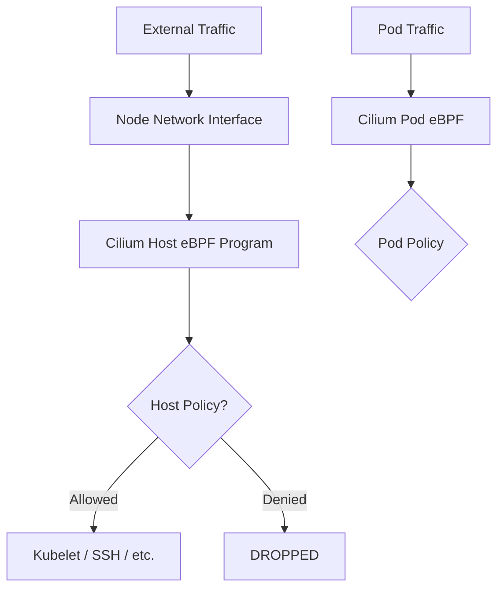

# How to Secure Cilium Host Firewall

Author: [nawazdhandala](https://github.com/nawazdhandala)

Tags: Cilium, Kubernetes, Host Firewall, Security, eBPF, Node Security

Description: Configure the Cilium Host Firewall to secure node-level network traffic using CiliumNetworkPolicies applied to host endpoints.

---

## Introduction

The Cilium Host Firewall extends Cilium's network policy enforcement to the node's own network stack, not just the pod network. This means you can apply the same eBPF-based policy enforcement to traffic entering or leaving the Kubernetes node itself-including SSH, API server, kubelet, and etcd traffic.

Traditional node firewalls use iptables or nftables rules. The Cilium Host Firewall replaces these with eBPF programs, providing richer policy capabilities including identity-aware rules and L7 filtering for node traffic.

## Prerequisites

- Cilium 1.10+
- Kernel 5.3+ (for host endpoint policy)
- `kubectl` with kube-system access

## Enable the Host Firewall

```bash
helm upgrade cilium cilium/cilium \
  --namespace kube-system \
  --reuse-values \
  --set hostFirewall.enabled=true
```

## Architecture



## Enable Policy Audit Mode First

Before enforcing, run in audit mode to understand current traffic:

```bash
# Apply audit mode annotation to the node's host endpoint
kubectl annotate node <node-name> \
  policy.cilium.io/host-firewall-mode=audit
```

## Apply a Host Network Policy

Label the node and create a policy:

```bash
kubectl label node <node-name> environment=production
```

```yaml
apiVersion: cilium.io/v2
kind: CiliumClusterwideNetworkPolicy
metadata:
  name: node-host-policy
spec:
  nodeSelector:
    matchLabels:
      environment: production
  ingress:
    - fromEntities:
        - cluster
      toPorts:
        - ports:
            - port: "10250"
              protocol: TCP
    - toPorts:
        - ports:
            - port: "22"
              protocol: TCP
```

## Switch to Enforcement Mode

After verifying audit mode shows no unexpected drops:

```bash
kubectl annotate node <node-name> \
  policy.cilium.io/host-firewall-mode=policy
```

## Verify Policy Enforcement

```bash
kubectl exec -n kube-system ds/cilium -- \
  cilium-dbg endpoint list | grep -i "host"
```

## Emergency Recovery

If locked out via SSH due to misconfigured host policy:

```bash
# Disable enforcement on the node
kubectl annotate node <node-name> \
  policy.cilium.io/host-firewall-mode=disabled --overwrite
```

## Conclusion

The Cilium Host Firewall provides eBPF-based node-level traffic control using the same policy API as pod network policies. Always use audit mode before enforcement to prevent lockouts, and ensure SSH and critical infrastructure ports are explicitly allowed before switching to enforcement mode.
