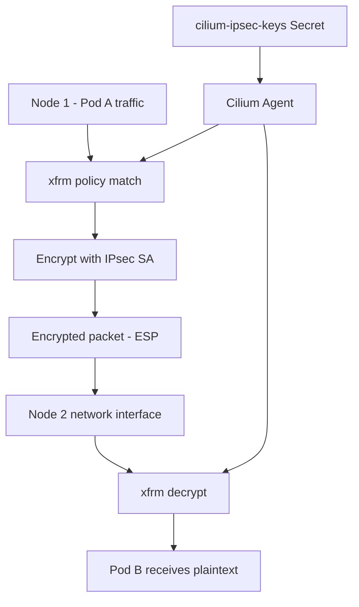

# How to Configure Cilium IPsec Transparent Encryption

Author: [nawazdhandala](https://github.com/nawazdhandala)

Tags: Cilium, Kubernetes, IPsec, Encryption, Security, eBPF

Description: Configure Cilium's IPsec transparent encryption mode to encrypt pod-to-pod traffic using the Linux kernel's native IPsec (xfrm) framework.

---

## Introduction

Cilium's IPsec transparent encryption uses the Linux kernel's built-in xfrm framework to encrypt traffic between nodes. Unlike WireGuard, IPsec requires manual key management but provides FIPS-compatible encryption algorithms and integrates with existing IPsec-aware network infrastructure.

IPsec encryption in Cilium works by installing xfrm states and policies on each node. The Cilium agent manages key distribution through a Kubernetes Secret and automatically updates nodes when keys rotate.

This guide covers the complete IPsec configuration, key management, and verification steps.

## Prerequisites

- Linux kernel 4.19+
- Cilium 1.10+
- `kubectl` with kube-system access

## Generate IPsec Pre-Shared Key

```bash
PSK=$(dd if=/dev/urandom count=20 bs=1 2>/dev/null | xxd -p -l 20)
echo "Generated PSK: ${PSK}"
```

Create the Kubernetes Secret with the key in the required format:

```bash
kubectl create secret generic cilium-ipsec-keys \
  --namespace kube-system \
  --from-literal=keys="3 rfc4106(gcm(aes)) ${PSK} 128"
```

The format is: `<SPI> <algorithm> <key> <key-length>`.

## Enable IPsec Encryption

```bash
helm upgrade cilium cilium/cilium \
  --namespace kube-system \
  --reuse-values \
  --set encryption.enabled=true \
  --set encryption.type=ipsec
```

## Architecture



## Verify IPsec Setup

```bash
# Check encryption status
kubectl exec -n kube-system ds/cilium -- cilium-dbg encrypt status

# Check xfrm states on a node (run on the node directly)
ip xfrm state
ip xfrm policy
```

## Monitor Encryption Status

```bash
kubectl exec -n kube-system ds/cilium -- \
  cilium-dbg monitor --type drop | grep -i ipsec
```

## Key Rotation

Rotate the PSK to a new key while maintaining connectivity:

```bash
NEW_PSK=$(dd if=/dev/urandom count=20 bs=1 2>/dev/null | xxd -p -l 20)

# Use SPI 4 (increment from previous 3)
kubectl create secret generic cilium-ipsec-keys \
  --namespace kube-system \
  --from-literal=keys="4 rfc4106(gcm(aes)) ${NEW_PSK} 128" \
  --dry-run=client -o yaml | kubectl apply -f -
```

Cilium performs a rolling key rotation without dropping connections.

## Limitations

- IPsec adds packet overhead (ESP header)
- Performance lower than WireGuard for high-throughput workloads
- Key rotation requires careful sequencing

## Conclusion

Cilium IPsec transparent encryption provides kernel-native encryption for pod-to-pod traffic. It is well-suited for environments requiring FIPS compliance or integration with existing IPsec infrastructure. Key rotation is handled automatically by Cilium when the Secret is updated.
