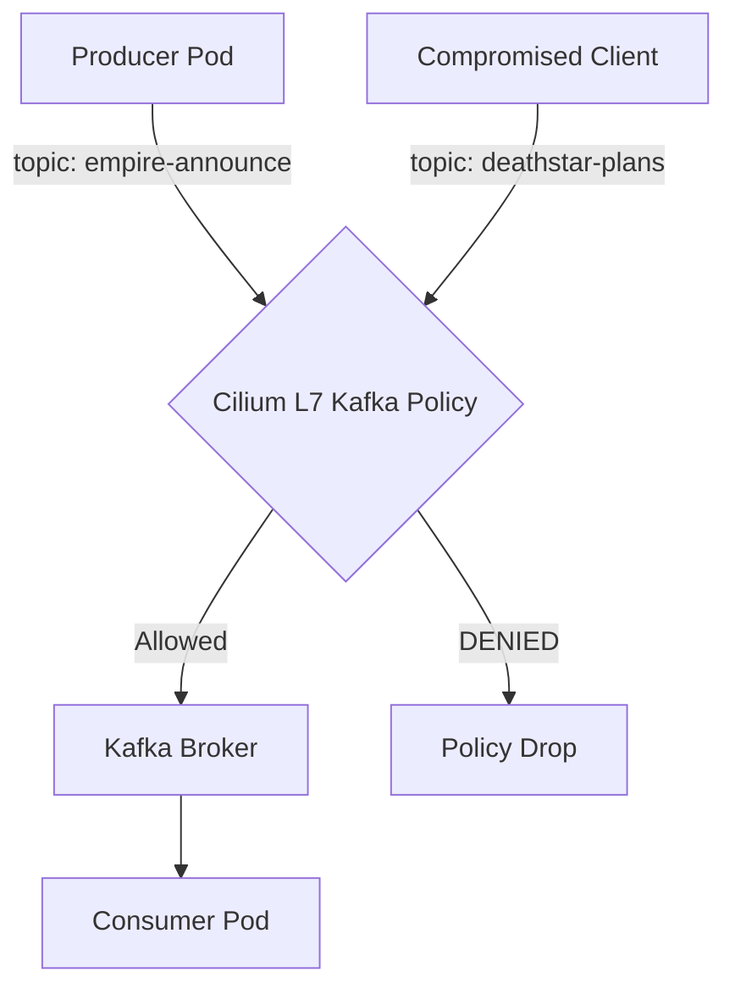

# How to Secure a Kafka Cluster with Cilium

Author: [nawazdhandala](https://github.com/nawazdhandala)

Tags: Cilium, Kubernetes, Kafka, Security, L7 Policy, eBPF

Description: Use Cilium L7 network policies to control which producers and consumers can access specific Kafka topics in Kubernetes.

---

## Introduction

Running Kafka in Kubernetes without network-level access control means any pod in the cluster can produce or consume from any topic. Cilium solves this with L7 Kafka-aware network policies that understand the Kafka wire protocol and can enforce access rules at the topic and operation level.

This is significantly more powerful than IP-based firewall rules: a compromised client that obtains the broker's IP and port cannot produce to unauthorized topics if Cilium's Kafka policy is in place.

## Prerequisites

- Cilium 1.6+ (Kafka L7 policy support)
- Kafka deployed in Kubernetes
- `kubectl` CLI

## Deploy Kafka

```bash
kubectl apply -f https://raw.githubusercontent.com/cilium/cilium/main/examples/kubernetes-kafka/kafka.yaml
```

This deploys Zookeeper, Kafka broker, and test client pods.

## Architecture



## Test Baseline Access (No Policy)

```bash
# Produce to a topic
kubectl exec -it kafka-client -- \
  kafka-console-producer.sh --topic empire-announce \
  --broker-list kafka:9092

# Consume from a topic
kubectl exec -it kafka-client -- \
  kafka-console-consumer.sh --topic empire-announce \
  --bootstrap-server kafka:9092 --from-beginning
```

## Apply Kafka L7 Policy

Allow only specific topic access per client:

```yaml
apiVersion: cilium.io/v2
kind: CiliumNetworkPolicy
metadata:
  name: kafka-policy
  namespace: default
spec:
  endpointSelector:
    matchLabels:
      app: kafka
  ingress:
    - fromEndpoints:
        - matchLabels:
            app: empire-hq
      toPorts:
        - ports:
            - port: "9092"
              protocol: TCP
          rules:
            kafka:
              - topic: "empire-announce"
                apiKey: "produce"
              - topic: "empire-announce"
                apiKey: "fetch"
    - fromEndpoints:
        - matchLabels:
            app: empire-outpost
      toPorts:
        - ports:
            - port: "9092"
              protocol: TCP
          rules:
            kafka:
              - topic: "empire-announce"
                apiKey: "fetch"
```

```bash
kubectl apply -f kafka-policy.yaml
```

## Verify Policy Enforcement

Try to produce to an unauthorized topic:

```bash
kubectl exec -it empire-outpost -- \
  kafka-console-producer.sh --topic deathstar-plans \
  --broker-list kafka:9092
```

Expected: Connection refused or error from Cilium policy enforcement.

## Monitor Kafka Traffic with Hubble

```bash
hubble observe --namespace default \
  --to-label app=kafka \
  --verdict DROPPED
```

## Conclusion

Cilium's Kafka-aware L7 policies enforce topic-level access control in the Kubernetes network layer, preventing unauthorized producers and consumers without requiring changes to Kafka's own ACL system. This provides defense-in-depth for Kafka deployments where standard authentication may be insufficient.
