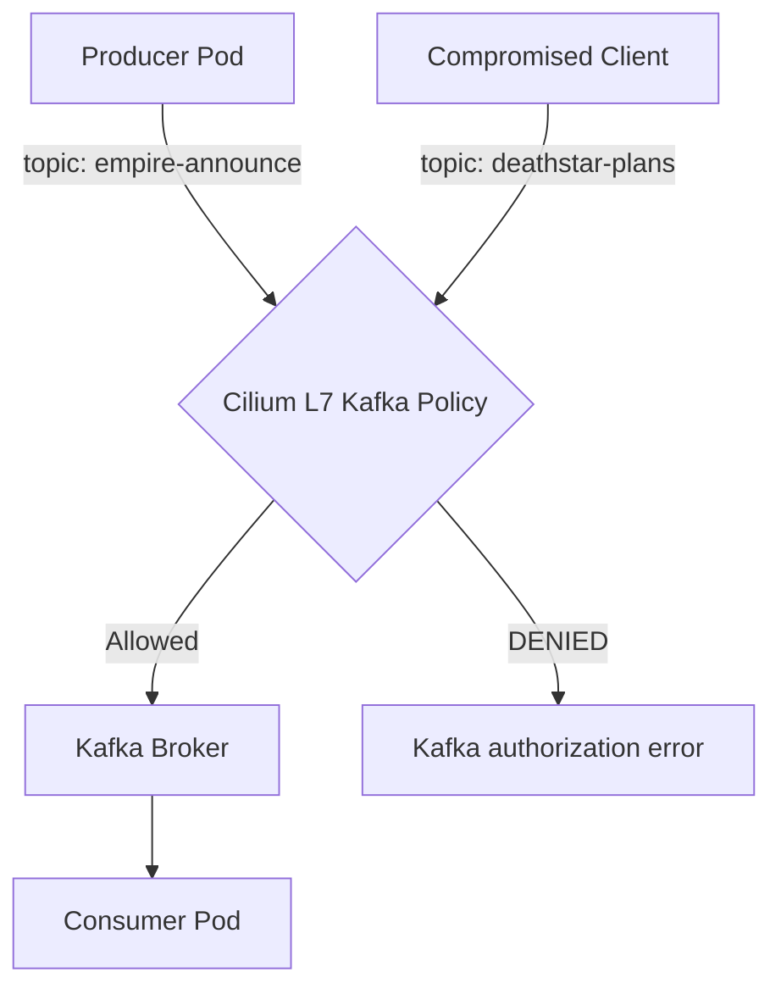

# How to Secure a Kafka Cluster with Cilium

Author: [nawazdhandala](https://github.com/nawazdhandala)

Tags: Cilium, Kubernetes, Kafka, Security, L7 Policy, eBPF

Description: Use Cilium L7 network policies to control which producers and consumers can access specific Kafka topics in Kubernetes.

---

## Introduction

Running Kafka in Kubernetes without Kafka ACLs or network-level access control can allow pods in the cluster to produce or consume from topics they should not access. Cilium solves this with L7 Kafka-aware network policies that understand the Kafka wire protocol and can enforce access rules at the topic and operation level.

This is significantly more powerful than IP-based firewall rules: a compromised client that obtains the broker's IP and port cannot produce to unauthorized topics if Cilium's Kafka policy is in place.

## Prerequisites

- Cilium with Kafka L7 policy support (Kafka L7 policy is deprecated in current Cilium releases and may be removed in a future release)
- Kafka deployed in Kubernetes
- `kubectl` CLI
- Hubble enabled and the `hubble` CLI installed, if you want to observe flows

## Deploy Kafka

```bash
kubectl apply -f https://raw.githubusercontent.com/cilium/cilium/1.19.4/examples/kubernetes-kafka/kafka-sw-app.yaml
```

This deploys Zookeeper, a Kafka broker, Kafka service, and test client deployments.

## Architecture


```mermaid
flowchart TD
    A[Producer Pod] -->|topic: empire-announce| B{Cilium L7 Kafka Policy}
    B -->|Allowed| C[Kafka Broker]
    D[Compromised Client] -->|topic: deathstar-plans| B
    B -->|DENIED| E[Kafka authorization error]
    C --> F[Consumer Pod]
```

## Test Baseline Access (No Policy)

```bash
HQ_POD=$(kubectl get pods -l app=empire-hq -o jsonpath='{.items[0].metadata.name}')
OUTPOST_POD=$(kubectl get pods -l outpostid=9999 -o jsonpath='{.items[0].metadata.name}')

# Produce to a topic
echo "Operational update" | kubectl exec -i "$HQ_POD" -- \
  ./kafka-produce.sh --topic empire-announce

# Consume from a topic
kubectl exec -it "$OUTPOST_POD" -- \
  ./kafka-consume.sh --topic empire-announce
```

## Apply Kafka L7 Policy

Allow only specific topic access per client:

```yaml
apiVersion: cilium.io/v2
kind: CiliumNetworkPolicy
metadata:
  name: kafka-policy
  namespace: default
spec:
  endpointSelector:
    matchLabels:
      app: kafka
  ingress:
    - fromEndpoints:
        - matchLabels:
            app: empire-hq
      toPorts:
        - ports:
            - port: "9092"
              protocol: TCP
          rules:
            kafka:
              - topic: "empire-announce"
                role: "produce"
    - fromEndpoints:
        - matchLabels:
            app: empire-outpost
      toPorts:
        - ports:
            - port: "9092"
              protocol: TCP
          rules:
            kafka:
              - topic: "empire-announce"
                role: "consume"
```

```bash
kubectl apply -f kafka-policy.yaml
```

## Verify Policy Enforcement

Try to produce to an unauthorized topic:

```bash
echo "stolen plans" | kubectl exec -i "$OUTPOST_POD" -- \
  ./kafka-produce.sh --topic deathstar-plans
```

Expected: Kafka reports a topic authorization error because the Cilium policy does not allow this Kafka request.

## Monitor Kafka Traffic with Hubble

```bash
hubble observe --namespace default \
  --to-label app=kafka
```

## Conclusion

Cilium's Kafka-aware L7 policies enforce topic-level access control in the Kubernetes network layer, preventing unauthorized producers and consumers without requiring changes to Kafka's own ACL system. This provides defense-in-depth for Kafka deployments where standard authentication may be insufficient.
