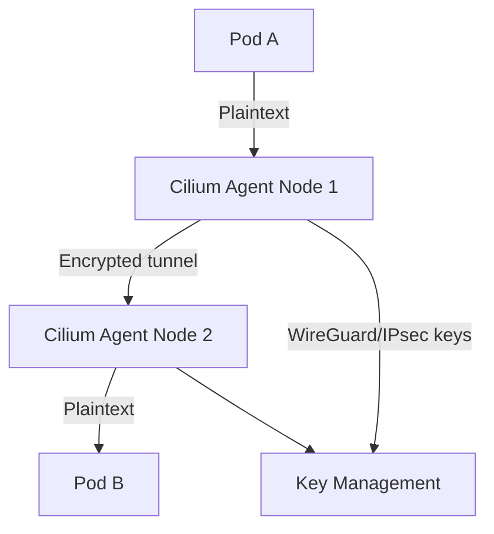

# How to Configure Cilium Transparent Encryption

Author: [nawazdhandala](https://github.com/nawazdhandala)

Tags: Cilium, Kubernetes, Encryption, Security, WireGuard, IPsec, eBPF

Description: Configure Cilium transparent encryption to encrypt all pod-to-pod traffic automatically using either WireGuard or IPsec without modifying application code.

---

## Introduction

Cilium transparent encryption encrypts all traffic between pods at the network layer, providing confidentiality and integrity without requiring applications to implement TLS themselves. This satisfies compliance requirements for data-in-transit encryption and defends against network-level eavesdropping.

Cilium supports two encryption modes: WireGuard, which is simpler to configure and uses modern cryptography, and IPsec, which is more widely supported in enterprise environments and integrates with existing VPN infrastructure. Both modes are transparent to applications.

This guide covers configuring both modes and explains key tradeoffs.

## Prerequisites

- Cilium 1.10+
- Kubernetes cluster with nodes supporting WireGuard (kernel 5.6+) or IPsec
- Helm 3.x

## Choose Your Encryption Mode

| Feature | WireGuard | IPsec |
|---------|-----------|-------|
| Kernel version | 5.6+ | 4.19+ |
| Performance | Excellent | Good |
| Key management | Automatic | Manual rotation needed |
| FIPS compliance | No | Yes (with xfrm) |

## Configure WireGuard Encryption

```bash
helm upgrade cilium cilium/cilium \
  --namespace kube-system \
  --reuse-values \
  --set encryption.enabled=true \
  --set encryption.type=wireguard
```

## Configure IPsec Encryption

Generate and create the Pre-Shared Key secret:

```bash
PSK=$(dd if=/dev/urandom count=20 bs=1 2>/dev/null | xxd -p -l 20)
kubectl create secret generic cilium-ipsec-keys \
  --namespace kube-system \
  --from-literal=keys="3 rfc4106(gcm(aes)) ${PSK} 128"
```

Enable IPsec:

```bash
helm upgrade cilium cilium/cilium \
  --namespace kube-system \
  --reuse-values \
  --set encryption.enabled=true \
  --set encryption.type=ipsec
```

## Architecture



## Verify Encryption is Active

```bash
cilium status | grep Encryption
kubectl exec -n kube-system ds/cilium -- \
  cilium-dbg encrypt status
```

For WireGuard, check interfaces:

```bash
# Run on a node
wg show
```

## Verify Traffic is Encrypted

Use tcpdump on a node interface and verify pod-to-pod traffic is not plaintext:

```bash
# On the node (not inside a pod)
sudo tcpdump -i <node-interface> -n not port 22 -c 10
```

WireGuard traffic appears as UDP on port 51871.

## Key Rotation for IPsec

```bash
NEW_PSK=$(dd if=/dev/urandom count=20 bs=1 2>/dev/null | xxd -p -l 20)
kubectl patch secret cilium-ipsec-keys -n kube-system \
  --type merge \
  -p '{"data":{"keys":"'$(echo -n "4 rfc4106(gcm(aes)) ${NEW_PSK} 128" | base64)'"}}'
```

## Conclusion

Cilium transparent encryption provides automatic pod-to-pod traffic encryption with minimal configuration. WireGuard offers the simplest setup with modern cryptography, while IPsec provides broader compatibility. Both modes require no application changes and are enforced at the eBPF layer.
