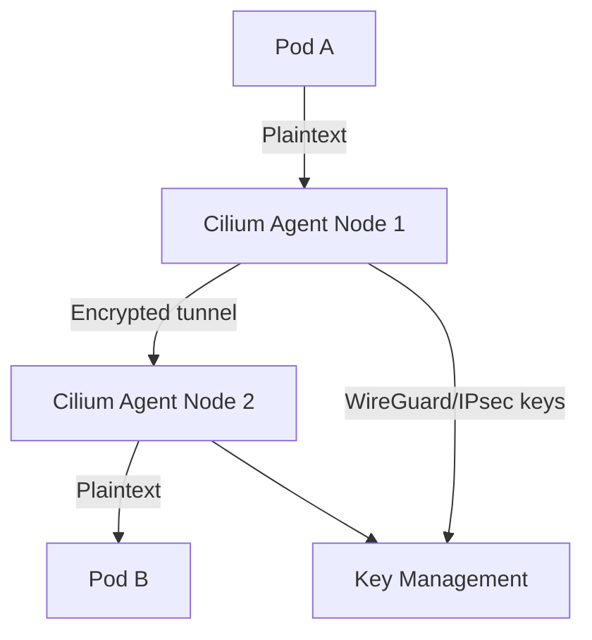

# How to Configure Cilium Transparent Encryption

Author: [nawazdhandala](https://github.com/nawazdhandala)

Tags: Cilium, Kubernetes, Encryption, Security, WireGuard, IPsec, eBPF

Description: Configure Cilium transparent encryption to encrypt all pod-to-pod traffic automatically using either WireGuard or IPsec without modifying application code.

---

## Introduction

Cilium transparent encryption encrypts cross-node traffic between Cilium-managed pods at the network layer, providing confidentiality and integrity without requiring applications to implement TLS themselves. Traffic between pods on the same node is not encrypted, because the raw traffic can already be observed on that node. This helps satisfy data-in-transit encryption requirements and defends against network-level eavesdropping between nodes.

Cilium supports transparent encryption with WireGuard, IPsec, and ztunnel. This guide covers WireGuard, which is simpler to configure and uses modern cryptography, and IPsec, which uses the Linux XFRM/IPsec stack and is familiar in enterprise environments. Both modes are transparent to applications.

This guide covers configuring both modes and explains key tradeoffs.

## Prerequisites

- A current Cilium release
- Kubernetes cluster with nodes that meet Cilium's Linux kernel requirements and support WireGuard or IPsec/XFRM
- Helm 3.x

## Choose Your Encryption Mode

| Feature | WireGuard | IPsec |
|---------|-----------|-------|
| Kernel support | Linux 5.6+ in-kernel WireGuard, or an out-of-tree module on older kernels | Linux XFRM and ESP kernel options for the selected algorithm |
| Performance | Excellent | Good |
| Key management | Automatic | Manual rotation needed |
| Compliance fit | Usually not used for FIPS-bound deployments | Often easier to align with FIPS-bound deployments, depending on the validated crypto modules in use |

## Configure WireGuard Encryption

```bash
helm upgrade cilium cilium/cilium \
  --namespace kube-system \
  --reuse-values \
  --set encryption.enabled=true \
  --set encryption.type=wireguard
```

## Configure IPsec Encryption

Generate and create the Pre-Shared Key secret:

```bash
PSK=$(dd if=/dev/urandom count=20 bs=1 2>/dev/null | xxd -p -l 20)
kubectl create secret generic cilium-ipsec-keys \
  --namespace kube-system \
  --from-literal=keys="3+ rfc4106(gcm(aes)) ${PSK} 128"
```

Enable IPsec:

```bash
helm upgrade cilium cilium/cilium \
  --namespace kube-system \
  --reuse-values \
  --set encryption.enabled=true \
  --set encryption.type=ipsec
```

## Architecture


```mermaid
flowchart TD
    A[Pod A] -->|Plaintext| B[Cilium Agent Node 1]
    B -->|Encrypted tunnel| C[Cilium Agent Node 2]
    C -->|Plaintext| D[Pod B]
    B -->|WireGuard/IPsec keys| E[Key Management]
    C --> E
```

## Verify Encryption is Active

```bash
kubectl exec -n kube-system ds/cilium -- \
  cilium-dbg status | grep Encryption
kubectl exec -n kube-system ds/cilium -- \
  cilium-dbg encrypt status
```

For WireGuard, check interfaces:

```bash
# Run on a node

wg show
```

## Verify Traffic is Encrypted

Use tcpdump on a node interface and verify pod-to-pod traffic is not plaintext:

```bash
# On the node (not inside a pod)
sudo tcpdump -i <node-interface> -n 'udp port 51871 or esp' -c 10
```

WireGuard traffic appears as UDP on port 51871. IPsec traffic appears as ESP.

## Key Rotation for IPsec

```bash
KEYID=$(kubectl get secret -n kube-system cilium-ipsec-keys \
  -o go-template --template='{{.data.keys}}' | base64 -d | grep -oP '^\d+')
if [[ ${KEYID} -ge 15 ]]; then KEYID=0; fi
NEW_PSK=$(dd if=/dev/urandom count=20 bs=1 2>/dev/null | xxd -p -c 64)
kubectl patch secret -n kube-system cilium-ipsec-keys \
  -p "{\"stringData\":{\"keys\":\"$((KEYID + 1))+ rfc4106(gcm(aes)) ${NEW_PSK} 128\"}}"
```

## Conclusion

Cilium transparent encryption provides automatic cross-node pod-to-pod traffic encryption with minimal configuration. WireGuard offers the simplest setup with modern cryptography, while IPsec provides broader compatibility. Both modes require no application changes and are enforced by Cilium's datapath.
