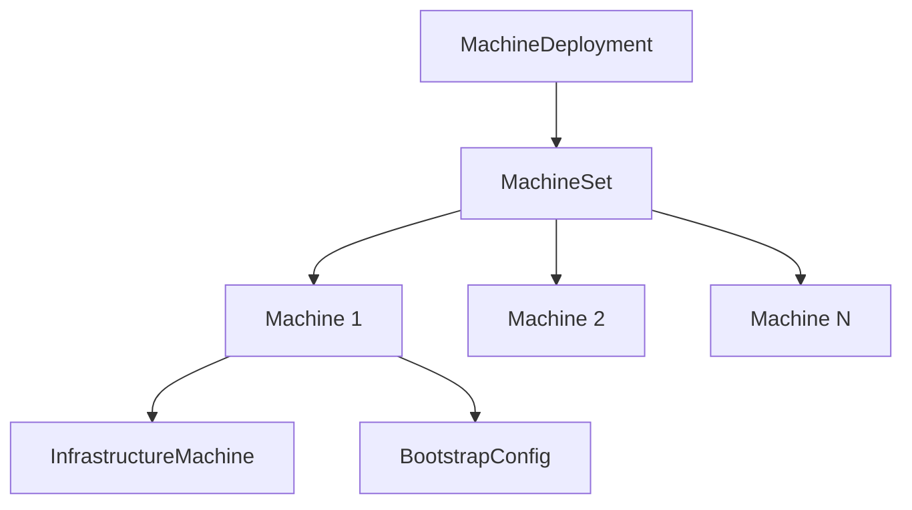

# How to Configure Cluster API Machine Deployments with Flux

Author: [nawazdhandala](https://github.com/nawazdhandala)

Tags: Flux CD, Cluster API, CAPI, MachineDeployment, GitOps, Kubernetes, Multi-Cluster

Description: Manage Cluster API MachineDeployment resources using Flux CD GitOps to declaratively control worker node pools for Kubernetes clusters.

---

## Introduction

MachineDeployment is the Cluster API resource for managing groups of worker nodes. It is analogous to a Kubernetes Deployment-it maintains a desired number of Machine replicas and handles rolling updates when the node configuration changes. Managing MachineDeployments through Flux means node pool configuration, scaling events, and machine template updates are all version-controlled and continuously reconciled.

When a platform engineer changes the instance type or node count in a MachineDeployment manifest, Flux applies the change to the management cluster, and CAPI performs a rolling update of the worker nodes. This brings the same controlled, reviewable process to infrastructure scaling that Kubernetes Deployments bring to application scaling.

This guide covers defining MachineDeployments for different workload types, configuring rolling update strategies, and managing them with Flux CD.

## Prerequisites

- Cluster API installed on the management cluster with a cloud provider
- Flux CD bootstrapped on the management cluster
- An existing CAPI Cluster resource
- `kubectl` CLI installed

## Step 1: Understand MachineDeployment Architecture



## Step 2: Create a Standard Worker MachineDeployment

```yaml
# clusters/workloads/production-cluster/machinedeployment-default.yaml
apiVersion: cluster.x-k8s.io/v1beta1
kind: MachineDeployment
metadata:
  name: production-cluster-workers-default
  namespace: default
  labels:
    cluster.x-k8s.io/cluster-name: production-cluster
    pool: default
spec:
  clusterName: production-cluster
  # Number of worker nodes in this pool
  replicas: 3
  selector:
    matchLabels:
      cluster.x-k8s.io/cluster-name: production-cluster
      pool: default
  strategy:
    type: RollingUpdate
    rollingUpdate:
      # Maximum nodes that can be unavailable during rolling update
      maxUnavailable: 0
      # Maximum nodes above desired count during rolling update
      maxSurge: 1
  template:
    metadata:
      labels:
        cluster.x-k8s.io/cluster-name: production-cluster
        pool: default
    spec:
      clusterName: production-cluster
      version: v1.29.2
      bootstrap:
        configRef:
          apiVersion: bootstrap.cluster.x-k8s.io/v1beta1
          kind: KubeadmConfigTemplate
          name: production-cluster-workers-default
      infrastructureRef:
        apiVersion: infrastructure.cluster.x-k8s.io/v1beta2
        kind: AWSMachineTemplate
        name: production-cluster-workers-default
```

## Step 3: Create Specialized Node Pools

Different workload types benefit from different instance types and configurations.

```yaml
# clusters/workloads/production-cluster/machinedeployment-compute.yaml
# High-CPU pool for compute-intensive workloads
apiVersion: cluster.x-k8s.io/v1beta1
kind: MachineDeployment
metadata:
  name: production-cluster-workers-compute
  namespace: default
spec:
  clusterName: production-cluster
  replicas: 2
  selector:
    matchLabels:
      cluster.x-k8s.io/cluster-name: production-cluster
      pool: compute
  strategy:
    type: RollingUpdate
    rollingUpdate:
      maxUnavailable: 0
      maxSurge: 1
  template:
    metadata:
      labels:
        cluster.x-k8s.io/cluster-name: production-cluster
        pool: compute
    spec:
      clusterName: production-cluster
      version: v1.29.2
      bootstrap:
        configRef:
          apiVersion: bootstrap.cluster.x-k8s.io/v1beta1
          kind: KubeadmConfigTemplate
          name: production-cluster-workers-compute
      infrastructureRef:
        apiVersion: infrastructure.cluster.x-k8s.io/v1beta2
        kind: AWSMachineTemplate
        name: production-cluster-workers-compute

---
apiVersion: infrastructure.cluster.x-k8s.io/v1beta2
kind: AWSMachineTemplate
metadata:
  name: production-cluster-workers-compute
  namespace: default
spec:
  template:
    spec:
      # Compute-optimized instance for CPU-intensive workloads
      instanceType: c6i.4xlarge
      iamInstanceProfile: nodes.cluster-api-provider-aws.sigs.k8s.io
      sshKeyName: capi-key
      rootVolume:
        size: 100
        type: gp3
      # Additional data volume for ephemeral storage
      nonRootVolumes:
        - deviceName: /dev/xvdb
          size: 200
          type: gp3
      additionalTags:
        pool: compute
        environment: production
```

## Step 4: Create the Kubeadm Config Template with Node Taints

```yaml
# clusters/workloads/production-cluster/kubeadm-config-compute.yaml
apiVersion: bootstrap.cluster.x-k8s.io/v1beta1
kind: KubeadmConfigTemplate
metadata:
  name: production-cluster-workers-compute
  namespace: default
spec:
  template:
    spec:
      joinConfiguration:
        nodeRegistration:
          # Apply taints to restrict scheduling to specific workloads
          taints:
            - key: workload-type
              value: compute
              effect: NoSchedule
          kubeletExtraArgs:
            cloud-provider: aws
            # Node labels applied during bootstrap
            node-labels: "pool=compute,workload-type=compute"
```

## Step 5: Manage MachineDeployments with Flux Kustomization

```yaml
# clusters/management/workloads/production-cluster-workers.yaml
apiVersion: kustomize.toolkit.fluxcd.io/v1
kind: Kustomization
metadata:
  name: production-cluster-workers
  namespace: flux-system
spec:
  interval: 5m
  path: ./clusters/workloads/production-cluster/workers
  prune: false
  sourceRef:
    kind: GitRepository
    name: flux-system
  dependsOn:
    - name: workload-cluster-production
  healthChecks:
    - apiVersion: cluster.x-k8s.io/v1beta1
      kind: MachineDeployment
      name: production-cluster-workers-default
      namespace: default
    - apiVersion: cluster.x-k8s.io/v1beta1
      kind: MachineDeployment
      name: production-cluster-workers-compute
      namespace: default
```

## Step 6: Perform a Rolling Node Upgrade

To change the instance type or update the AMI, create a new AWSMachineTemplate and update the MachineDeployment reference.

```bash
# 1. Create the new machine template with the updated instance type
# Update machinedeployment-default.yaml to reference a new AWSMachineTemplate

# 2. Commit and push - Flux applies the change
git add clusters/workloads/production-cluster/
git commit -m "feat: upgrade default node pool to m6i.2xlarge"
git push origin main

# 3. Watch the rolling update progress
kubectl get machinedeployment production-cluster-workers-default \
  -n default --watch

# 4. Check individual machine status
kubectl get machines -n default \
  -l cluster.x-k8s.io/cluster-name=production-cluster
```

## Best Practices

- Create separate MachineDeployments for different workload categories (default, compute, memory, GPU) rather than a single large pool. This allows independent scaling and upgrade of each pool.
- Use `maxUnavailable: 0` and `maxSurge: 1` for production rolling updates to ensure no capacity is lost during node replacements.
- Apply `taints` to specialized node pools via `KubeadmConfigTemplate` to ensure only workloads with the corresponding `tolerations` are scheduled on them.
- Never modify an existing AWSMachineTemplate for rolling updates. Create a new template with a version suffix (e.g., `workers-v2`) and update the MachineDeployment reference. CAPI triggers a rolling update on the reference change.
- Use Flux health checks on MachineDeployments to block application deployments until the node pool is fully ready.

## Conclusion

Cluster API MachineDeployments are now managed through Flux CD. Worker node pool configuration, scaling, and rolling updates all flow through Git. Infrastructure engineers update node pool manifests in pull requests, and CAPI performs the rolling update automatically after the merge. This brings the same controlled deployment model to infrastructure nodes that Kubernetes uses for application pods.
