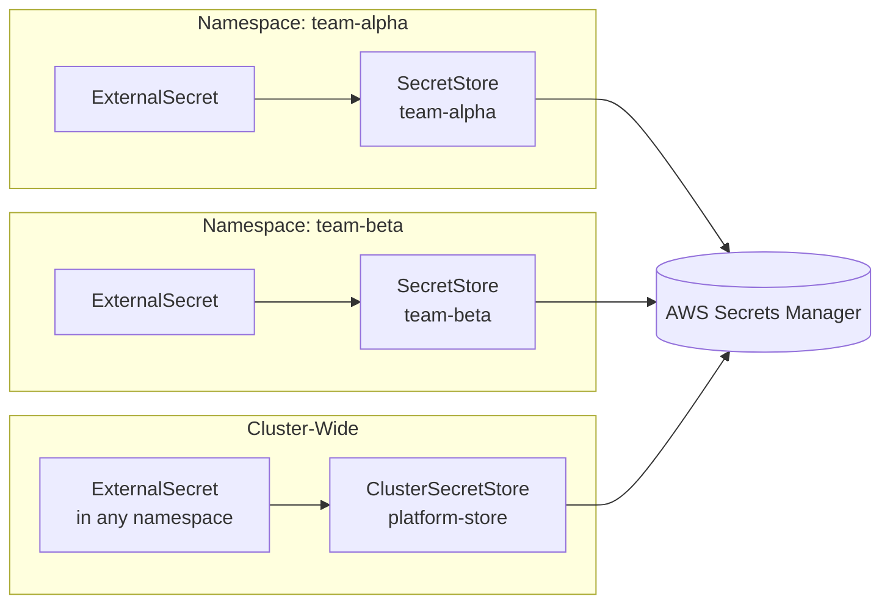

# How to Configure ClusterSecretStore for Multi-Namespace Access with Flux

Author: [nawazdhandala](https://github.com/nawazdhandala)

Tags: Flux CD, Kubernetes, GitOps, External Secrets Operator, ClusterSecretStore, Multi-Namespace

Description: Configure a ClusterSecretStore for cross-namespace secret access using Flux CD, enabling multiple application namespaces to consume secrets from a single centrally-managed secret store.

---

## Introduction

The External Secrets Operator provides two levels of secret store scope: `SecretStore` (namespace-scoped) and `ClusterSecretStore` (cluster-scoped). While `SecretStore` is appropriate when different teams need different authentication configurations, `ClusterSecretStore` is the right choice for platform-level secret stores that many application namespaces need to access.

Common use cases for `ClusterSecretStore` include shared infrastructure credentials (database connection strings, API keys for shared services), TLS certificates managed centrally, and platform-level secrets that span multiple teams. Without `ClusterSecretStore`, every namespace would need its own `SecretStore` with duplicate authentication configuration.

This guide covers configuring a `ClusterSecretStore` backed by AWS Secrets Manager, controlling which namespaces can reference it, and managing everything through Flux CD.

## Prerequisites

- External Secrets Operator deployed via Flux HelmRelease
- An external secret store accessible from the cluster (AWS, Vault, etc.)
- `cluster-admin` permissions to create cluster-scoped resources
- Flux CD bootstrapped on the cluster

## Step 1: Understand SecretStore vs ClusterSecretStore



## Step 2: Create the ESO Service Account for ClusterSecretStore

```yaml
# clusters/my-cluster/external-secrets/cluster-store-sa.yaml
apiVersion: v1
kind: ServiceAccount
metadata:
  name: eso-cluster-store
  namespace: external-secrets
  annotations:
    # IRSA annotation for AWS authentication
    eks.amazonaws.com/role-arn: arn:aws:iam::123456789012:role/ESOClusterStoreRole
```

## Step 3: Configure the ClusterSecretStore

```yaml
# clusters/my-cluster/external-secrets/cluster-secret-store.yaml
apiVersion: external-secrets.io/v1beta1
kind: ClusterSecretStore
metadata:
  name: platform-aws-secrets
  # ClusterSecretStore has no namespace - it is cluster-scoped
spec:
  provider:
    aws:
      service: SecretsManager
      region: us-east-1
      auth:
        jwt:
          serviceAccountRef:
            # Must specify the namespace for cluster-scoped stores
            name: eso-cluster-store
            namespace: external-secrets
  # Control which namespaces can use this store
  conditions:
    - namespaceSelector:
        # Only allow namespaces with this label to use this store
        matchLabels:
          secrets.platform.io/allowed: "true"
```

## Step 4: Label Application Namespaces

```yaml
# clusters/my-cluster/apps/team-alpha/namespace.yaml
apiVersion: v1
kind: Namespace
metadata:
  name: team-alpha
  labels:
    # Allow team-alpha to use the ClusterSecretStore
    secrets.platform.io/allowed: "true"
```

```yaml
# clusters/my-cluster/apps/team-beta/namespace.yaml
apiVersion: v1
kind: Namespace
metadata:
  name: team-beta
  labels:
    secrets.platform.io/allowed: "true"
```

## Step 5: Consume the ClusterSecretStore from Multiple Namespaces

Any namespace with the `secrets.platform.io/allowed: "true"` label can now reference the `ClusterSecretStore`:

```yaml
# clusters/my-cluster/apps/team-alpha/externalsecret.yaml
apiVersion: external-secrets.io/v1beta1
kind: ExternalSecret
metadata:
  name: shared-db-credentials
  namespace: team-alpha
spec:
  refreshInterval: 1h
  secretStoreRef:
    name: platform-aws-secrets
    # Reference ClusterSecretStore instead of SecretStore
    kind: ClusterSecretStore
  target:
    name: db-credentials
    creationPolicy: Owner
  data:
    - secretKey: host
      remoteRef:
        key: platform/database
        property: host
    - secretKey: password
      remoteRef:
        key: platform/database
        property: password
```

```yaml
# clusters/my-cluster/apps/team-beta/externalsecret.yaml
apiVersion: external-secrets.io/v1beta1
kind: ExternalSecret
metadata:
  name: shared-api-key
  namespace: team-beta
spec:
  refreshInterval: 1h
  secretStoreRef:
    name: platform-aws-secrets
    kind: ClusterSecretStore
  target:
    name: api-credentials
  data:
    - secretKey: api-key
      remoteRef:
        key: platform/shared-api-key
        property: value
```

## Step 6: Manage via Flux Kustomization

```yaml
# clusters/my-cluster/external-secrets/kustomization.yaml
apiVersion: kustomize.toolkit.fluxcd.io/v1
kind: Kustomization
metadata:
  name: cluster-secret-store
  namespace: flux-system
spec:
  interval: 10m
  path: ./clusters/my-cluster/external-secrets
  prune: true
  sourceRef:
    kind: GitRepository
    name: flux-system
  dependsOn:
    - name: external-secrets
  healthChecks:
    - apiVersion: external-secrets.io/v1beta1
      kind: ClusterSecretStore
      name: platform-aws-secrets
```

## Step 7: Verify Cross-Namespace Access

```bash
# Check ClusterSecretStore status
kubectl get clustersecretstore platform-aws-secrets

# Verify ExternalSecrets in multiple namespaces are syncing
kubectl get externalsecret -n team-alpha
kubectl get externalsecret -n team-beta

# Confirm Secrets were created
kubectl get secret db-credentials -n team-alpha
kubectl get secret api-credentials -n team-beta
```

## Best Practices

- Use `conditions` with `namespaceSelector` on `ClusterSecretStore` to explicitly allow which namespaces can reference it; this prevents unintended access from any namespace in the cluster.
- Prefer `ClusterSecretStore` for platform-wide secrets and `SecretStore` for team-specific secrets that require separate authentication credentials.
- Avoid granting the `ClusterSecretStore` service account access to all secrets; scope the IAM policy or Vault policy to specific secret path prefixes.
- Store the `ClusterSecretStore` manifest in a platform team-owned directory in Git and restrict write access to that directory.
- Monitor `ClusterSecretStore` status with Prometheus to alert when authentication fails and all dependent `ExternalSecret` resources are affected.

## Conclusion

`ClusterSecretStore` enables platform teams to provide a centrally-managed, authenticated connection to a secret store while allowing application teams to consume secrets from their own namespaces without needing cluster-level permissions. Managed through Flux CD, the `ClusterSecretStore` configuration is auditable, consistently applied, and protected by your Git repository access controls.
