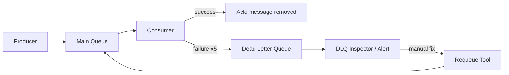

# How to Configure Dead Letter Queue Patterns with Flux CD

Author: [nawazdhandala](https://github.com/nawazdhandala)

Tags: Flux CD, Kubernetes, GitOps, Dead Letter Queue, RabbitMQ, Kafka, Message Queue, Error Handling

Description: Implement dead letter queue patterns in message brokers managed by Flux CD for GitOps-managed error handling in distributed messaging systems.

---

## Introduction

A Dead Letter Queue (DLQ) is a message queue that holds messages that could not be delivered or processed successfully after a configured number of retries. DLQs are a fundamental error handling pattern in distributed messaging systems, preventing poison messages from blocking queues while preserving unprocessable messages for inspection and reprocessing.

Managing DLQ configuration through Flux CD ensures that retry policies, expiration settings, and dead-letter routing are version-controlled and consistently applied. Whether you are using Kafka, RabbitMQ, NATS, or ActiveMQ Artemis, the DLQ configuration lives in Git as a pull-requested, reviewed change.

This post covers implementing DLQ patterns across Kafka (using Strimzi), RabbitMQ (using the Topology Operator), and provides guidance for processing dead-lettered messages.

## Prerequisites

- Strimzi Kafka cluster and/or RabbitMQ cluster deployed via Flux CD
- `kubectl` and `flux` CLIs installed
- Kubernetes v1.26+ with Flux CD bootstrapped

## Step 1: Dead Letter Queue Pattern Architecture



## Step 2: Kafka DLQ Pattern with Strimzi

Kafka doesn't have native DLQ support — the pattern is implemented at the application layer. Create a DLQ topic and have consumers publish failed messages there:

```yaml
# infrastructure/messaging/topics/orders-main.yaml
apiVersion: kafka.strimzi.io/v1beta2
kind: KafkaTopic
metadata:
  name: orders
  namespace: kafka
  labels:
    strimzi.io/cluster: production
spec:
  partitions: 12
  replicas: 3
  config:
    retention.ms: "604800000"    # 7 days
    min.insync.replicas: "2"
    compression.type: snappy
---
# infrastructure/messaging/topics/orders-retry-1.yaml
apiVersion: kafka.strimzi.io/v1beta2
kind: KafkaTopic
metadata:
  name: orders-retry-1
  namespace: kafka
  labels:
    strimzi.io/cluster: production
spec:
  partitions: 12
  replicas: 3
  config:
    # Retry delay: hold messages for 30 seconds before redeliver
    # (requires consumer to check timestamp and re-enqueue)
    retention.ms: "604800000"
    min.insync.replicas: "2"
---
# infrastructure/messaging/topics/orders-dead-letter.yaml
apiVersion: kafka.strimzi.io/v1beta2
kind: KafkaTopic
metadata:
  name: orders-dead-letter
  namespace: kafka
  labels:
    strimzi.io/cluster: production
    purpose: dead-letter
spec:
  partitions: 3    # fewer partitions — DLQ is not high throughput
  replicas: 3
  config:
    # Long retention for DLQ — 90 days for inspection
    retention.ms: "7776000000"
    min.insync.replicas: "2"
    compression.type: gzip
```

Consumer-side DLQ pattern (example application code pattern in ConfigMap for reference):

```yaml
# infrastructure/messaging/topics/kafka-dlq-pattern-doc.yaml
apiVersion: v1
kind: ConfigMap
metadata:
  name: kafka-dlq-pattern
  namespace: kafka
data:
  pattern.md: |
    ## Kafka DLQ Pattern
    1. Consumer processes message from `orders`
    2. On failure: publish to `orders-retry-1` with header `x-retry-count: 1`
    3. Retry consumer reads `orders-retry-1`, checks timestamp >= 30s
    4. If retry count < MAX_RETRIES (3): re-publish to `orders-retry-1` with incremented count
    5. If retry count >= MAX_RETRIES: publish to `orders-dead-letter` with failure reason header
    6. Alert fires when `orders-dead-letter` has unread messages > threshold
```

## Step 3: RabbitMQ DLQ Pattern with Topology Operator

RabbitMQ has native DLQ support via `x-dead-letter-exchange`:

```yaml
# infrastructure/messaging/rabbitmq/topology/dlq-setup.yaml

# Dead letter exchange
apiVersion: rabbitmq.com/v1beta1
kind: Exchange
metadata:
  name: dlx-exchange
  namespace: rabbitmq
spec:
  name: dlx
  type: direct
  durable: true
  rabbitmqClusterReference:
    name: production
    namespace: rabbitmq
---
# Dead letter queue
apiVersion: rabbitmq.com/v1beta1
kind: Queue
metadata:
  name: dead-letter-queue
  namespace: rabbitmq
spec:
  name: dead-letter
  durable: true
  rabbitmqClusterReference:
    name: production
    namespace: rabbitmq
  arguments:
    x-queue-type: quorum
    # Keep dead letters for 30 days
    x-message-ttl: 2592000000
---
# Bind DLQ to the dead letter exchange
apiVersion: rabbitmq.com/v1beta1
kind: Binding
metadata:
  name: dlq-binding
  namespace: rabbitmq
spec:
  source: dlx
  destination: dead-letter
  destinationType: queue
  routingKey: "#"   # catch all routing keys
  rabbitmqClusterReference:
    name: production
    namespace: rabbitmq
---
# Main queue with DLX configured
apiVersion: rabbitmq.com/v1beta1
kind: Queue
metadata:
  name: orders-main-queue
  namespace: rabbitmq
spec:
  name: orders.main
  durable: true
  rabbitmqClusterReference:
    name: production
    namespace: rabbitmq
  arguments:
    x-queue-type: quorum
    # Route failed messages to dead letter exchange
    x-dead-letter-exchange: dlx
    x-dead-letter-routing-key: orders.failed
    # Max redelivery attempts before dead-lettering
    delivery-limit: 5        # quorum queue setting
    x-message-ttl: 86400000  # 24 hours max age
```

## Step 4: DLQ Inspector Job (Alerting)

Create a CronJob that alerts when the DLQ has unread messages:

```yaml
# infrastructure/messaging/dlq-monitor-cronjob.yaml
apiVersion: batch/v1
kind: CronJob
metadata:
  name: dlq-monitor
  namespace: rabbitmq
spec:
  schedule: "*/5 * * * *"   # every 5 minutes
  jobTemplate:
    spec:
      template:
        spec:
          restartPolicy: OnFailure
          containers:
            - name: monitor
              image: curlimages/curl:8.7.1
              command:
                - /bin/sh
                - -c
                - |
                  # Check RabbitMQ dead letter queue message count
                  COUNT=$(curl -s -u admin:${RMQ_PASSWORD} \
                    http://production.rabbitmq.svc.cluster.local:15672/api/queues/%2F/dead-letter \
                    | grep -o '"messages":[0-9]*' | head -1 | cut -d: -f2)

                  echo "DLQ message count: $COUNT"

                  if [ "$COUNT" -gt "0" ]; then
                    # Send alert to Slack
                    curl -s -XPOST "${SLACK_WEBHOOK_URL}" \
                      -H "Content-Type: application/json" \
                      -d "{\"text\":\"⚠️ Dead Letter Queue has ${COUNT} unprocessed messages!\"}"
                  fi
              env:
                - name: RMQ_PASSWORD
                  valueFrom:
                    secretKeyRef:
                      name: production-default-user
                      key: password
                - name: SLACK_WEBHOOK_URL
                  valueFrom:
                    secretKeyRef:
                      name: alerting-credentials
                      key: slack-webhook-url
```

## Step 5: DLQ Requeue Tool Deployment

Provide a tool to requeue dead-lettered messages after fixing the root cause:

```yaml
# infrastructure/messaging/dlq-requeue-job.yaml
apiVersion: batch/v1
kind: Job
metadata:
  name: dlq-requeue-orders
  namespace: rabbitmq
  # Create this Job manually when you want to requeue DLQ messages
spec:
  ttlSecondsAfterFinished: 3600
  template:
    spec:
      restartPolicy: OnFailure
      containers:
        - name: requeue
          image: curlimages/curl:8.7.1
          command:
            - /bin/sh
            - -c
            - |
              BASE_URL="http://production.rabbitmq.svc.cluster.local:15672/api"
              AUTH="admin:${RMQ_PASSWORD}"

              # Move all dead-letter messages back to main queue
              while true; do
                # Get one message from DLQ
                MSG=$(curl -s -u $AUTH \
                  -XPOST "${BASE_URL}/queues/%2F/dead-letter/get" \
                  -H "Content-Type: application/json" \
                  -d '{"count":1,"ackmode":"ack_requeue_false","encoding":"auto"}')

                [ "$(echo $MSG | grep -c 'payload')" -eq "0" ] && break

                PAYLOAD=$(echo $MSG | grep -o '"payload":"[^"]*"' | cut -d'"' -f4)
                ROUTING_KEY=$(echo $MSG | grep -o '"routing_key":"[^"]*"' | cut -d'"' -f4)

                # Re-publish to main exchange
                curl -s -u $AUTH \
                  -XPOST "${BASE_URL}/exchanges/%2F/orders.topic/publish" \
                  -H "Content-Type: application/json" \
                  -d "{\"properties\":{},\"routing_key\":\"${ROUTING_KEY}\",\"payload\":\"${PAYLOAD}\",\"payload_encoding\":\"string\"}"

                echo "Requeued message with routing key: $ROUTING_KEY"
              done
              echo "Requeue complete"
          env:
            - name: RMQ_PASSWORD
              valueFrom:
                secretKeyRef:
                  name: production-default-user
                  key: password
```

## Step 6: Flux Kustomization

```yaml
# clusters/production/dlq-kustomization.yaml
apiVersion: kustomize.toolkit.fluxcd.io/v1
kind: Kustomization
metadata:
  name: dlq-infrastructure
  namespace: flux-system
spec:
  interval: 10m
  sourceRef:
    kind: GitRepository
    name: flux-system
  path: ./infrastructure/messaging/dlq
  prune: true
  dependsOn:
    - name: rabbitmq-cluster
    - name: strimzi-kafka
```

## Best Practices

- Always configure a DLQ for all queues handling business-critical messages — never silently discard failures.
- Set `x-max-delivery-count` (RabbitMQ quorum queues) or implement retry counting in Kafka consumers to prevent infinite processing loops.
- Alert immediately when DLQ depth exceeds zero — a DLQ with messages means your system has unprocessed errors that need attention.
- Never auto-requeue from DLQ without first diagnosing and fixing the root cause — requeuing broken messages creates infinite loops.
- Log the failure reason as a message header when sending to DLQ to aid debugging.

## Conclusion

Dead letter queue patterns configured through Flux CD bring version control and consistency to one of the most important error handling mechanisms in distributed messaging. Whether you use Kafka's topic-based DLQ pattern or RabbitMQ's native `x-dead-letter-exchange`, the configuration lives in Git as a reviewed, auditable change. The DLQ monitor and requeue jobs give your team the operational tools to detect and recover from message processing failures with full visibility.
