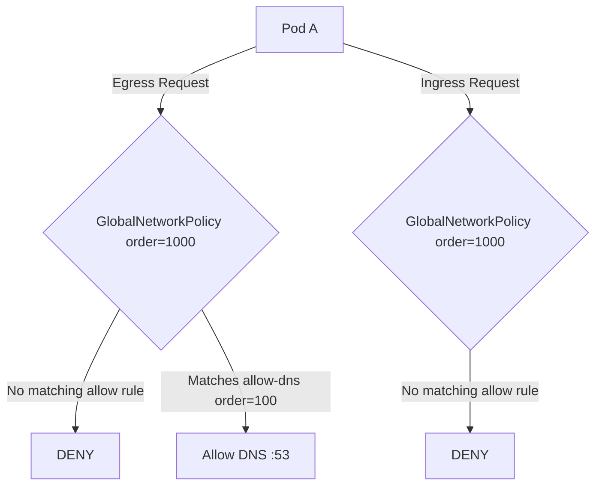

# How to Configure Default Deny Policies in Calico

Author: [nawazdhandala](https://github.com/nawazdhandala)

Tags: Calico, Kubernetes, Network Policy, Zero Trust, Security

Description: A step-by-step guide to configuring default deny network policies in Calico to enforce a zero-trust security posture in your Kubernetes cluster.

---

## Introduction

Default deny policies are the cornerstone of a zero-trust network architecture in Kubernetes. Without them, all pods can freely communicate with each other by default, creating an enormous attack surface. Calico's `GlobalNetworkPolicy` resource lets you enforce cluster-wide deny rules that block all traffic unless explicitly permitted.

Calico extends the standard Kubernetes `NetworkPolicy` with its own `NetworkPolicy` and `GlobalNetworkPolicy` CRDs under the `projectcalico.org/v3` API group. This gives you fine-grained control over ingress and egress at every layer, including host-level traffic. Configuring default deny at the global level ensures no workload is accidentally left open.

This guide walks you through implementing default deny policies in Calico step by step, covering both namespace-scoped and global approaches, so you can build a solid security foundation for your cluster.

## Prerequisites

- A running Kubernetes cluster with Calico installed (v3.26+)
- `kubectl` configured with cluster-admin access
- `calicoctl` CLI installed and configured
- Basic familiarity with Kubernetes networking concepts

## Step 1: Understand the Traffic Flow Before Locking Down

Before applying any deny policy, map your existing traffic. Use `calicoctl` to inspect current policy state:

```bash
calicoctl get networkpolicies --all-namespaces
calicoctl get globalnetworkpolicies
```

Document which pods communicate with each other and which external endpoints they reach. This baseline prevents surprise outages after you apply deny rules.

## Step 2: Apply a Global Default Deny Policy

Create a `GlobalNetworkPolicy` with a low order value so it matches last (higher-priority policies take precedence when order is lower):

```yaml
apiVersion: projectcalico.org/v3
kind: GlobalNetworkPolicy
metadata:
  name: default-deny-all
spec:
  order: 1000
  selector: all()
  types:
    - Ingress
    - Egress
```

Apply with:

```bash
calicoctl apply -f default-deny-all.yaml
```

## Step 3: Allow Required System Traffic

After locking everything down, re-add essential traffic. DNS is the most critical:

```yaml
apiVersion: projectcalico.org/v3
kind: GlobalNetworkPolicy
metadata:
  name: allow-dns-egress
spec:
  order: 100
  selector: all()
  egress:
    - action: Allow
      protocol: UDP
      destination:
        ports:
          - 53
    - action: Allow
      protocol: TCP
      destination:
        ports:
          - 53
  types:
    - Egress
```

## Step 4: Verify Policy Is Active

```bash
calicoctl get globalnetworkpolicies -o wide
kubectl run test-pod --image=busybox --restart=Never -- sleep 3600
kubectl exec test-pod -- wget -qO- http://google.com
# Should timeout/fail - confirming default deny is active
```

## Architecture Diagram



## Conclusion

Configuring default deny policies in Calico is the first and most important step toward a zero-trust Kubernetes cluster. By applying a `GlobalNetworkPolicy` that denies all ingress and egress, then layering explicit allow rules on top, you ensure that every communication path is intentional and auditable. Always map your traffic first, apply deny policies in staging, and incrementally restore only the access you need.
