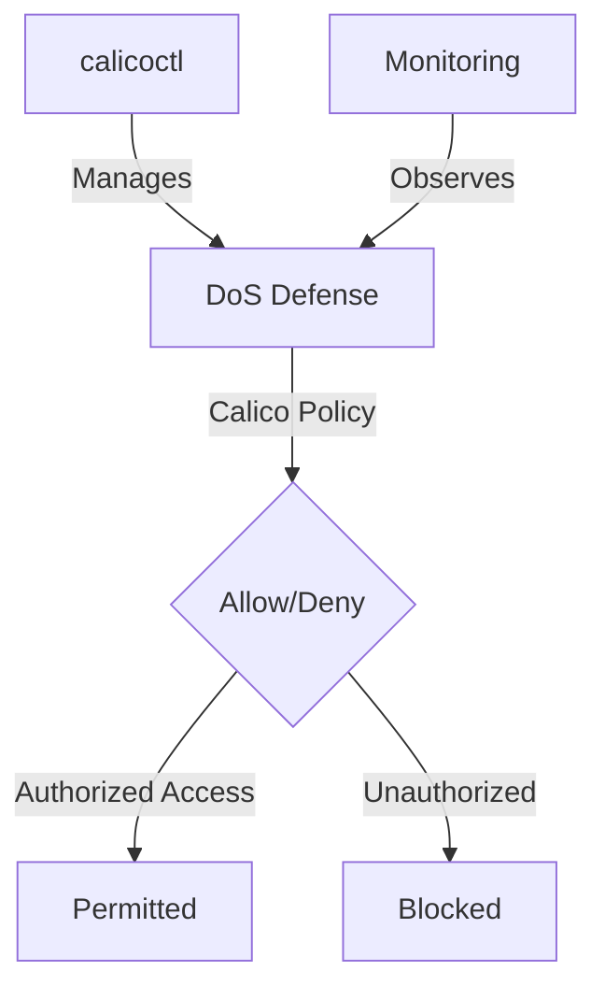

# How to Configure DoS Defense with Calico Network Policies

Author: [nawazdhandala](https://github.com/nawazdhandala)

Tags: Calico, Kubernetes, Network Policy, DoS Defense, Security

Description: Configure Calico network policies for DoS defense to protect cluster workloads from denial of service attacks.

---

## Introduction

DoS Defense with Calico Policies is an important security consideration for production Calico deployments. The `projectcalico.org/v3` API provides the tools needed to configure DoS Defense effectively, combining Calico's network policy with proper access controls and monitoring.

This guide covers configure DoS Defense in Calico with practical configurations and operational best practices.

## Prerequisites

- Kubernetes cluster with Calico v3.26+
- `calicoctl` and `kubectl` installed
- Understanding of Calico's monitoring and security architecture

## Core Configuration

```yaml
apiVersion: projectcalico.org/v3
kind: HostEndpoint
metadata:
  name: production-web-host
  labels:
    apply-dos-mitigation: 'true'
spec:
  node: worker-1
  interfaceName: eth0
  expectedIPs:
    - 10.0.0.10
---
# Block known bad actors

apiVersion: projectcalico.org/v3
kind: GlobalNetworkSet
metadata:
  name: dos-deny-list
  labels:
    dos-deny-list: 'true'
spec:
  nets:
    - 198.51.100.0/24  # Known attack source
    - 203.0.113.0/24
---
apiVersion: projectcalico.org/v3
kind: GlobalNetworkPolicy
metadata:
  name: dos-mitigation
spec:
  order: 10
  selector: apply-dos-mitigation == 'true'
  doNotTrack: true
  applyOnForward: true
  ingress:
    - action: Deny
      source:
        selector: dos-deny-list == 'true'
  types:
    - Ingress
```

## Implementation

```bash
# Apply DoS defense policies
calicoctl apply -f dos-defense.yaml

# Enable Felix Prometheus metrics if they are not already enabled
calicoctl patch felixconfiguration default --patch '{"spec":{"prometheusMetricsEnabled": true}}'

# Monitor Felix metrics on a node
curl -s http://localhost:9091/metrics | grep felix_active_local
```

## eBPF and XDP Acceleration

```bash
# Enable the eBPF dataplane for accelerated policy enforcement
kubectl patch installation.operator.tigera.io default --type merge -p '{"spec":{"calicoNetwork":{"linuxDataplane":"BPF", "bpfNetworkBootstrap":"Enabled", "kubeProxyManagement":"Enabled"}}}'
```

## Architecture



## Conclusion

Configure DoS Defense in Calico requires a combination of proper policy configuration, regular monitoring, and proactive testing. Use the patterns in this guide as a foundation and adapt them to your specific security requirements. Always validate changes in staging before production and maintain comprehensive logging for security visibility.
