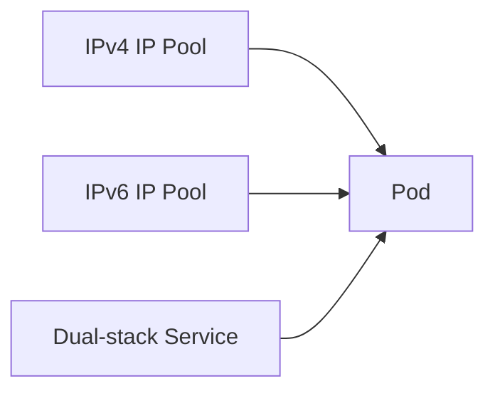

# How to Configure Dual-Stack IPv6 with Calico

Author: [nawazdhandala](https://github.com/nawazdhandala)

Tags: Calico, Kubernetes, IPv6, Dual-Stack, Networking

Description: Configure Calico for IPv4/IPv6 dual-stack networking to assign both IPv4 and IPv6 addresses to pods.

---

## Introduction

Dual-Stack IPv6 with Calico enables important networking capabilities in Calico Kubernetes clusters. Proper configuration ensures reliable service connectivity and IP address management.

## Prerequisites

- Calico installed with Calico IPAM
- Kubernetes configured for IPv4/IPv6 dual-stack
- kubectl and calicoctl access
- Cluster-admin access

## Configuration

```bash
calicoctl get ippools -o yaml
calicoctl get bgpconfiguration -o yaml
```

## Example Configuration

```yaml
apiVersion: operator.tigera.io/v1
kind: Installation
metadata:
  name: default
spec:
  calicoNetwork:
    ipPools:
      - blockSize: 26
        cidr: 10.48.0.0/21
        encapsulation: IPIP
        natOutgoing: Enabled
        nodeSelector: all()
      - blockSize: 122
        cidr: 2001:db8:48::/64
        encapsulation: None
        natOutgoing: Enabled
        nodeSelector: all()
```

For manifest-based installations, enable both address families in the Calico CNI IPAM configuration:

```json
"ipam": {
  "type": "calico-ipam",
  "assign_ipv4": "true",
  "assign_ipv6": "true"
}
```

Also configure IPv6 support on the `calico-node` container:

```yaml
- name: IP6
  value: "autodetect"
- name: FELIX_IPV6SUPPORT
  value: "true"
```

## Verify

```bash
kubectl get svc -A
kubectl get pods -A -o wide
calicoctl ipam check
```

## Architecture



## Conclusion

How to Configure Dual-Stack IPv6 with Calico in Calico provides reliable IP addressing for Kubernetes services and workloads. Follow the configuration and verification steps to ensure correct behavior.
