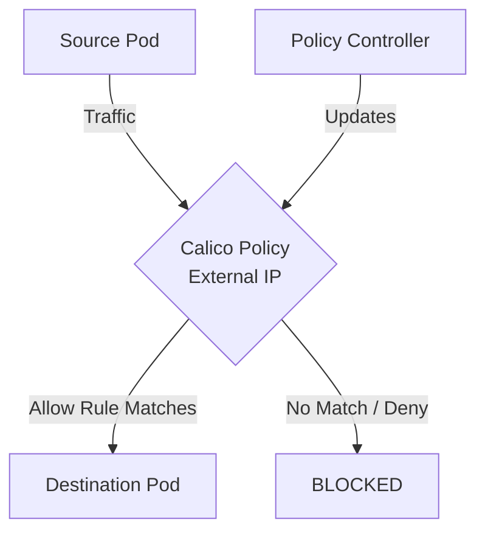

# How to Configure External IP Policies in Calico

Author: [nawazdhandala](https://github.com/nawazdhandala)

Tags: Calico, Kubernetes, Network Policy, External IP, Security

Description: A step-by-step guide to configuring External IP Policies in Calico.

---

## Introduction

External IP Policies in Calico provides fine-grained network security controls using the `projectcalico.org/v3` API. This guide covers how to configure External IP effectively.

Calico's extensible policy model supports External IP through its `GlobalNetworkPolicy` and `NetworkPolicy` resources, giving you cluster-wide and namespace-scoped control over traffic that matches your External IP criteria.

This guide provides practical techniques for configure External IP in your Kubernetes cluster, following security best practices and production-tested patterns.

## Prerequisites

- Kubernetes cluster with Calico v3.26+
- `calicoctl` and `kubectl` installed
- Basic understanding of Calico network policy concepts

## Step 1: Plan Your External IP Policies Rules

Before writing policies, document the traffic flows you want to control using External IP. Identify the sources, destinations, and protocols involved.

## Step 2: Write the External IP Policies Policy

```yaml
apiVersion: projectcalico.org/v3
kind: NetworkPolicy
metadata:
  name: configure-external-ip
  namespace: production
spec:
  order: 100
  selector: all()
  ingress:
    - action: Allow
      source:
        selector: app == 'authorized'
  egress:
    - action: Allow
      destination:
        ports: [443, 80]
  types:
    - Ingress
    - Egress
```

## Step 3: Apply and Verify

```bash
calicoctl apply -f external-ip-policy.yaml
calicoctl get networkpolicies -n production -o wide
```

## Step 4: Test the Policy

```bash
kubectl exec -n production test-pod -- curl -s --max-time 5 http://target-service:8080
echo "Result: $?"
```

## Architecture



## Conclusion

Configure External IP policies in Calico requires attention to policy ordering, selector accuracy, and bidirectional rule coverage. Follow the patterns in this guide to ensure your External IP policies are correctly configured, tested, and monitored. Always validate in staging before applying to production, and maintain comprehensive logging for visibility into policy decisions.
