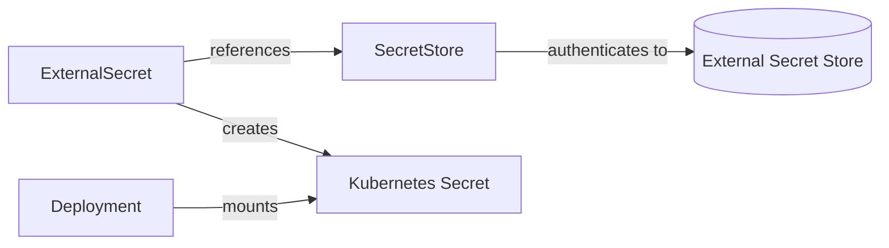

# How to Configure ExternalSecret for Syncing Secrets with Flux

Author: [nawazdhandala](https://github.com/nawazdhandala)

Tags: Flux CD, Kubernetes, GitOps, External Secrets Operator, ExternalSecret

Description: Create ExternalSecret resources to sync secrets from external stores into Kubernetes Secrets using ESO with Flux CD for declarative, GitOps-driven secret management.

---

## Introduction

The `ExternalSecret` resource is the central building block of the External Secrets Operator. It defines which secrets to fetch from an external store, how to map them to Kubernetes Secret keys, and how frequently to refresh them. Understanding how to configure `ExternalSecret` effectively lets you model any secret synchronization pattern — single values, multiple values from one secret, bulk imports from a path, and cross-namespace references.

When managed through Flux CD, `ExternalSecret` resources live alongside the application manifests that consume them. A Deployment and its `ExternalSecret` are committed together, reviewed together, and reconciled together. This eliminates the common pain of deploying an application and manually creating secrets separately.

This guide covers all the major `ExternalSecret` configuration patterns: single key mapping, multi-key mapping, bulk dataFrom imports, and computed keys.

## Prerequisites

- External Secrets Operator deployed via Flux HelmRelease
- A `SecretStore` or `ClusterSecretStore` configured and in Ready state
- Flux CD bootstrapped on the cluster

## Step 1: Understand the ExternalSecret Structure



## Step 2: Sync a Single Secret Key

The simplest case: pull one value from the external store into one Kubernetes Secret key.

```yaml
# clusters/my-cluster/apps/myapp/externalsecret-simple.yaml
apiVersion: external-secrets.io/v1beta1
kind: ExternalSecret
metadata:
  name: myapp-api-key
  namespace: default
spec:
  # How often to re-sync from the external store
  refreshInterval: 1h
  secretStoreRef:
    name: aws-secrets-manager
    kind: SecretStore
  target:
    # Name of the Kubernetes Secret to create
    name: myapp-api-key
    # ESO owns the lifecycle of this Secret
    creationPolicy: Owner
    # Delete the Secret when ExternalSecret is deleted
    deletionPolicy: Delete
  data:
    - secretKey: api-key        # Key in the Kubernetes Secret
      remoteRef:
        key: myapp/api-key      # Path in the external store
        property: value         # Field within the secret (for JSON secrets)
```

## Step 3: Sync Multiple Keys from Different Sources

Pull several values from different external secrets into one Kubernetes Secret:

```yaml
# clusters/my-cluster/apps/myapp/externalsecret-multi.yaml
apiVersion: external-secrets.io/v1beta1
kind: ExternalSecret
metadata:
  name: myapp-credentials
  namespace: default
spec:
  refreshInterval: 30m
  secretStoreRef:
    name: aws-secrets-manager
    kind: SecretStore
  target:
    name: myapp-credentials
    creationPolicy: Owner
  data:
    - secretKey: db-host
      remoteRef:
        key: myapp/database
        property: host
    - secretKey: db-password
      remoteRef:
        key: myapp/database
        property: password
    - secretKey: redis-url
      remoteRef:
        key: myapp/redis
        property: url
    - secretKey: smtp-password
      remoteRef:
        key: myapp/email
        property: smtp-password
```

## Step 4: Bulk Import with dataFrom

Use `dataFrom` to import all fields from an external secret as individual Kubernetes Secret keys:

```yaml
# clusters/my-cluster/apps/myapp/externalsecret-datafrom.yaml
apiVersion: external-secrets.io/v1beta1
kind: ExternalSecret
metadata:
  name: myapp-all-secrets
  namespace: default
spec:
  refreshInterval: 1h
  secretStoreRef:
    name: aws-secrets-manager
    kind: SecretStore
  target:
    name: myapp-all-secrets
    creationPolicy: Owner
  # Bulk import: all JSON fields from this secret become Secret keys
  dataFrom:
    - extract:
        key: myapp/all-config
```

If `myapp/all-config` contains `{"db_url": "...", "api_key": "...", "redis_url": "..."}`, the resulting Kubernetes Secret will have keys `db_url`, `api_key`, and `redis_url`.

## Step 5: Mix data and dataFrom

Combine bulk import with individual overrides:

```yaml
# clusters/my-cluster/apps/myapp/externalsecret-mixed.yaml
apiVersion: external-secrets.io/v1beta1
kind: ExternalSecret
metadata:
  name: myapp-mixed
  namespace: default
spec:
  refreshInterval: 1h
  secretStoreRef:
    name: aws-secrets-manager
    kind: SecretStore
  target:
    name: myapp-mixed
    creationPolicy: Owner
  # Bulk import all fields from the config secret
  dataFrom:
    - extract:
        key: myapp/base-config
  # Override or add specific keys individually
  data:
    - secretKey: override-db-password
      remoteRef:
        key: myapp/prod-database
        property: password
```

## Step 6: Manage ExternalSecrets via Flux Kustomization

```yaml
# clusters/my-cluster/apps/myapp/kustomization.yaml
apiVersion: kustomize.toolkit.fluxcd.io/v1
kind: Kustomization
metadata:
  name: myapp
  namespace: flux-system
spec:
  interval: 5m
  path: ./clusters/my-cluster/apps/myapp
  prune: true
  sourceRef:
    kind: GitRepository
    name: flux-system
  dependsOn:
    # Ensure SecretStore is ready before creating ExternalSecrets
    - name: secret-stores
  healthChecks:
    - apiVersion: external-secrets.io/v1beta1
      kind: ExternalSecret
      name: myapp-credentials
      namespace: default
```

## Step 7: Verify Secret Sync

```bash
# Check ExternalSecret sync status
kubectl get externalsecret -n default

# View detailed sync status
kubectl describe externalsecret myapp-credentials -n default
# Look for: Status.Conditions[0].Type: Ready

# Verify the Kubernetes Secret was created
kubectl get secret myapp-credentials -n default

# Decode and verify values (for debugging only)
kubectl get secret myapp-credentials -n default \
  -o jsonpath='{.data.db-password}' | base64 -d
```

## Best Practices

- Always set `creationPolicy: Owner` so ESO manages the Secret lifecycle and prevents orphaned Secrets.
- Set `deletionPolicy: Delete` to clean up Kubernetes Secrets when the `ExternalSecret` is deleted via Flux pruning.
- Use `dataFrom.extract` for application config objects that contain many key-value pairs to avoid verbose manifest files.
- Add `ExternalSecret` resources to Flux health checks so dependent Deployments wait for secrets to be populated.
- Set `refreshInterval` based on secret sensitivity: shorter intervals for credentials that rotate frequently, longer for stable API keys.

## Conclusion

`ExternalSecret` is the glue between your external secret store and Kubernetes workloads. By managing `ExternalSecret` resources through Flux CD alongside the applications that consume them, you create a cohesive, auditable secret provisioning workflow where secrets are always available when applications are deployed, and removed when applications are removed.
