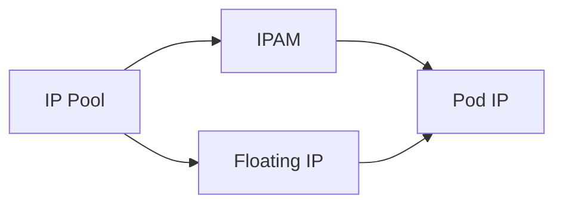

# How to Configure Floating IPs with Calico

Author: [nawazdhandala](https://github.com/nawazdhandala)

Tags: Calico, Kubernetes, IPAM, Floating IP, Networking

Description: Configure floating IP addresses in Calico to provide stable external IPs that can be reassigned between pods.

---

## Introduction

Floating IPs with Calico provide important IP address management capabilities in Calico. This feature allows an additional IP address to be assigned to a pod's workload endpoint and moved between pods in your Kubernetes cluster.

## Prerequisites

- Calico CNI plugin installed with manifest-managed CNI configuration
- kubectl and calicoctl access
- IP pools configured for the floating IP range

## Configuration

```bash
calicoctl get ippools -o yaml
calicoctl ipam show --show-blocks
kubectl -n kube-system edit configmap calico-config
```

In the `cni_network_config` section, enable floating IPs in the `calico` plugin configuration:

```json
{
  "type": "calico",
  "ipam": {
    "type": "calico-ipam"
  },
  "feature_control": {
    "floating_ips": true
  }
}
```

## Example

The floating IP must be within a configured IP pool:

```yaml
apiVersion: projectcalico.org/v3
kind: IPPool
metadata:
  name: example-pool
spec:
  cidr: 10.48.0.0/16
  blockSize: 26
  natOutgoing: true
---
apiVersion: v1
kind: Pod
metadata:
  name: floating-ip-example
  annotations:
    cni.projectcalico.org/floatingIPs: '["10.48.0.10"]'
spec:
  containers:
    - name: nginx
      image: nginx
```

## Verification

```bash
calicoctl ipam check -o ipam-report.json
calicoctl get workloadendpoints -A -o yaml
kubectl get pods -A -o wide
```

## Architecture



## Conclusion

How to Configure Floating IPs with Calico helps ensure your Calico deployment handles IP addressing correctly for your specific workload requirements.
