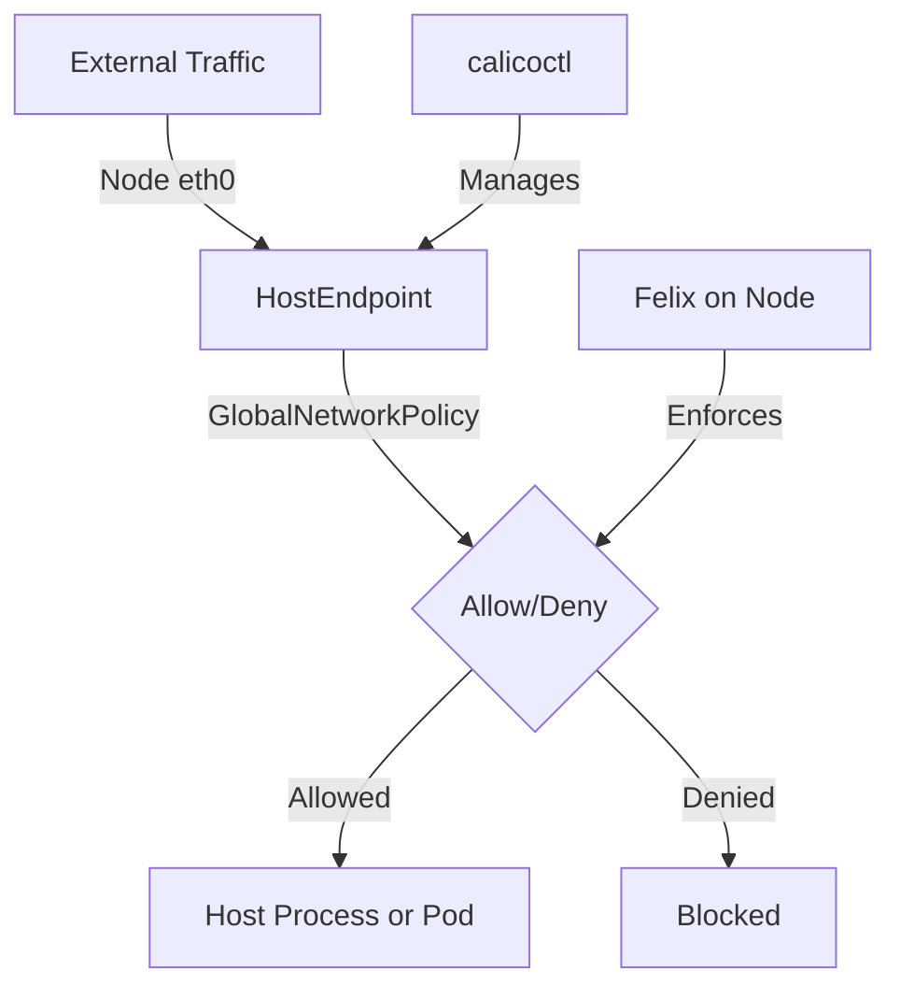

# How to Configure Forwarded Traffic Policies for Calico Hosts

Author: [nawazdhandala](https://github.com/nawazdhandala)

Tags: Calico, Kubernetes, Network Policy, Host Traffic, Forwarding, Security

Description: Configure Calico forwarded traffic policies on hosts for configure traffic control at the node level.

---

## Introduction

Forwarded Traffic Policies on Hosts in Calico provides host-level network security beyond standard pod-to-pod policies. Using the `projectcalico.org/v3` API, you can control traffic at the node level, protecting both pod traffic and the underlying host infrastructure.

Calico's host endpoint functionality extends policy enforcement to the host network namespace, allowing you to protect host processes, control traffic to and from external networks, and implement node-level security controls that complement your pod policies.

This guide covers how to configure Forwarded Traffic effectively, with production-ready YAML configurations and operational commands.

## Prerequisites

- Kubernetes cluster with Calico v3.26+
- `calicoctl` and `kubectl` installed
- Node-level access for host endpoint configuration
- Understanding of Calico HostEndpoint concepts

## Core Configuration

```yaml
apiVersion: projectcalico.org/v3
kind: HostEndpoint
metadata:
  name: node01-eth0
  labels:
    node: node01
    environment: production
spec:
  interfaceName: eth0
  node: node01
  expectedIPs:
    - 192.168.1.10
---
apiVersion: projectcalico.org/v3
kind: GlobalNetworkPolicy
metadata:
  name: configure-forwarded-traffic
spec:
  order: 100
  selector: node == 'node01'
  applyOnForward: true
  preDNAT: false
  ingress:
    - action: Allow
      source:
        nets:
          - 10.0.0.0/8
      destination:
        ports: [22, 443, 6443]
  egress:
    - action: Allow
  types:
    - Ingress
    - Egress
```

## Implementation

```bash
# Create host endpoint
calicoctl apply -f host-endpoint.yaml

# Verify host endpoint is active
calicoctl get hostendpoints -o wide

# Apply host protection policy
calicoctl apply -f host-protection-policy.yaml

# Test SSH access (should still work)
ssh user@node01-ip "echo connected"
```

## Operational Commands

```bash
# List all host endpoints
calicoctl get hostendpoints

# View host-level policy decisions
sudo iptables -L -n | grep CALICO

# Check Felix status on node
kubectl exec -n kube-system calico-node-xxx -- calico-node -felix-live
```

## Architecture



## Conclusion

Forwarded Traffic Policies on Hosts with Calico provides a comprehensive security layer that extends beyond pod-to-pod policies to protect the underlying node infrastructure. Configure host endpoints carefully to avoid locking yourself out of the node, always test SSH and management access after applying host policies, and use staged policies to preview impact before enforcement. Host-level policies are powerful but require careful planning and testing.

