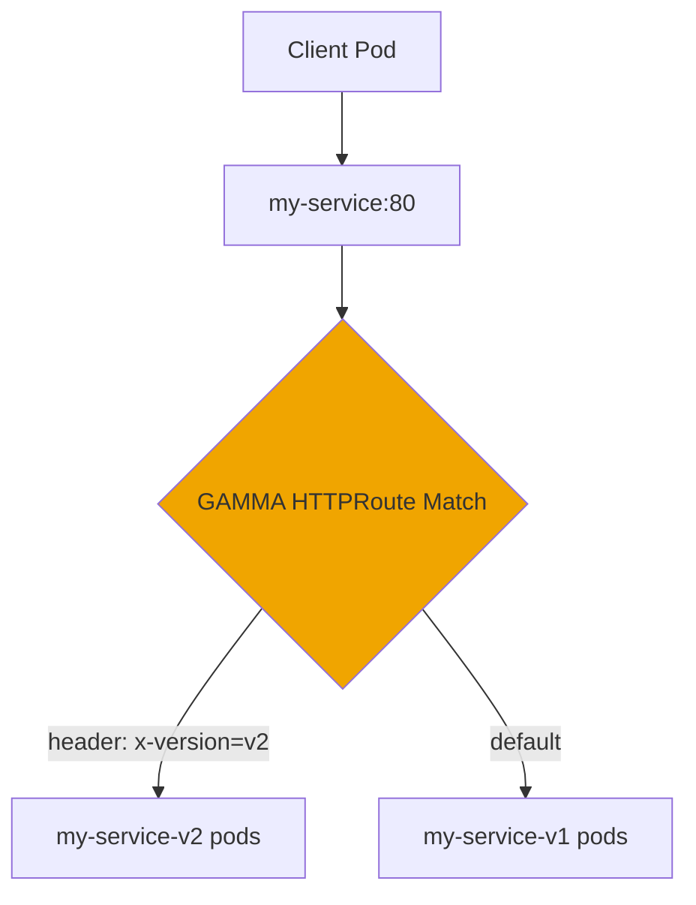

# How to Configure GAMMA in the Cilium Gateway API

Author: [nawazdhandala](https://github.com/nawazdhandala)

Tags: Cilium, Kubernetes, GAMMA, Gateway API, Service Mesh, EBPF

Description: Configure GAMMA routes within the Cilium Gateway API to enable east-west service mesh traffic management using standard HTTPRoute resources.

---

## Introduction

GAMMA (Gateway API for Mesh Management and Administration) within the Cilium Gateway API allows operators to define east-west routing rules that apply to traffic between services. Unlike traditional service meshes that rely on sidecars, Cilium uses eBPF to apply these rules at the kernel level.

The key GAMMA configuration element is the `parentRef` on an HTTPRoute pointing to a Service rather than a Gateway. This tells Cilium to intercept and route traffic destined for that Service according to the route rules, without requiring any changes to the client or server workloads.

This guide explains the GAMMA configuration model and how to set up common routing patterns.

## Prerequisites

- Cilium 1.15+ with `gatewayAPI.enableGamma=true`
- Gateway API CRDs with experimental support
- At least two Services and Deployments to route between

## Configure Service as Route Parent

A GAMMA HTTPRoute uses a Kubernetes Service as its `parentRef`:

```yaml
apiVersion: gateway.networking.k8s.io/v1
kind: HTTPRoute
metadata:
  name: my-service-route
  namespace: production
spec:
  parentRefs:
    - group: ""
      kind: Service
      name: my-service
      port: 80
  rules:
    - matches:
        - headers:
            - name: x-version
              value: v2
      backendRefs:
        - name: my-service-v2
          port: 80
    - backendRefs:
        - name: my-service-v1
          port: 80
```

## Architecture



## Configure Weighted Traffic Splitting

```yaml
spec:
  rules:
    - backendRefs:
        - name: my-service-v1
          port: 80
          weight: 80
        - name: my-service-v2
          port: 80
          weight: 20
```

Apply and verify:

```bash
kubectl apply -f gamma-route.yaml
kubectl get httproute my-service-route -n production
```

## Configure Header Modification

Add response headers to identify which backend served the request:

```yaml
spec:
  rules:
    - filters:
        - type: ResponseHeaderModifier
          responseHeaderModifier:
            add:
              - name: x-served-by
                value: cilium-gamma
      backendRefs:
        - name: my-service-v1
          port: 80
```

## Verify Route Configuration

```bash
kubectl describe httproute my-service-route -n production
```

Check that `Accepted` and `ResolvedRefs` conditions are both `True`.

## Conclusion

Configuring GAMMA in the Cilium Gateway API involves creating HTTPRoutes with Service parentRefs and defining rules for header-based routing, traffic splitting, or request modification. Cilium applies these rules in the eBPF datapath, delivering service mesh capabilities without sidecar proxies.
