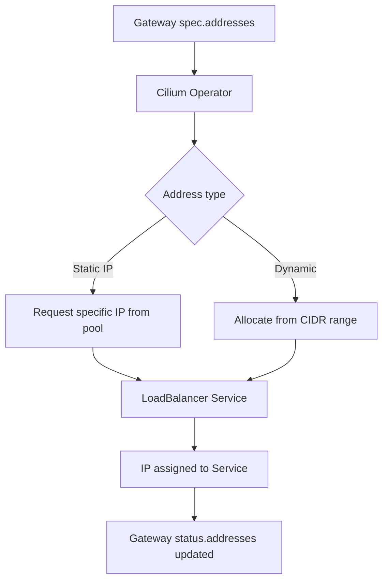

# How to Configure Cilium Gateway API Addresses Support

Author: [nawazdhandala](https://github.com/nawazdhandala)

Tags: Cilium, Kubernetes, Gateway API, IP Addresses, Load Balancer

Description: Configure static IP address assignment and address pool management for Cilium Gateway API gateways to control external ingress entry points.

---

## Introduction

Cilium's Gateway API addresses support allows operators to specify exactly which IP addresses are assigned to Gateway resources. This is useful for controlling ingress entry points, pre-registering DNS, and ensuring consistent IP addresses across deployments and upgrades.

Addresses can be assigned statically (requesting a specific IP) or dynamically from a CiliumLoadBalancerIPPool. The Gateway controller creates a LoadBalancer Service for each Gateway and passes the address configuration to the cloud provider or MetalLB.

## Prerequisites

- Cilium with Gateway API enabled
- A load balancer IP source (cloud provider, MetalLB, or CiliumLoadBalancerIPPool)

## Configure a Static IP Address

Request a specific IP in the Gateway spec:

```yaml
apiVersion: gateway.networking.k8s.io/v1
kind: Gateway
metadata:
  name: static-ip-gateway
  namespace: default
spec:
  gatewayClassName: cilium
  addresses:
    - type: IPAddress
      value: "203.0.113.10"
  listeners:
    - name: http
      protocol: HTTP
      port: 80
```

## Configure IP Pool

Create a pool for dynamic allocation:

```yaml
apiVersion: cilium.io/v2alpha1
kind: CiliumLoadBalancerIPPool
metadata:
  name: gateway-pool
spec:
  cidrs:
    - cidr: "203.0.113.0/28"
  serviceSelector:
    matchLabels:
      cilium.io/gateway: "true"
```

## Architecture



## Verify IP Assignment

```bash
kubectl get gateway static-ip-gateway -n default \
  -o jsonpath='{.status.addresses}'
```

## Multiple Addresses

Gateways can have multiple addresses (e.g., one IPv4 and one IPv6):

```yaml
spec:
  addresses:
    - type: IPAddress
      value: "203.0.113.10"
    - type: IPAddress
      value: "2001:db8::10"
```

## Check Pool Utilization

```bash
kubectl get ciliumloadbalancerippool gateway-pool \
  -o jsonpath='{.status}'
```

## Conclusion

Configuring Cilium Gateway API addresses support gives operators explicit control over ingress IP addresses. Static IPs enable predictable DNS and firewall rule management, while IP pools provide flexible dynamic allocation. Both approaches are managed through the Gateway spec and reflected in the status.
