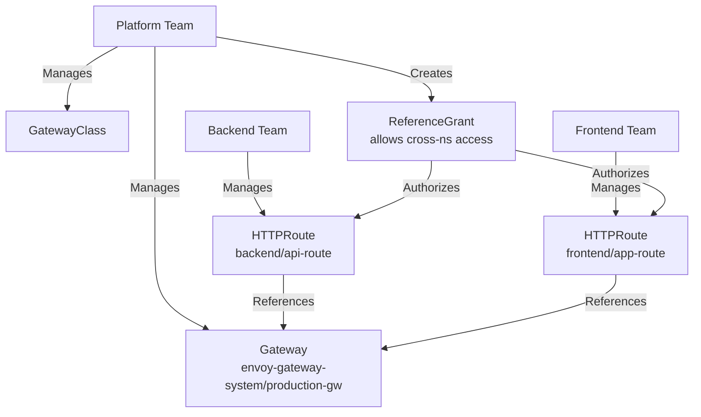

# How to Configure Gateway API with Cross-Namespace Routes via Flux CD

Author: [nawazdhandala](https://github.com/nawazdhandala)

Tags: Flux CD, Kubernetes, GitOps, Gateway API, HTTPRoute, ReferenceGrant, Multi-Tenant

Description: Manage Kubernetes Gateway API cross-namespace route references using Flux CD to enable multi-tenant routing with proper isolation controls and explicit access grants between namespaces.

---

## Introduction

One of the most powerful features of the Kubernetes Gateway API is its role-oriented multi-tenant model. In traditional Kubernetes Ingress, a single resource controls all routing in a namespace, and there is no standard mechanism for safely allowing application teams to attach routes to centrally-managed gateways. Gateway API solves this with a three-tier model: platform engineers manage GatewayClass and Gateway resources, while application developers manage HTTPRoute resources in their own namespaces.

The cross-namespace reference capability - enabled by the `ReferenceGrant` CRD - allows routes in one namespace to reference services or gateways in another namespace, with explicit, auditable grants. This enables a platform team to run a shared gateway in a dedicated namespace while giving application teams autonomous control over their routing rules, all managed through Flux CD with clear ownership boundaries.

This guide implements a complete multi-tenant routing architecture using Gateway API cross-namespace references managed by Flux CD.

## Prerequisites

- A Kubernetes cluster with Flux CD bootstrapped
- A Gateway API implementation deployed (Envoy Gateway, Contour, etc.)
- kubectl with cluster-admin access
- Multiple team namespaces (at least two for demonstration)
- Basic understanding of Gateway API concepts

## Step 1: Understand the Multi-Tenant Model

The Gateway API multi-tenant architecture assigns different responsibilities to different roles.



## Step 2: Platform Team - Configure the Shared Gateway

The platform team defines and manages the shared Gateway that all teams attach to.

```yaml
# infrastructure/gateway/shared-gateway.yaml
apiVersion: gateway.networking.k8s.io/v1
kind: Gateway
metadata:
  name: shared-gateway
  namespace: envoy-gateway-system
  labels:
    app.kubernetes.io/managed-by: flux
    managed-by: platform-team
spec:
  gatewayClassName: envoy-gateway
  listeners:
    - name: https
      protocol: HTTPS
      port: 443
      tls:
        mode: Terminate
        certificateRefs:
          - name: wildcard-example-tls
            namespace: envoy-gateway-system
      # Allow routes from all namespaces that have the approved label
      allowedRoutes:
        namespaces:
          from: Selector
          selector:
            matchLabels:
              # Only namespaces with this label can attach routes
              gateway.networking.k8s.io/approved: "true"
        kinds:
          - group: gateway.networking.k8s.io
            kind: HTTPRoute
```

## Step 3: Platform Team - Create ReferenceGrants

Explicitly grant each application namespace permission to reference the shared gateway.

```yaml
# infrastructure/gateway/reference-grants.yaml
# Grant backend team permission to attach routes to the shared gateway
apiVersion: gateway.networking.k8s.io/v1beta1
kind: ReferenceGrant
metadata:
  name: allow-backend-routes
  namespace: envoy-gateway-system
  labels:
    app.kubernetes.io/managed-by: flux
    managed-by: platform-team
spec:
  from:
    - group: gateway.networking.k8s.io
      kind: HTTPRoute
      namespace: backend
  to:
    - group: gateway.networking.k8s.io
      kind: Gateway
      name: shared-gateway
---
# Grant frontend team permission
apiVersion: gateway.networking.k8s.io/v1beta1
kind: ReferenceGrant
metadata:
  name: allow-frontend-routes
  namespace: envoy-gateway-system
spec:
  from:
    - group: gateway.networking.k8s.io
      kind: HTTPRoute
      namespace: frontend
  to:
    - group: gateway.networking.k8s.io
      kind: Gateway
      name: shared-gateway
---
# Grant frontend team access to use backend services (service-to-service via gateway)
apiVersion: gateway.networking.k8s.io/v1beta1
kind: ReferenceGrant
metadata:
  name: allow-frontend-to-backend-service
  namespace: backend
spec:
  from:
    - group: gateway.networking.k8s.io
      kind: HTTPRoute
      namespace: frontend
  to:
    - group: ""
      kind: Service
```

## Step 4: Label Namespaces for Gateway Access

Add the required label to application namespaces so the Gateway allows their routes.

```yaml
# infrastructure/namespaces/backend.yaml
apiVersion: v1
kind: Namespace
metadata:
  name: backend
  labels:
    # Required label for the shared gateway to accept routes
    gateway.networking.k8s.io/approved: "true"
    team: backend
    environment: production
    app.kubernetes.io/managed-by: flux
---
apiVersion: v1
kind: Namespace
metadata:
  name: frontend
  labels:
    gateway.networking.k8s.io/approved: "true"
    team: frontend
    environment: production
    app.kubernetes.io/managed-by: flux
```

## Step 5: Application Teams - Attach HTTPRoutes to the Shared Gateway

Each application team manages their own HTTPRoute in their namespace, referencing the shared gateway.

```yaml
# apps/backend/httproute.yaml
apiVersion: gateway.networking.k8s.io/v1
kind: HTTPRoute
metadata:
  name: api-route
  namespace: backend
  labels:
    app.kubernetes.io/managed-by: flux
    team: backend
spec:
  # Cross-namespace reference to the shared gateway
  parentRefs:
    - name: shared-gateway
      namespace: envoy-gateway-system  # Gateway is in a different namespace
      sectionName: https

  hostnames:
    - "api.example.com"

  rules:
    - matches:
        - path:
            type: PathPrefix
            value: /api
      backendRefs:
        - name: api-server  # Service in the same (backend) namespace
          port: 8080
```

```yaml
# apps/frontend/httproute.yaml
apiVersion: gateway.networking.k8s.io/v1
kind: HTTPRoute
metadata:
  name: app-route
  namespace: frontend
spec:
  parentRefs:
    - name: shared-gateway
      namespace: envoy-gateway-system
      sectionName: https

  hostnames:
    - "app.example.com"

  rules:
    - matches:
        - path:
            type: PathPrefix
            value: /
      backendRefs:
        - name: frontend-app
          port: 3000
```

## Step 6: Deploy with Separate Flux Kustomizations per Team

Separate Flux Kustomizations enforce the ownership model: platform team manages the gateway, application teams manage their routes.

```yaml
# clusters/production/platform-gateway-kustomization.yaml
apiVersion: kustomize.toolkit.fluxcd.io/v1
kind: Kustomization
metadata:
  name: platform-gateway
  namespace: flux-system
spec:
  interval: 10m
  path: ./infrastructure/gateway
  prune: true
  sourceRef:
    kind: GitRepository
    name: flux-system
  dependsOn:
    - name: envoy-gateway
---
# Backend team's routing - separate Kustomization
apiVersion: kustomize.toolkit.fluxcd.io/v1
kind: Kustomization
metadata:
  name: backend-routing
  namespace: flux-system
spec:
  interval: 5m
  path: ./apps/backend
  prune: true
  sourceRef:
    kind: GitRepository
    name: flux-system
  dependsOn:
    - name: platform-gateway  # Routes depend on gateway existing first
```

```bash
# Verify the multi-tenant setup
kubectl get gateway -n envoy-gateway-system
kubectl get httproute -A
kubectl get referencegrant -A

# Check route attachment status
kubectl describe httproute api-route -n backend
kubectl describe httproute app-route -n frontend

# Test cross-namespace routing
curl -I https://api.example.com/api/v1/health
curl -I https://app.example.com/

# Verify Flux reconciliation
flux get kustomization platform-gateway
flux get kustomization backend-routing
```

## Best Practices

- Always use `allowedRoutes.namespaces.from: Selector` with a label selector on the Gateway rather than `All`; requiring explicit namespace labels prevents unauthorized route attachment without requiring per-namespace ReferenceGrants.
- Store ReferenceGrant resources in the target namespace (the namespace being referenced), not the source namespace; this keeps permission grants close to the resource they protect.
- Require that ReferenceGrant changes go through a separate pull request review process with platform team approval; these grants define your routing security boundary.
- Use separate Git repositories or branches for platform team resources (Gateways, ReferenceGrants) and application team resources (HTTPRoutes) to enforce ownership through repository access control.
- Document the maximum number of namespaces that can attach routes to a shared Gateway; too many teams sharing one Gateway creates operational coupling.
- Monitor route attachment metrics to ensure your Gateway has sufficient capacity for all attached routes; consider separate Gateways for different traffic tiers.

## Conclusion

Gateway API cross-namespace routing managed through Flux CD enables a clean multi-tenant architecture where platform teams control infrastructure boundaries and application teams control their own routing rules. The `ReferenceGrant` model makes cross-namespace access explicit and auditable - every permission is documented in Git, reviewed in pull requests, and automatically enforced by the Gateway implementation. This is the foundation for a scalable, self-service API gateway platform that grows with your organization.
