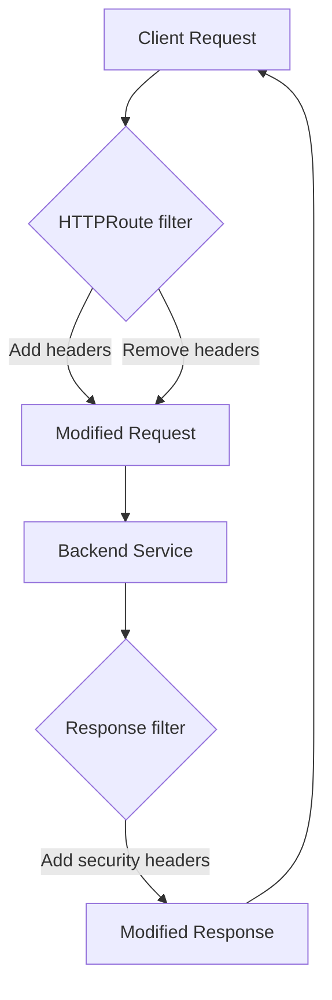

# How to Configure HTTP Header Modifiers in the Cilium Gateway API

Author: [nawazdhandala](https://github.com/nawazdhandala)

Tags: Cilium, Kubernetes, HTTP, Gateway API, Headers, Routing

Description: Configure HTTP request and response header modification in Cilium's Gateway API to add, remove, or override headers at the ingress gateway.

---

## Introduction

HTTP header modification is a common ingress requirement for adding tracing headers, routing metadata, security headers, and environment identifiers. Cilium's Gateway API supports header modification as a route-level filter applied before requests reach backends (request header modifier) or before responses reach clients (response header modifier).

Header modifications can be applied globally to a route or conditionally based on request matches, enabling patterns like adding authentication headers for specific paths or injecting security headers on all responses.

## Prerequisites

- Cilium with Gateway API enabled
- A Gateway and HTTPRoute deployed

## Add Request Headers

Inject headers into requests before forwarding to backends:

```yaml
apiVersion: gateway.networking.k8s.io/v1
kind: HTTPRoute
metadata:
  name: header-inject-route
  namespace: default
spec:
  parentRefs:
    - name: my-gateway
  rules:
    - filters:
        - type: RequestHeaderModifier
          requestHeaderModifier:
            add:
              - name: X-Request-ID
                value: "gateway-injected"
              - name: X-Environment
                value: "production"
            remove:
              - X-Debug-Token
      backendRefs:
        - name: api-service
          port: 8080
```

## Architecture



## Add Response Headers

Add security headers to all responses:

```yaml
rules:
  - filters:
      - type: ResponseHeaderModifier
        responseHeaderModifier:
          add:
            - name: X-Content-Type-Options
              value: "nosniff"
            - name: X-Frame-Options
              value: "DENY"
            - name: Strict-Transport-Security
              value: "max-age=31536000; includeSubDomains"
    backendRefs:
      - name: web-service
        port: 80
```

## Override vs Add vs Remove

```yaml
requestHeaderModifier:
  # add: adds header (fails if already exists)
  add:
    - name: X-New-Header
      value: "new-value"
  # set: add or override existing header
  set:
    - name: X-Forwarded-Proto
      value: "https"
  # remove: delete header before forwarding
  remove:
    - X-Internal-Token
```

## Test Header Modification

```bash
GATEWAY_IP=$(kubectl get gateway my-gateway \
  -o jsonpath='{.status.addresses[0].value}')

# Check headers sent to backend (using debug endpoint)
curl -v http://${GATEWAY_IP}/headers 2>&1 | grep "X-"

# Check response headers
curl -I http://${GATEWAY_IP}/
```

## Combine with Route Matching

Add different headers based on path:

```yaml
rules:
  - matches:
      - path:
          type: PathPrefix
          value: /api
    filters:
      - type: RequestHeaderModifier
        requestHeaderModifier:
          add:
            - name: X-Route-Target
              value: "api"
  - matches:
      - path:
          type: PathPrefix
          value: /web
    filters:
      - type: ResponseHeaderModifier
        responseHeaderModifier:
          add:
            - name: Cache-Control
              value: "public, max-age=3600"
```

## Conclusion

HTTP header modification in Cilium's Gateway API provides centralized header management at the ingress layer, enabling security header injection, request routing metadata, and legacy header cleanup without modifying backend services. Combining header filters with route matching allows precise control over which routes receive which header modifications.
