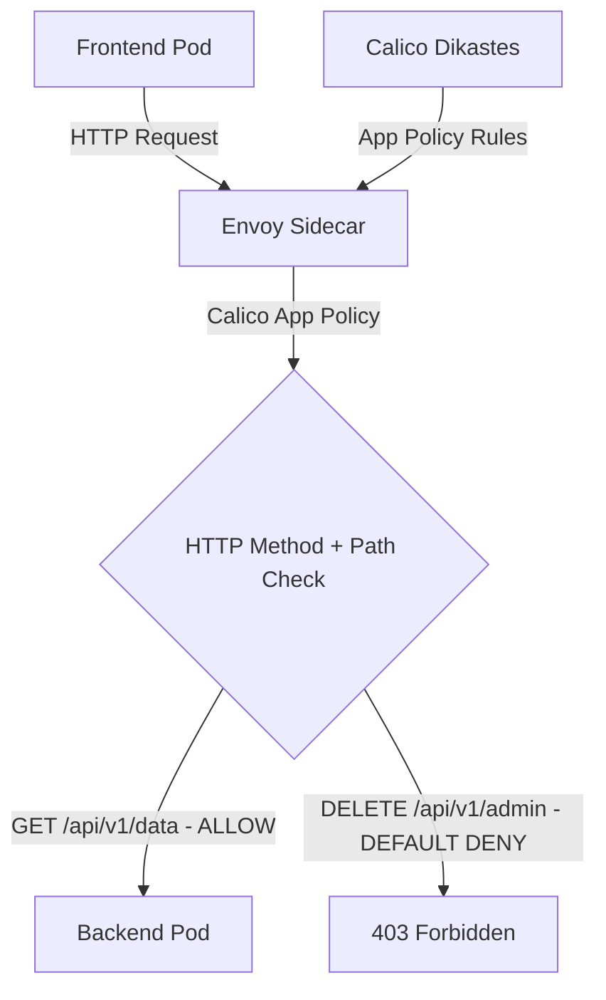

# How to Configure HTTP Method Policies with Calico and Istio

Author: [nawazdhandala](https://github.com/nawazdhandala)

Tags: Calico, Kubernetes, Network Policy, Istio, HTTP Methods, Security

Description: Configure Calico HTTP method-based network policies using Istio to control access by HTTP verb (GET, POST, DELETE, etc.).

---

## Introduction

HTTP Method Policies with Calico and Istio combines Calico's network-layer enforcement with Istio's application-layer visibility. This powerful combination lets you write policies that reference HTTP attributes - methods and paths - in addition to network-level properties like IP addresses and ports.

Calico's `projectcalico.org/v3` NetworkPolicy and GlobalNetworkPolicy resources support HTTP match criteria when application layer policy is enabled with Istio integration. These rules are evaluated through Istio's Envoy sidecar proxies and the Calico Dikastes sidecar rather than only at the network layer. This enables fine-grained control like "allow GET requests to /api/health while leaving POST requests to /api/admin denied by default."

This guide covers configure HTTP Method Policies using Calico and Istio together.

## Prerequisites

- Kubernetes cluster with Calico and Istio installed
- Istio 1.22+ and Kubernetes 1.29+ when using Calico's current Kubernetes native sidecar-based Istio integration
- Calico-Istio integration configured with Dikastes injection templates and Envoy authorization
- `calicoctl`, `kubectl`, and `istioctl` installed
- Workloads with Istio sidecar injection enabled and the Dikastes template annotation configured

## Core Configuration

```yaml
apiVersion: projectcalico.org/v3
kind: NetworkPolicy
metadata:
  name: configure-http-method-policies
  namespace: production
spec:
  order: 100
  selector: app == 'backend-api'
  ingress:
    - action: Allow
      source:
        selector: app == 'frontend'
      http:
        methods:
          - GET
          - POST
        paths:
          - exact: /api/v1/data
          - prefix: /api/v1/public
  types:
    - Ingress
```

## Istio + Calico Setup

```bash
# Verify Calico-Istio integration

kubectl get configmap -n istio-system istio-sidecar-injector -o yaml | grep "dikastes:" -A 5
kubectl get pods -n calico-system -l k8s-app=csi-node-driver
kubectl get felixconfiguration default -o yaml | grep policySyncPathPrefix

# Enable sidecar injection for namespace
kubectl label namespace production istio-injection=enabled --overwrite

# After redeploying workloads, verify the Istio and Dikastes sidecars are present
kubectl get pod -n production -l app=backend-api -o jsonpath='{.items[0].spec.containers[*].name}'
```

## Test Application-Layer Policy

```bash
# Test allowed method
kubectl exec -n production frontend-pod -- curl -sS -o /dev/null -w "%{http_code}\n" -X GET http://backend-api:8080/api/v1/data
# Expected: 200

# Test denied method/path
kubectl exec -n production frontend-pod -- curl -sS -o /dev/null -w "%{http_code}\n" -X DELETE http://backend-api:8080/api/v1/admin
# Expected: 403
```

## Architecture



## Conclusion

HTTP Method Policies with Calico and Istio provide fine-grained network security in Kubernetes, combining network-layer enforcement with application-layer policy evaluation. By filtering on HTTP methods and paths, you can implement access controls that are impossible with pure network-layer policies. Ensure your Calico-Istio integration is properly configured and test both allowed and denied request patterns to verify your application-layer policies are working correctly.
