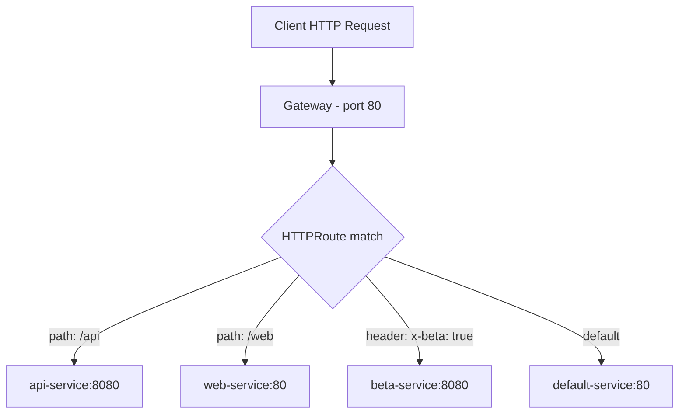

# How to Configure HTTP Routing in the Cilium Gateway API

Author: [nawazdhandala](https://github.com/nawazdhandala)

Tags: Cilium, Kubernetes, HTTP, Gateway API, Routing, Ingress

Description: Configure HTTP routing in Cilium's Gateway API using HTTPRoute resources with path matching, header filtering, and traffic splitting.

---

## Introduction

HTTP routing is the most common use case for Kubernetes ingress, and Cilium's Gateway API implementation provides a powerful HTTPRoute resource for defining routing rules. HTTPRoutes support path prefix and exact matching, header-based routing, traffic weight splitting, and request/response header modification.

Unlike the older Kubernetes Ingress resource, HTTPRoute provides a more expressive API with consistent semantics across all Gateway API implementations.

## Prerequisites

- Cilium with Gateway API enabled
- Gateway API CRDs installed
- A Gateway with an HTTP listener

## Deploy a Gateway

```yaml
apiVersion: gateway.networking.k8s.io/v1
kind: Gateway
metadata:
  name: http-gateway
  namespace: default
spec:
  gatewayClassName: cilium
  listeners:
    - name: http
      protocol: HTTP
      port: 80
```

## Architecture



## Basic Path Routing

```yaml
apiVersion: gateway.networking.k8s.io/v1
kind: HTTPRoute
metadata:
  name: api-route
  namespace: default
spec:
  parentRefs:
    - name: http-gateway
  hostnames:
    - "api.example.com"
  rules:
    - matches:
        - path:
            type: PathPrefix
            value: /api
      backendRefs:
        - name: api-service
          port: 8080
    - matches:
        - path:
            type: PathPrefix
            value: /
      backendRefs:
        - name: web-service
          port: 80
```

## Header-Based Routing

```yaml
rules:
  - matches:
      - headers:
          - name: x-environment
            value: staging
    backendRefs:
      - name: staging-service
        port: 8080
  - backendRefs:
      - name: production-service
        port: 8080
```

## Traffic Splitting

```yaml
rules:
  - backendRefs:
      - name: app-v1
        port: 8080
        weight: 90
      - name: app-v2
        port: 8080
        weight: 10
```

## Apply and Test

```bash
kubectl apply -f http-route.yaml

GATEWAY_IP=$(kubectl get gateway http-gateway \
  -o jsonpath='{.status.addresses[0].value}')

# Test path routing
curl -H "Host: api.example.com" http://${GATEWAY_IP}/api/users
curl -H "Host: api.example.com" http://${GATEWAY_IP}/

# Test header routing
curl -H "Host: api.example.com" \
     -H "x-environment: staging" \
     http://${GATEWAY_IP}/api/users
```

## Conclusion

Configuring HTTP routing in the Cilium Gateway API provides a powerful and expressive way to define ingress routing rules. Path matching, header-based routing, and traffic splitting cover the most common deployment patterns, while the consistent HTTPRoute API works identically across all Gateway API implementations.
