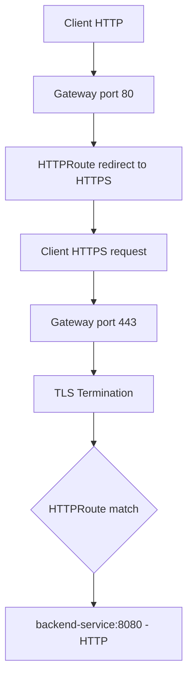

# How to Configure HTTPS Routing in the Cilium Gateway API

Author: [nawazdhandala](https://github.com/nawazdhandala)

Tags: Cilium, Kubernetes, HTTPS, TLS, Gateway API, Routing, Security

Description: Configure HTTPS routing in Cilium's Gateway API with TLS termination, certificate management, and secure backend routing.

---

## Introduction

HTTPS routing in Cilium's Gateway API involves TLS termination at the gateway, with encrypted traffic between the client and gateway and optionally re-encrypted or cleartext traffic between the gateway and backend pods. Cilium handles TLS termination through its Envoy integration.

Certificate management is typically handled by cert-manager, which automatically provisions and renews TLS certificates from Let's Encrypt or internal CAs and stores them as Kubernetes Secrets referenced by the Gateway listener.

## Prerequisites

- Cilium with Gateway API enabled
- cert-manager installed (for automated certificates)
- Valid domain name pointing to your Gateway IP

## Create TLS Certificate

Using cert-manager:

```yaml
apiVersion: cert-manager.io/v1
kind: Certificate
metadata:
  name: gateway-tls
  namespace: default
spec:
  secretName: gateway-tls-secret
  dnsNames:
    - api.example.com
  issuerRef:
    name: letsencrypt-prod
    kind: ClusterIssuer
```

Or create a self-signed certificate for testing:

```bash
openssl req -x509 -nodes -days 365 -newkey rsa:2048 \
  -keyout tls.key -out tls.crt \
  -subj "/CN=api.example.com"

kubectl create secret tls gateway-tls-secret \
  --key tls.key --cert tls.crt
```

## Configure HTTPS Gateway

```yaml
apiVersion: gateway.networking.k8s.io/v1
kind: Gateway
metadata:
  name: https-gateway
  namespace: default
spec:
  gatewayClassName: cilium
  listeners:
    - name: https
      protocol: HTTPS
      port: 443
      hostname: "api.example.com"
      tls:
        mode: Terminate
        certificateRefs:
          - kind: Secret
            name: gateway-tls-secret
    - name: http-redirect
      protocol: HTTP
      port: 80
```

## Architecture



## Create HTTPRoute for HTTPS

```yaml
apiVersion: gateway.networking.k8s.io/v1
kind: HTTPRoute
metadata:
  name: https-route
  namespace: default
spec:
  parentRefs:
    - name: https-gateway
      sectionName: https
  hostnames:
    - "api.example.com"
  rules:
    - backendRefs:
        - name: api-service
          port: 8080
```

## HTTP to HTTPS Redirect

```yaml
apiVersion: gateway.networking.k8s.io/v1
kind: HTTPRoute
metadata:
  name: http-redirect
  namespace: default
spec:
  parentRefs:
    - name: https-gateway
      sectionName: http-redirect
  rules:
    - filters:
        - type: RequestRedirect
          requestRedirect:
            scheme: https
            statusCode: 301
```

## Verify HTTPS

```bash
curl -v https://api.example.com/
```

## Conclusion

Configuring HTTPS routing in Cilium's Gateway API provides TLS termination with automatic certificate management via cert-manager. The combination of HTTPS listener, TLS secret reference, and HTTP-to-HTTPS redirect delivers a complete secure ingress configuration following security best practices.
