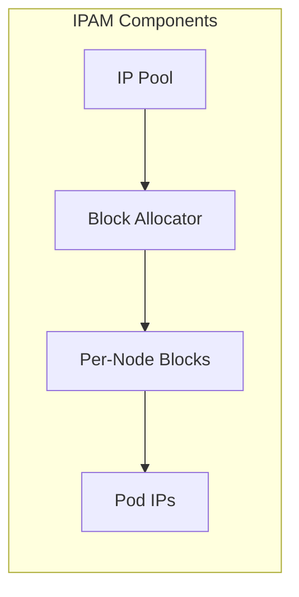

# How to Configure IP Address Allocation by Topology in Calico

Author: [nawazdhandala](https://github.com/nawazdhandala)

Tags: Calico, Kubernetes, IPAM, Topology, Networking

Description: Configure Calico topology-aware IPAM to allocate IP addresses based on zone or rack placement for predictable addressing.

---

## Introduction

IP Address Allocation by Topology is an important aspect of Calico IP address management in Kubernetes. Getting this right ensures efficient IP utilization, predictable pod addressing, and smooth cluster operations.

This guide provides practical steps to manage IP Address Allocation by Topology in your Calico deployment with focus on production-grade configurations and best practices.

## Prerequisites

- Calico v3.20+ with IPAM configured
- kubectl and calicoctl access
- IP pools configured in the cluster

## Configuration Steps

```bash
# Check current IPAM state

calicoctl ipam show --show-blocks

# View IP pool configuration
calicoctl get ippools -o yaml

# Label nodes with topology information
kubectl label nodes worker-a topology.kubernetes.io/zone=zone-a
kubectl label nodes worker-b topology.kubernetes.io/zone=zone-b

# Check IPAM allocations
calicoctl ipam check
```

## Example Configuration

```yaml
apiVersion: projectcalico.org/v3
kind: IPPool
metadata:
  name: pool-zone-a
spec:
  cidr: 10.48.0.0/17
  blockSize: 26
  vxlanMode: Always
  natOutgoing: true
  nodeSelector: topology.kubernetes.io/zone == "zone-a"
---
apiVersion: projectcalico.org/v3
kind: IPPool
metadata:
  name: pool-zone-b
spec:
  cidr: 10.48.128.0/17
  blockSize: 26
  vxlanMode: Always
  natOutgoing: true
  nodeSelector: topology.kubernetes.io/zone == "zone-b"
```

## Verification

```bash
# Verify allocations
kubectl get pods -A -o wide --no-headers | awk '{print $7}' | sort -u | head -20

# Check pool utilization
calicoctl ipam show --show-configuration

# Validate consistency
calicoctl ipam check -o ipam-report.json
```

## Architecture



## Conclusion

Properly managing IP Address Allocation by Topology in Calico ensures reliable pod networking and prevents IP exhaustion issues. Regular monitoring of pool utilization and IPAM consistency checks help maintain a healthy IP addressing infrastructure.
