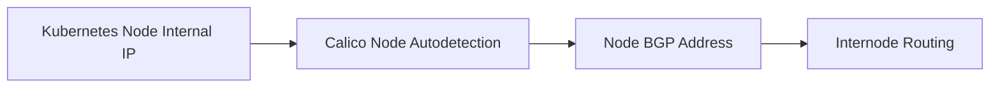

# How to Configure IP Autodetection in Calico

Author: [nawazdhandala](https://github.com/nawazdhandala)

Tags: Calico, Kubernetes, IPAM, IP Autodetection, Networking

Description: Configure how Calico detects and selects the primary IP address for each node in diverse network interface environments.

---

## Introduction

Calico IP Autodetection is a critical configuration aspect of Calico networking. This guide provides step-by-step instructions for managing this feature effectively in production Kubernetes clusters.

## Prerequisites

- Calico v3.20+ installed with the Tigera Operator
- kubectl and calicoctl configured
- Cluster-admin access

## Steps

```bash
# Check current state

kubectl get nodes -o wide
calicoctl get nodes -o yaml
kubectl get installation.operator.tigera.io default -o yaml
```

## Configuration

```yaml
apiVersion: operator.tigera.io/v1
kind: Installation
metadata:
  name: default
spec:
  calicoNetwork:
    nodeAddressAutodetectionV4:
      kubernetes: NodeInternalIP
```

## Verify

```bash
# Validate changes
kubectl get nodes -o wide
calicoctl get nodes -o yaml | grep -E 'ipv4Address|ipv6Address'
```

## Architecture



## Conclusion

How to Configure IP Autodetection in Calico in Calico requires careful planning and validation. Use the steps above to ensure your configuration meets your cluster's IP addressing requirements.
