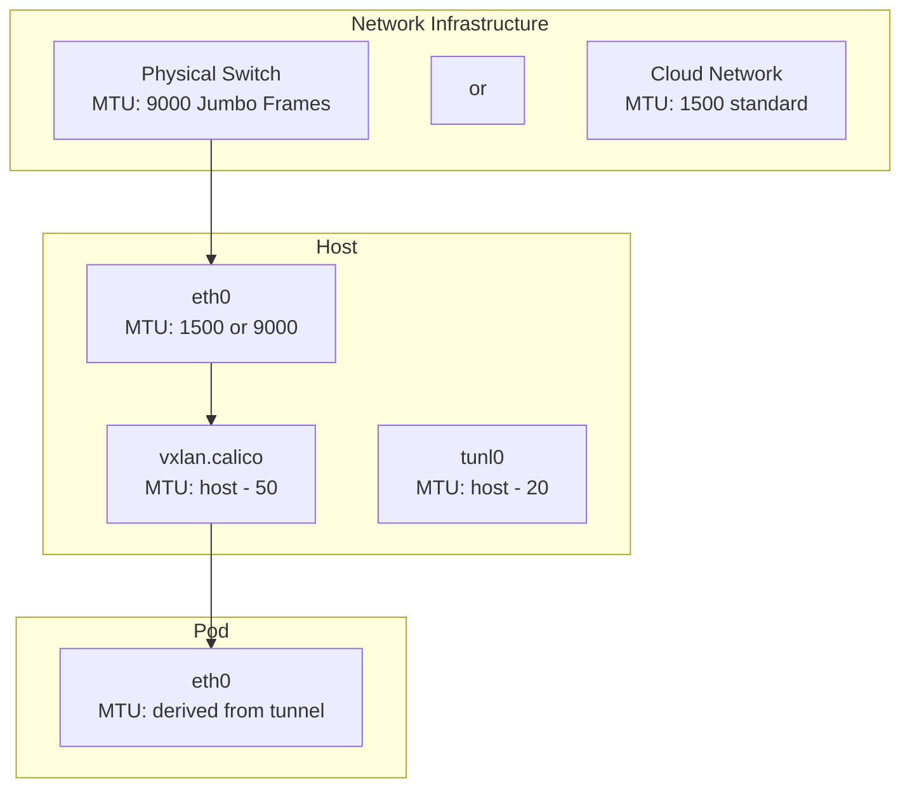

# How to Configure MTU Sizing for Calico

Author: [nawazdhandala](https://github.com/nawazdhandala)

Tags: Calico, Kubernetes, MTU, Networking, CNI

Description: Configure MTU settings in Calico to match your network infrastructure and avoid packet fragmentation that degrades performance and causes mysterious connectivity failures.

---

## Introduction

MTU (Maximum Transmission Unit) configuration is one of the most impactful and frequently misunderstood aspects of Calico networking. An incorrectly sized MTU causes packet fragmentation, which degrades throughput by orders of magnitude and can cause mysterious application-level failures like broken TLS handshakes or GRPC streams that silently drop data.

Calico automatically detects the host MTU and sets pod MTU accordingly, accounting for encapsulation overhead when VXLAN or IP-in-IP is used. However, automatic detection can fail in environments with non-standard MTU configurations, underlying network MTU changes, or when running on cloud platforms with different MTU values per interface.

## Prerequisites

- Calico installed (v3.20+ for automatic MTU detection)
- Knowledge of your network's physical MTU
- kubectl access

## Understand MTU Requirements by Mode

| Mode | Overhead | Recommended Pod MTU (if host MTU=1500) |
|------|----------|----------------------------------------|
| Native BGP | 0 bytes | 1500 |
| IP-in-IP | 20 bytes | 1480 |
| VXLAN | 50 bytes | 1450 |
| WireGuard | 60 bytes | 1440 |
| WireGuard + VXLAN | 110 bytes | 1390 |

## Check Current MTU Configuration

```bash
# Check what Calico has auto-detected
kubectl get felixconfiguration default -o yaml | grep -i mtu

# Check current pod interface MTU
kubectl exec test-pod -- ip link show eth0

# Check host interface MTU
ip link show eth0
```

## Set MTU Explicitly

Override auto-detection with explicit MTU values:

```bash
calicoctl patch felixconfiguration default --type merge \
  --patch '{"spec":{"mtu":1500}}'

# For VXLAN deployments
calicoctl patch felixconfiguration default --type merge \
  --patch '{"spec":{"vxlanMTU":1450}}'

# For WireGuard deployments
calicoctl patch felixconfiguration default --type merge \
  --patch '{"spec":{"wireguardMTU":1440}}'
```

## Configure MTU in Installation Resource

For Calico Operator installations, set MTU in the Installation resource:

```yaml
apiVersion: operator.tigera.io/v1
kind: Installation
metadata:
  name: default
spec:
  calicoNetwork:
    mtu: 1500
    ipPools:
    - cidr: 10.48.0.0/16
      encapsulation: VXLAN
```

## MTU Configuration Diagram



## Verify MTU on New Pods

After changing MTU configuration, verify new pods get the correct MTU:

```bash
kubectl run mtu-test --image=busybox -- sleep 3600
kubectl exec mtu-test -- ip link show eth0
# Look for: mtu <expected_value>
```

## Conclusion

Configuring the correct MTU in Calico prevents packet fragmentation and the hard-to-debug performance and connectivity issues it causes. Set MTU explicitly rather than relying on auto-detection when running in environments with non-standard MTU values or when using encapsulation modes. Always verify that newly created pods receive the expected MTU by checking their network interface configuration.
