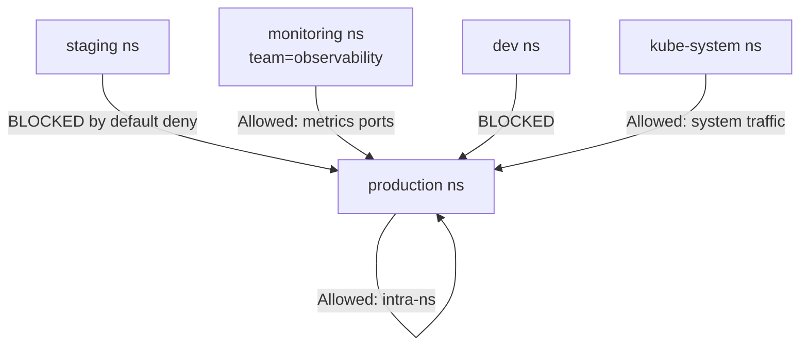

# How to Configure Namespace-Based Policies in Calico

Author: [nawazdhandala](https://github.com/nawazdhandala)

Tags: Calico, Kubernetes, Network Policy, Namespace, Security

Description: A step-by-step guide to configuring Calico namespace-based network policies to isolate workloads by Kubernetes namespace.

---

## Introduction

Namespace-based network policies are one of the most practical starting points for Kubernetes network security. By isolating namespaces from each other, you create clear security boundaries between teams, environments, and application tiers. Calico's `projectcalico.org/v3` API gives you namespace selectors that allow you to reference namespaces by their labels, enabling dynamic policies that automatically apply as namespaces are created.

Kubernetes namespaces are natural organizational units: you might have `production`, `staging`, `dev`, `monitoring`, and `kube-system` namespaces. Namespace-based policies ensure that your staging workloads cannot accidentally communicate with production databases, and that development experiments cannot interfere with running services.

This guide walks through configuring namespace isolation in Calico using namespace selectors, GlobalNetworkPolicy for cluster-wide rules, and namespace-scoped NetworkPolicy for per-namespace controls.

## Prerequisites

- Kubernetes cluster with Calico v3.26+
- `calicoctl` and `kubectl` installed
- Multiple namespaces with meaningful labels applied

## Step 1: Label Your Namespaces

```bash
kubectl label namespace production environment=production team=platform
kubectl label namespace staging environment=staging team=platform
kubectl label namespace monitoring team=observability purpose=monitoring
kubectl label namespace kube-system purpose=system
```

## Step 2: Apply Default Deny Per Namespace

```yaml
apiVersion: projectcalico.org/v3
kind: NetworkPolicy
metadata:
  name: default-deny
  namespace: production
spec:
  order: 1000
  selector: all()
  types:
    - Ingress
    - Egress
```

## Step 3: Allow Intra-Namespace Traffic

```yaml
apiVersion: projectcalico.org/v3
kind: NetworkPolicy
metadata:
  name: allow-same-namespace
  namespace: production
spec:
  order: 100
  selector: all()
  ingress:
    - action: Allow
      source:
        namespaceSelector: environment == 'production'
  egress:
    - action: Allow
      destination:
        namespaceSelector: environment == 'production'
  types:
    - Ingress
    - Egress
```

## Step 4: Allow Monitoring Access Across Namespaces

```yaml
apiVersion: projectcalico.org/v3
kind: GlobalNetworkPolicy
metadata:
  name: allow-monitoring-ingress
spec:
  order: 200
  selector: all()
  ingress:
    - action: Allow
      source:
        namespaceSelector: team == 'observability'
      destination:
        ports: [9090, 9091, 8080, 8443]
  types:
    - Ingress
```

## Namespace Isolation Architecture



## Conclusion

Namespace-based policies in Calico provide a clean organizational layer for cluster security. By labeling namespaces with meaningful metadata and writing policies that reference those labels, you create dynamic isolation that scales as your cluster grows. New namespaces get isolation automatically when you apply the right labels - no per-namespace policy changes required.
