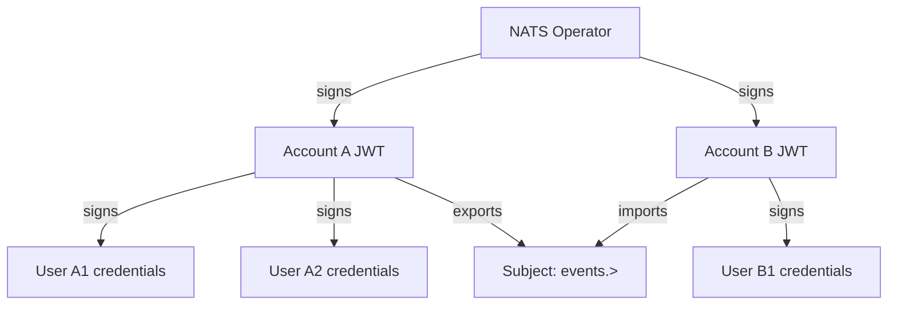

# How to Configure NATS Accounts with Flux CD

Author: [nawazdhandala](https://github.com/nawazdhandala)

Tags: Flux CD, Kubernetes, GitOps, NATS, Accounts, Security, Multi-tenancy

Description: Manage NATS accounts and security configurations using Flux CD for GitOps-managed NATS multi-tenancy and access control.

---

## Introduction

NATS accounts provide multi-tenancy and security isolation within a single NATS server or cluster. Each account has its own subject namespace, JetStream resources, and connection limits. Services in different accounts cannot communicate unless explicitly configured with import/export capabilities. The NATS Operator and decentralized JWT-based security model allow large organizations to manage hundreds of accounts with cryptographic, zero-trust security.

For simpler deployments, NATS supports static account configuration in the server config file, which maps well to Flux CD management via ConfigMaps. This post covers configuring NATS accounts using the resolver-based JWT approach for production multi-tenancy.

## Prerequisites

- NATS cluster deployed via Flux CD (see NATS JetStream post)
- `nsc` (NATS Security Credentials) tool installed locally
- `kubectl` and `flux` CLIs installed

## Step 1: Understand NATS Account Architecture



Each level (Operator → Account → User) uses NKey cryptography. The server verifies JWTs cryptographically without needing a central registry.

## Step 2: Generate NATS Security Credentials

```bash
# Initialize nsc environment
nsc add operator --name production-operator
nsc add account --name services-account
nsc add account --name analytics-account

# Add users to each account
nsc add user --account services-account --name orders-service
nsc add user --account analytics-account --name analytics-worker

# Generate credentials files
nsc generate creds --account services-account --name orders-service \
  > orders-service.creds
nsc generate creds --account analytics-account --name analytics-worker \
  > analytics-worker.creds

# Export the resolver configuration
nsc generate config --mem-resolver --config-file nats-resolver.conf
```

## Step 3: Store Credentials in Kubernetes Secrets

```bash
# Store operator JWT and resolver config
kubectl create secret generic nats-operator-config \
  -n nats \
  --from-file=resolver.conf=nats-resolver.conf

# Store user credentials
kubectl create secret generic orders-service-nats-creds \
  -n myapp \
  --from-file=orders-service.creds=orders-service.creds

kubectl create secret generic analytics-worker-nats-creds \
  -n analytics \
  --from-file=analytics-worker.creds=analytics-worker.creds
```

For GitOps, use Sealed Secrets:
```yaml
# infrastructure/messaging/nats/accounts/nats-account-secrets.yaml
# (SealedSecret wrapping the above credentials)
```

## Step 4: Configure NATS with Account Resolver

Update the NATS HelmRelease to use the resolver:

```yaml
# infrastructure/messaging/nats/nats-cluster.yaml (updated values)
apiVersion: helm.toolkit.fluxcd.io/v2
kind: HelmRelease
metadata:
  name: nats
  namespace: nats
spec:
  interval: 30m
  chart:
    spec:
      chart: nats
      version: "1.2.4"
      sourceRef:
        kind: HelmRepository
        name: nats
        namespace: flux-system
  values:
    config:
      cluster:
        enabled: true
        replicas: 3

      jetstream:
        enabled: true
        fileStore:
          enabled: true
          pvc:
            enabled: true
            size: 10Gi

      # Account configuration with JWT resolver
      merge:
        accounts:
          services:
            users:
              - user: services-user
                password: "$SERVICES_PASSWORD"
            jetstream:
              max_memory: 512Mi
              max_file: 10Gi
            imports:
              - stream:
                  subject: "analytics.>"
                  account: analytics
            exports:
              - stream:
                  subject: "orders.>"

          analytics:
            users:
              - user: analytics-user
                password: "$ANALYTICS_PASSWORD"
            jetstream:
              max_memory: 256Mi
              max_file: 5Gi
            imports:
              - stream:
                  subject: "orders.>"
                  account: services

        # System account for monitoring
        system_account: SYS

    # Inject account passwords from Secrets
    extraEnvs:
      - name: SERVICES_PASSWORD
        valueFrom:
          secretKeyRef:
            name: nats-account-passwords
            key: services-password
      - name: ANALYTICS_PASSWORD
        valueFrom:
          secretKeyRef:
            name: nats-account-passwords
            key: analytics-password
```

## Step 5: Create Account Password Secret

```yaml
# infrastructure/messaging/nats/accounts/account-passwords.yaml (use SealedSecret)
apiVersion: v1
kind: Secret
metadata:
  name: nats-account-passwords
  namespace: nats
type: Opaque
stringData:
  services-password: "ServicesPassword123!"
  analytics-password: "AnalyticsPassword123!"
```

## Step 6: Configure Applications to Use Account Credentials

```yaml
# apps/orders-service/deployment.yaml
apiVersion: apps/v1
kind: Deployment
metadata:
  name: orders-service
  namespace: myapp
spec:
  template:
    spec:
      containers:
        - name: app
          env:
            - name: NATS_URL
              value: "nats://nats.nats.svc.cluster.local:4222"
            - name: NATS_USER
              value: "services-user"
            - name: NATS_PASSWORD
              valueFrom:
                secretKeyRef:
                  name: nats-account-passwords
                  key: services-password
```

## Step 7: Flux Kustomization

```yaml
# clusters/production/nats-accounts-kustomization.yaml
apiVersion: kustomize.toolkit.fluxcd.io/v1
kind: Kustomization
metadata:
  name: nats-accounts
  namespace: flux-system
spec:
  interval: 5m
  sourceRef:
    kind: GitRepository
    name: flux-system
  path: ./infrastructure/messaging/nats/accounts
  prune: true
  dependsOn:
    - name: nats-cluster
```

## Step 8: Verify Account Isolation

```bash
# Connect as services account user
kubectl exec -n nats deploy/nats-box -- \
  nats --server nats://nats.nats.svc.cluster.local:4222 \
  --user services-user \
  --password 'ServicesPassword123!' \
  sub "orders.>"

# Verify analytics account cannot subscribe to orders without import
kubectl exec -n nats deploy/nats-box -- \
  nats --server nats://nats.nats.svc.cluster.local:4222 \
  --user analytics-user \
  --password 'AnalyticsPassword123!' \
  sub "orders.>" 2>&1
# Expected: "Permissions Violation"

# Verify import allows cross-account access
kubectl exec -n nats deploy/nats-box -- \
  nats --server nats://nats.nats.svc.cluster.local:4222 \
  --user analytics-user \
  --password 'AnalyticsPassword123!' \
  sub "orders.>" 2>&1
# This should work via the defined import
```

## Best Practices

- Use the `system_account` for monitoring and internal NATS tooling — never use it for application connections.
- Scope JetStream limits per account (`max_memory`, `max_file`) to prevent one account from consuming all JetStream storage.
- Use exports/imports for cross-account communication rather than giving accounts access to each other's subjects.
- Rotate user passwords by updating the Kubernetes Secret and triggering a NATS server config reload.
- Monitor account statistics with the NATS monitoring endpoint at `/accountz`.

## Conclusion

NATS account configuration managed through Flux CD gives you a version-controlled, multi-tenant messaging infrastructure where security boundaries are defined in Git. Account isolation prevents services from subscribing to subjects they don't own, and the export/import model enables controlled cross-account communication. With Flux managing the NATS configuration and Sealed Secrets handling credentials, your messaging security posture is as strong as your application security.
