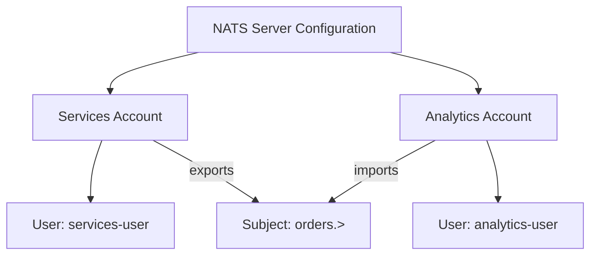

# How to Configure NATS Accounts with Flux CD

Author: [nawazdhandala](https://github.com/nawazdhandala)

Tags: Flux CD, Kubernetes, GitOps, NATS, Account, Security, Multi-Tenancy

Description: Manage NATS accounts and security configurations using Flux CD for GitOps-managed NATS multi-tenancy and access control.

---

## Introduction

NATS accounts provide multi-tenancy and security isolation within a single NATS server or cluster. Each account has its own subject namespace, JetStream resources, and connection limits. Services in different accounts cannot communicate unless explicitly configured with import/export capabilities. The NATS Operator and decentralized JWT-based security model allow large organizations to manage hundreds of accounts with cryptographic, zero-trust security.

For simpler deployments, NATS supports static account configuration in the server config file, which maps well to Flux CD management via ConfigMaps. This post covers configuring NATS accounts using static account definitions managed through the official NATS Helm chart and Flux CD.

## Prerequisites

- NATS cluster deployed via Flux CD (see NATS JetStream post)
- `kubectl` and `flux` CLIs installed

## Step 1: Understand NATS Account Architecture


```mermaid
graph TD
    A[NATS Server Configuration] --> B[Services Account]
    A --> C[Analytics Account]
    B --> D[User: services-user]
    C --> E[User: analytics-user]
    B -->|exports| F[Subject: orders.>]
    C -->|imports| F
```

Each account has its own users, subject namespace, and optional JetStream limits. Accounts exchange messages only when the exporting account defines an export and the importing account defines a matching import.

## Step 2: Generate Account Passwords

```bash
SERVICES_PASSWORD="$(openssl rand -base64 32)"
ANALYTICS_PASSWORD="$(openssl rand -base64 32)"
SYS_PASSWORD="$(openssl rand -base64 32)"
```

## Step 3: Store Passwords in Kubernetes Secrets

```bash
# Store passwords where the NATS Helm release runs
kubectl create secret generic nats-account-passwords \
  -n nats \
  --from-literal=services-password="${SERVICES_PASSWORD}" \
  --from-literal=analytics-password="${ANALYTICS_PASSWORD}" \
  --from-literal=sys-password="${SYS_PASSWORD}"

# Store the application-specific password in each application namespace
kubectl create secret generic orders-service-nats-creds \
  -n myapp \
  --from-literal=password="${SERVICES_PASSWORD}"

kubectl create secret generic analytics-worker-nats-creds \
  -n analytics \
  --from-literal=password="${ANALYTICS_PASSWORD}"
```

For GitOps, use Sealed Secrets:
```yaml
# infrastructure/messaging/nats/accounts/nats-account-secrets.yaml
# (SealedSecret wrapping the above credentials)
```

## Step 4: Configure NATS Accounts

Update the NATS HelmRelease to configure the accounts:

```yaml
# infrastructure/messaging/nats/nats-cluster.yaml (updated values)
apiVersion: helm.toolkit.fluxcd.io/v2
kind: HelmRelease
metadata:
  name: nats
  namespace: nats
spec:
  interval: 30m
  chart:
    spec:
      chart: nats
      version: "1.2.4"
      sourceRef:
        kind: HelmRepository
        name: nats
        namespace: flux-system
  values:
    config:
      cluster:
        enabled: true
        replicas: 3

      jetstream:
        enabled: true
        fileStore:
          enabled: true
          pvc:
            enabled: true
            size: 10Gi

      # Static account configuration
      merge:
        accounts:
          services:
            users:
              - user: services-user
                password: << $SERVICES_PASSWORD >>
            jetstream:
              max_memory: 512Mi
              max_file: 10Gi
            imports:
              - stream:
                  subject: "analytics.>"
                  account: analytics
            exports:
              - stream: "orders.>"

          analytics:
            users:
              - user: analytics-user
                password: << $ANALYTICS_PASSWORD >>
            jetstream:
              max_memory: 256Mi
              max_file: 5Gi
            exports:
              - stream: "analytics.>"
            imports:
              - stream:
                  subject: "orders.>"
                  account: services

          SYS:
            users:
              - user: sys-user
                password: << $SYS_PASSWORD >>

        # System account for monitoring
        system_account: SYS

    # Inject account passwords from Secrets
    container:
      env:
        SERVICES_PASSWORD:
          valueFrom:
            secretKeyRef:
              name: nats-account-passwords
              key: services-password
        ANALYTICS_PASSWORD:
          valueFrom:
            secretKeyRef:
              name: nats-account-passwords
              key: analytics-password
        SYS_PASSWORD:
          valueFrom:
            secretKeyRef:
              name: nats-account-passwords
              key: sys-password
```

## Step 5: Create Account Password Secret

```yaml
# infrastructure/messaging/nats/accounts/account-passwords.yaml (use SealedSecret)
apiVersion: v1
kind: Secret
metadata:
  name: nats-account-passwords
  namespace: nats
type: Opaque
stringData:
  services-password: "ServicesPassword123!"
  analytics-password: "AnalyticsPassword123!"
  sys-password: "SysPassword123!"
```

## Step 6: Configure Applications to Use Account Credentials

```yaml
# apps/orders-service/deployment.yaml
apiVersion: apps/v1
kind: Deployment
metadata:
  name: orders-service
  namespace: myapp
spec:
  selector:
    matchLabels:
      app: orders-service
  template:
    metadata:
      labels:
        app: orders-service
    spec:
      containers:
        - name: app
          image: ghcr.io/example/orders-service:1.0.0
          env:
            - name: NATS_URL
              value: "nats://nats.nats.svc.cluster.local:4222"
            - name: NATS_USER
              value: "services-user"
            - name: NATS_PASSWORD
              valueFrom:
                secretKeyRef:
                  name: orders-service-nats-creds
                  key: password
```

## Step 7: Flux Kustomization

```yaml
# clusters/production/nats-accounts-kustomization.yaml
apiVersion: kustomize.toolkit.fluxcd.io/v1
kind: Kustomization
metadata:
  name: nats-accounts
  namespace: flux-system
spec:
  interval: 5m
  sourceRef:
    kind: GitRepository
    name: flux-system
  path: ./infrastructure/messaging/nats/accounts
  prune: true
  dependsOn:
    - name: nats-cluster
```

## Step 8: Verify Account Isolation

```bash
# Connect as services account user
kubectl exec -n nats deploy/nats-box -- \
  nats --server nats://nats.nats.svc.cluster.local:4222 \
  --user services-user \
  --password 'ServicesPassword123!' \
  sub "orders.>"

# Verify analytics can subscribe to orders through the configured import
kubectl exec -n nats deploy/nats-box -- \
  nats --server nats://nats.nats.svc.cluster.local:4222 \
  --user analytics-user \
  --password 'AnalyticsPassword123!' \
  sub "orders.>" 2>&1
# This should work via the defined import

# Verify non-exported subjects remain isolated
kubectl exec -n nats deploy/nats-box -- \
  nats --server nats://nats.nats.svc.cluster.local:4222 \
  --user analytics-user \
  --password 'AnalyticsPassword123!' \
  sub "internal.>" 2>&1
# This subscribes in the analytics account namespace and will not receive services account messages.
```

## Best Practices

- Use the `system_account` for monitoring and internal NATS tooling - never use it for application connections.
- Scope JetStream limits per account (`max_memory`, `max_file`) to prevent one account from consuming all JetStream storage.
- Use exports/imports for cross-account communication rather than giving accounts access to each other's subjects.
- Rotate user passwords by updating the Kubernetes Secret and restarting or reconciling the NATS pods so the password environment variables are refreshed.
- Monitor account statistics with the NATS monitoring endpoint at `/accountz`.

## Conclusion

NATS account configuration managed through Flux CD gives you a version-controlled, multi-tenant messaging infrastructure where security boundaries are defined in Git. Account isolation prevents services from receiving messages from other account namespaces unless imports and exports allow it, and the export/import model enables controlled cross-account communication. With Flux managing the NATS configuration and Sealed Secrets handling credentials, your messaging security posture is as strong as your application security.
