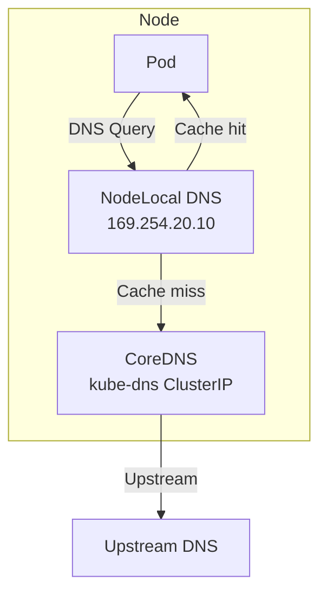

# How to Configure Node Local DNS Cache with Calico

Author: [nawazdhandala](https://github.com/nawazdhandala)

Tags: Calico, Kubernetes, DNS, node-cache, Networking

Description: Configure NodeLocal DNSCache with Calico to reduce DNS latency and improve reliability by adding a per-node DNS caching layer that avoids unnecessary kube-dns roundtrips.

---

## Introduction

DNS lookups are on the critical path for almost every network connection in Kubernetes. By default, all DNS queries from pods flow through kube-dns (or CoreDNS), which runs as a centralized service. In high-traffic clusters, this creates latency from cross-node network hops and potential DNS amplification under high load.

NodeLocal DNSCache addresses this by running a caching DNS agent (node-cache) as a DaemonSet on every node, using a link-local IP address (169.254.20.10) that intercepts DNS queries before they leave the node. This reduces DNS latency from milliseconds to microseconds for cached entries.

Calico requires specific configuration when NodeLocal DNSCache is used, particularly around network policy to allow traffic to the link-local DNS cache IP and iptables rules that interact with NodeLocal DNSCache's NOTRACK rules.

## Prerequisites

- Kubernetes cluster with CoreDNS
- Calico v3.20+
- kubectl and calicoctl access

## Deploy NodeLocal DNSCache

```bash
# Download the NodeLocal DNSCache manifest
curl -LO https://raw.githubusercontent.com/kubernetes/kubernetes/master/cluster/addons/dns/nodelocaldns/nodelocaldns.yaml

# Customize DNS IP addresses
# KUBEDNS_IP: CoreDNS ClusterIP
KUBEDNS=$(kubectl get svc kube-dns -n kube-system -o jsonpath='{.spec.clusterIP}')
sed -i "s/__PILLAR__DNS__SERVER__/${KUBEDNS}/g" nodelocaldns.yaml
sed -i "s/__PILLAR__LOCAL__DNS__/169.254.20.10/g" nodelocaldns.yaml
sed -i "s/__PILLAR__DNS__DOMAIN__/cluster.local/g" nodelocaldns.yaml

kubectl apply -f nodelocaldns.yaml
```

## Configure Calico to Allow NodeLocal DNS Traffic

Create a network policy allowing traffic to the link-local DNS cache:

```yaml
apiVersion: projectcalico.org/v3
kind: GlobalNetworkPolicy
metadata:
  name: allow-nodelocal-dns
spec:
  order: 10
  selector: all()
  types:
  - Egress
  egress:
  - action: Allow
    protocol: UDP
    destination:
      nets:
      - 169.254.20.10/32
      ports:
      - 53
  - action: Allow
    protocol: TCP
    destination:
      nets:
      - 169.254.20.10/32
      ports:
      - 53
```

## Configure Felix for NodeLocal DNS

NodeLocal DNSCache uses NOTRACK iptables rules. Configure Felix to not interfere with these:

```bash
calicoctl patch felixconfiguration default --type merge \
  --patch '{"spec":{"chainInsertMode":"Insert"}}'
```

## Verify NodeLocal DNS is Working

```bash
# Check node-cache pods are running
kubectl get pods -n kube-system -l k8s-app=node-local-dns

# Test DNS resolution using node-local cache
kubectl exec -it test-pod -- nslookup kubernetes.default 169.254.20.10

# Check cache stats
NODE_POD=$(kubectl get pod -n kube-system -l k8s-app=node-local-dns \
  --field-selector spec.nodeName=<node-name> -o name | head -1)
kubectl exec -n kube-system ${NODE_POD} -- cat /run/node-cache/health
```

## Architecture



## Conclusion

Configuring NodeLocal DNSCache with Calico reduces DNS latency by caching responses on each node, eliminating cross-node DNS roundtrips for cached entries. The key Calico-specific requirement is creating a global network policy allowing egress to 169.254.20.10:53. After deployment, verify cache pods are running on all nodes and test that DNS queries are being resolved by the local cache.
