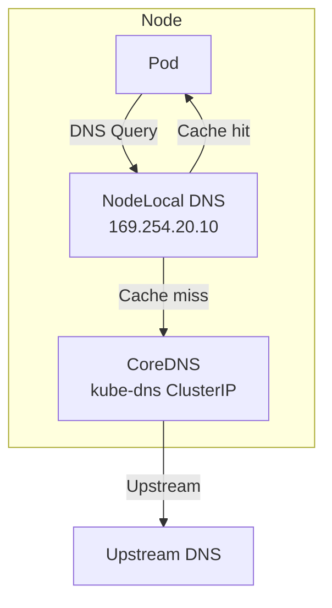

# How to Configure Node Local DNS Cache with Calico

Author: [nawazdhandala](https://github.com/nawazdhandala)

Tags: Calico, Kubernetes, DNS, Node-cache, Networking

Description: Configure NodeLocal DNSCache with Calico to reduce DNS latency and improve reliability by adding a per-node DNS caching layer that avoids unnecessary kube-dns roundtrips.

---

## Introduction

DNS lookups are on the critical path for almost every network connection in Kubernetes. By default, all DNS queries from pods flow through kube-dns (or CoreDNS), which runs as a centralized service. In high-traffic clusters, this creates latency from cross-node network hops and potential DNS amplification under high load.

NodeLocal DNSCache addresses this by running a caching DNS agent (node-cache) as a DaemonSet on every node, using a node-local IP address such as 169.254.20.10. This can reduce DNS latency for cached entries.

Calico requires specific configuration when NodeLocal DNSCache is used, particularly around network policy to allow traffic from the node-local cache to CoreDNS. Calico eBPF dataplane clusters also need a service annotation so Calico's kube-proxy replacement handles kube-dns correctly.

## Prerequisites

- Kubernetes cluster with CoreDNS
- Calico installed
- kubectl access

## Deploy NodeLocal DNSCache

```bash
# Download the NodeLocal DNSCache manifest

curl -LO https://raw.githubusercontent.com/kubernetes/kubernetes/master/cluster/addons/dns/nodelocaldns/nodelocaldns.yaml

# Customize DNS IP addresses for kube-proxy in iptables mode
# If your cluster uses kube-proxy in IPVS mode, use the IPVS substitutions
# from the Kubernetes NodeLocal DNSCache documentation instead.
# KUBEDNS_IP: CoreDNS ClusterIP
KUBEDNS=$(kubectl get svc kube-dns -n kube-system -o jsonpath='{.spec.clusterIP}')
sed -i "s/__PILLAR__DNS__SERVER__/${KUBEDNS}/g" nodelocaldns.yaml
sed -i "s/__PILLAR__LOCAL__DNS__/169.254.20.10/g" nodelocaldns.yaml
sed -i "s/__PILLAR__DNS__DOMAIN__/cluster.local/g" nodelocaldns.yaml

kubectl apply -f nodelocaldns.yaml
```

## Configure Calico to Allow NodeLocal DNS Traffic

Create a network policy allowing traffic from NodeLocal DNSCache to CoreDNS:

```yaml
apiVersion: projectcalico.org/v3
kind: NetworkPolicy
metadata:
  name: default.local-dns-to-core-dns
  namespace: kube-system
spec:
  tier: default
  selector: k8s-app == "kube-dns"
  types:
  - Ingress
  ingress:
  - action: Allow
    protocol: TCP
    destination:
      selector: k8s-app == "kube-dns"
      ports:
      - '53'
```

## Configure Calico eBPF for NodeLocal DNS

If your Calico installation uses the eBPF dataplane, annotate the kube-dns service so Calico does not apply service NAT to NodeLocal DNSCache traffic:

```bash
kubectl annotate service kube-dns -n kube-system projectcalico.org/natExcludeService=true
```

## Verify NodeLocal DNS is Working

```bash
# Check node-cache pods are running
kubectl get pods -n kube-system -l k8s-app=node-local-dns

# Test DNS resolution using node-local cache
kubectl exec -it test-pod -- nslookup kubernetes.default 169.254.20.10

# Check cache metrics
NODE_POD=$(kubectl get pod -n kube-system -l k8s-app=node-local-dns \
  --field-selector spec.nodeName=<node-name> -o name | head -1)
kubectl port-forward -n kube-system ${NODE_POD} 9253:9253
# In another terminal:
curl http://127.0.0.1:9253/metrics | grep coredns_cache
```

## Architecture


```mermaid
graph TD
    subgraph Node
        POD[Pod] -->|DNS Query| NODELOCAL[NodeLocal DNS\n169.254.20.10]
        NODELOCAL -->|Cache miss| COREDNS[CoreDNS\nkube-dns ClusterIP]
        NODELOCAL -->|Cache hit| POD
    end
    COREDNS -->|Upstream| DNS[Upstream DNS]
```

## Conclusion

Configuring NodeLocal DNSCache with Calico reduces DNS latency by caching responses on each node, eliminating cross-node DNS roundtrips for cached entries. The key Calico-specific requirement is creating a network policy allowing NodeLocal DNSCache to reach CoreDNS on port 53. If you use Calico eBPF, annotate the kube-dns service for NodeLocal DNSCache. After deployment, verify cache pods are running on all nodes and test that DNS queries are being resolved by the local cache.
