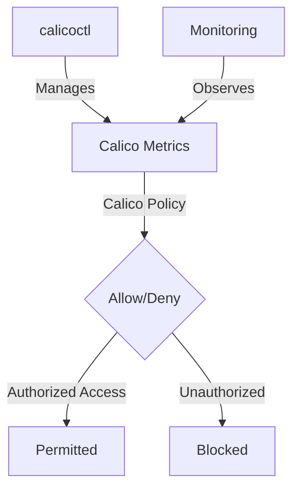

# How to Configure Secure Calico Metrics Endpoints

Author: [nawazdhandala](https://github.com/nawazdhandala)

Tags: Calico, Kubernetes, Metric, Security, Prometheus

Description: Configure security for Calico metrics endpoints to restrict access to authorized monitoring systems only.

---

## Introduction

Securing Calico Metrics Endpoints is an important security consideration for production Calico deployments. The `projectcalico.org/v3` API provides the tools needed to configure Calico Metrics effectively, combining Calico's network policy with proper access controls and monitoring.

This guide covers configure Calico Metrics in Calico with practical configurations and operational best practices.

## Prerequisites

- Kubernetes cluster with Calico v3.26+
- `calicoctl` and `kubectl` installed
- Calico host endpoints enabled for Kubernetes nodes
- Understanding of Calico's monitoring and security architecture

## Core Configuration

```yaml
# Restrict access to Calico Felix metrics (port 9091)

apiVersion: projectcalico.org/v3
kind: GlobalNetworkPolicy
metadata:
  name: secure-calico-metrics
spec:
  order: 100
  selector: has(kubernetes-host)
  ingress:
    - action: Allow
      protocol: TCP
      source:
        namespaceSelector: team == 'observability'
      destination:
        ports: [9091]
    - action: Allow
      protocol: TCP
      source:
        selector: app == 'prometheus'
      destination:
        ports: [9091]
    - action: Deny
      protocol: TCP
      destination:
        ports: [9091]
  types:
    - Ingress
```

## Implementation Steps

```bash
# Enable automatic host endpoints and label Kubernetes nodes for the policy selector
calicoctl patch kubecontrollersconfiguration default --patch='{"spec": {"controllers": {"node": {"hostEndpoint": {"autoCreate": "Enabled"}}}}}'
kubectl label nodes --all kubernetes-host= --overwrite
kubectl label namespace monitoring team=observability --overwrite

# Apply metrics security policy
calicoctl apply -f secure-calico-metrics.yaml

# Verify only authorized access works
kubectl exec -n monitoring prometheus-pod -- curl -fsS http://calico-node-ip:9091/metrics >/dev/null
echo "Prometheus access (should work): $?"

# Verify unauthorized access is blocked
kubectl exec -n default test-pod -- curl -fsS --max-time 5 http://calico-node-ip:9091/metrics
echo "Unauthorized access (should timeout): $?"
```

## Verify Metrics Security

```bash
# If Calico Whisker and Goldmane flow logs are enabled, open Whisker and filter for dest_port 9091
kubectl port-forward -n calico-system service/whisker 8081:8081

# Check active policy for the Calico host endpoints
calicoctl get globalnetworkpolicy secure-calico-metrics -o yaml
```

## Architecture



## Conclusion

Configure Calico Metrics in Calico requires a combination of proper policy configuration, regular monitoring, and proactive testing. Use the patterns in this guide as a foundation and adapt them to your specific security requirements. Always validate changes in staging before production and maintain comprehensive logging for security visibility.
