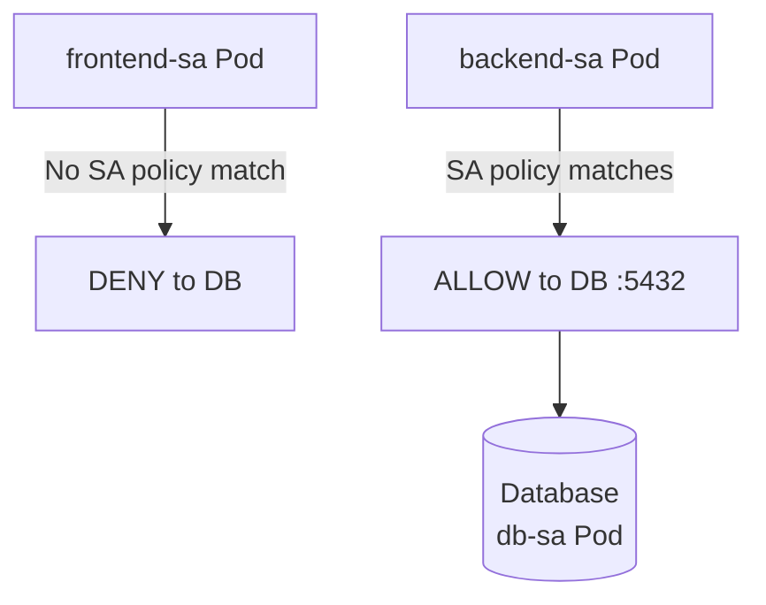

# How to Configure Service Account-Based Policies in Calico

Author: [nawazdhandala](https://github.com/nawazdhandala)

Tags: Calico, Kubernetes, Network Policy, Service Accounts, Security, Zero Trust

Description: A step-by-step guide to configuring Calico network policies based on Kubernetes service accounts for stronger workload identity-based access control.

---

## Introduction

Service account-based policies represent a stronger identity model than label-based policies because service accounts are more controlled - they are granted by the cluster operator rather than set freely in pod metadata. In a zero-trust cluster, using service accounts as the identity basis for network policy makes it harder for an attacker to escalate network access by simply adding labels to a pod.

Calico's `projectcalico.org/v3` NetworkPolicy supports `serviceAccountSelector` in both the policy selector and the source/destination fields, enabling policies like "allow pods running as the `payment-processor` service account to reach the database." This ties network access to the Kubernetes RBAC identity of the workload.

This guide shows how to configure service account-based network policies in Calico, covering the full workflow from service account creation to policy enforcement.

## Prerequisites

- Kubernetes cluster with Calico v3.26+
- `calicoctl` and `kubectl` installed
- Understanding of Kubernetes service accounts and RBAC

## Step 1: Create Dedicated Service Accounts

```bash
# Create service accounts for each workload
kubectl create serviceaccount frontend-sa -n production
kubectl create serviceaccount backend-sa -n production
kubectl create serviceaccount db-sa -n production
```

## Step 2: Assign Service Accounts to Pods

```yaml
apiVersion: apps/v1
kind: Deployment
metadata:
  name: backend
  namespace: production
spec:
  template:
    spec:
      serviceAccountName: backend-sa
      containers:
        - name: backend
          image: my-backend:v1
```

## Step 3: Write Service Account-Based Policy

```yaml
apiVersion: projectcalico.org/v3
kind: NetworkPolicy
metadata:
  name: allow-backend-to-db
  namespace: production
spec:
  order: 100
  serviceAccountSelector: name == 'db-sa'
  ingress:
    - action: Allow
      source:
        serviceAccountSelector: name == 'backend-sa'
      destination:
        ports: [5432]
  types:
    - Ingress
```

## Step 4: Verify Service Account Identity

```bash
# Verify pod is running with the correct service account
kubectl get pod backend-xxx -n production -o jsonpath='{.spec.serviceAccountName}'

# Apply policy and test
calicoctl apply -f allow-backend-to-db.yaml
kubectl exec -n production backend-xxx -- psql -h db-service -U app -c "SELECT 1"
```

## Architecture



## Conclusion

Service account-based Calico policies provide a stronger identity foundation than label-based policies because service accounts are controlled by RBAC, not freely editable metadata. By assigning dedicated service accounts to each workload and writing policies that reference those accounts, you create a network access model that is directly tied to the Kubernetes identity hierarchy. This is especially powerful for protecting sensitive services like databases and secrets managers.
