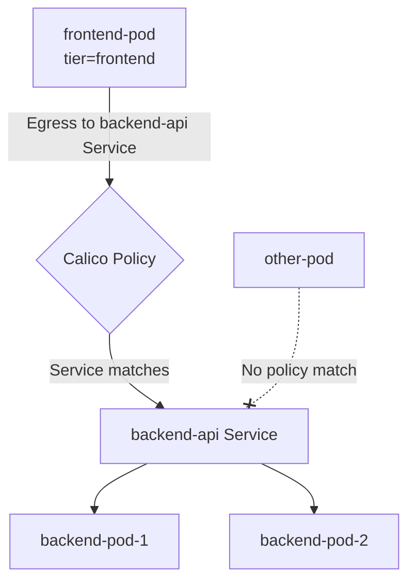

# How to Configure Service-Based Policies in Calico

Author: [nawazdhandala](https://github.com/nawazdhandala)

Tags: Calico, Kubernetes, Network Policy, Services, Security

Description: A step-by-step guide to configuring Calico network policies that target Kubernetes Services for fine-grained traffic control.

---

## Introduction

Service-based network policies let you write rules that reference Kubernetes Services rather than individual pod selectors. This is powerful because services are the stable abstraction in Kubernetes - pods come and go, but services persist. Calico's `projectcalico.org/v3` supports targeting services in egress rules, enabling policies like "allow traffic to the payment-service Service only."

Calico's service-aware policies work with the Kubernetes Service object to automatically track the pods behind the service. When pods are added or removed from a service's endpoint set, the network policy updates automatically without any policy changes.

This guide covers how to write Calico network policies that reference Kubernetes Services, both for ingress protection of service-backing pods and for egress control of which services pods are allowed to call.

## Prerequisites

- Kubernetes cluster with Calico v3.26+
- `calicoctl` and `kubectl` installed
- Understanding of Kubernetes Services and Endpoints

## Step 1: Label Your Services

```bash
kubectl label service backend-api -n production tier=api environment=production
kubectl label service payment-db -n production tier=data environment=production
```

## Step 2: Write Egress Policy Targeting a Service

```yaml
apiVersion: projectcalico.org/v3
kind: NetworkPolicy
metadata:
  name: allow-frontend-to-backend-service
  namespace: production
spec:
  order: 100
  selector: tier == 'frontend'
  egress:
    - action: Allow
      destination:
        services:
          name: backend-api
          namespace: production
  types:
    - Egress
```

## Step 3: Protect a Service's Backing Pods

```yaml
apiVersion: projectcalico.org/v3
kind: NetworkPolicy
metadata:
  name: protect-payment-service
  namespace: production
spec:
  order: 100
  selector: app == 'payment-db'
  ingress:
    - action: Allow
      source:
        selector: tier == 'backend'
      destination:
        ports: [5432]
    - action: Deny
  types:
    - Ingress
```

## Step 4: Test Service-Based Policy

```bash
# Test that frontend can reach backend via service
BACKEND_SVC=$(kubectl get service backend-api -n production -o jsonpath='{.spec.clusterIP}')
kubectl exec -n production frontend-pod -- curl -s --max-time 5 http://$BACKEND_SVC:8080
echo "Test (should pass): $?"
```

## Service-Based Policy Architecture



## Conclusion

Service-based Calico policies provide a stable abstraction layer for network access control. By targeting Kubernetes Services rather than individual pod selectors, your policies remain valid as pods scale up and down or are replaced. This is especially useful for controlling access to critical shared services like databases and APIs where stability of the policy reference is important.
