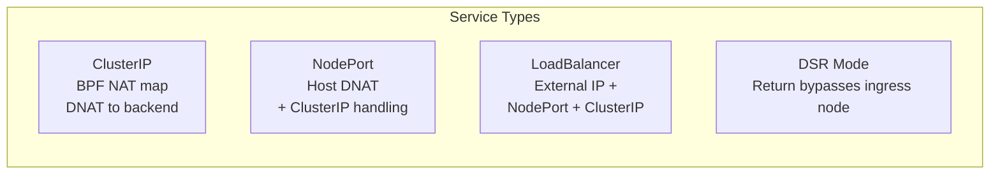

# How to Configure Service Handling in Calico eBPF Mode

Author: [nawazdhandala](https://github.com/nawazdhandala)

Tags: Calico, Kubernetes, eBPF, Service Handling, Networking

Description: Configure Calico eBPF service handling for Kubernetes services including NodePort, ClusterIP, and LoadBalancer types.

---

## Introduction

Calico eBPF mode handles Kubernetes service traffic for ClusterIP, NodePort, and LoadBalancer services using BPF programs and maps that are loaded directly into the kernel. ExternalName services are resolved by DNS and do not use service proxying. This provides lower latency service routing compared to iptables-based approaches and scales better with the number of services and endpoints.

Understanding how eBPF handles each service type is important for troubleshooting and optimization. ClusterIP services are handled via BPF NAT maps, NodePort services add host networking DNAT, and external service traffic can optionally use DSR to bypass the ingress node on the return path when the underlying network supports it.

## Prerequisites

- Calico eBPF mode enabled
- kube-proxy disabled
- Multiple service types deployed for testing

## Verify Service Type Handling

```bash
# Check BPF NAT map contents

kubectl exec -n calico-system ds/calico-node -- \
  calico-node -bpf nat dump | head -50

# Test ClusterIP service
SVC_IP=$(kubectl get svc my-service -o jsonpath='{.spec.clusterIP}')
kubectl exec test-pod -- wget -O- http://${SVC_IP}/

# Test NodePort service
NODE_IP=$(kubectl get nodes -o jsonpath='{.items[0].status.addresses[0].address}')
NODE_PORT=$(kubectl get svc my-nodeport -o jsonpath='{.spec.ports[0].nodePort}')
curl http://${NODE_IP}:${NODE_PORT}/
```

## Configure Service Affinity

```bash
# Enable session affinity for a service
kubectl patch svc my-service -p '{"spec":{"sessionAffinity":"ClientIP"}}'

# Verify the service is still programmed in the BPF NAT table
SVC_IP=$(kubectl get svc my-service -o jsonpath='{.spec.clusterIP}')
kubectl exec -n calico-system ds/calico-node -- \
  calico-node -bpf nat dump | grep "${SVC_IP}"
```

## eBPF Service Types Architecture



## Conclusion

Calico eBPF service handling provides efficient routing for Kubernetes service traffic. Verify each service type works after enabling eBPF mode, check BPF map contents to diagnose routing issues, and configure session affinity where needed for stateful applications. Monitor BPF map capacity as it must accommodate service frontends and backends.
